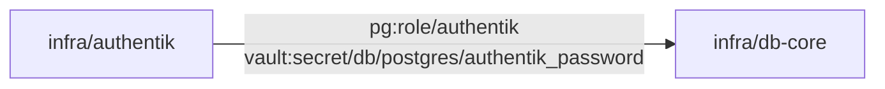
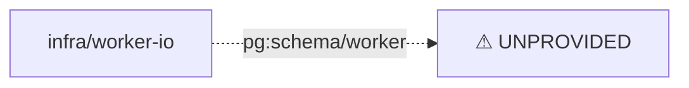

# CIU — Feature reference & CLI surface

The canonical, at-a-glance list of what CIU does and how to drive it. Normative
detail lives in [SPEC.md](SPEC.md) (`S-xx` IDs); the task-oriented guide is
[CIU.md](CIU.md). When this list and SPEC.md disagree, **SPEC.md wins** — open an
issue.

CIU ships **one** console entrypoint: **`ciu`**, a flat verb dispatcher
(`ciu <verb> …`). The former `ciu-deploy` script is withdrawn; its actions are
now verbs (`ciu up/down/clean/health`).

---

## Capability matrix

| Capability | What it gives you | Spec |
|---|---|---|
| **Layered config** | `defaults` + optional **committed sparse** override → rendered config, per global chain and per stack. CIU never auto-creates an override; an absent one means "defaults apply alone". | S3.1, S3.1a |
| **Jinja2 + `$VAR` + TOML render** | Templates render against merged config + machine facts (UID/GID, network, physical paths, FQDN), then `$VAR`/`${VAR}` expand, then parse as TOML. | S3.2 |
| **State preservation** | `[state]` from a prior `ciu.toml` survives re-render; `[secrets]` never carried. | S3.4 |
| **Six secret directives** | `ASK_VAULT`, `GEN_TO_VAULT`, `GEN_LOCAL`, `ASK_EXTERNAL`, `ASK_FILE`, `GEN_EPHEMERAL` — resolve/generate, write `0440` files, mount at `/run/secrets/<name>`. | S4.2 |
| **Secure-by-default first run** | `GEN_*` mint a strong random secret once and reuse it (the file *is* the state). | S4.11 |
| **Leak prevention** | stringify-guards (S4.21), post-render plaintext scan of compose **and** overlay (S4.22), redacted `--print-context` (S4.23). | S4.21–S4.23 |
| **Secret consumption channels** | A declared secret counts as consumed via compose `services.*.secrets`, a configfile `secret('<name>')`, **or** a hook marked `consumed_by = "hook"`. Consumed-by-nothing → warn; undeclared reference → abort. | S4.20 |
| **Secret exposure to env** | `expose_env = "NAME"` injects a value into compose process env (discouraged; logged). Invalid on `ASK_FILE`. | S4.19 |
| **Configfile mounts** | Render an app config file (DSNs/URLs via `secret()`), mount it read-only at a container path through the overlay. | S5.1–S5.4 |
| **Replicated-service fan-out** | A base configfile section `[<root>.svc.configfile.*]` fans out to instance keys `svc-1`, `svc-2`, … (1-based); an exact compose key wins; no match → preserved selector **+ `[WARN]`**. | S5.3 |
| **Dev loop (`ciu dev`)** | `[<root>.dev]` declares `prebuild`/`command`/`port`/`mount`/`depends_on`; runs an HMR/codegen loop in one ephemeral container, gated on dependency health. | S5a |
| **Hostdir provisioning** | Auto-named `vol-*` dirs, correct owner/mode, fixed-UID patterns (postgres 999), `seed=` first-run content; ownership fixed via a root helper container when the operator isn't root. | S6.1–S6.7 |
| **Complete teardown** | `clean`/`--reset` removes containers (any state) + project volumes + `vol-*` + rendered outputs; enforces a **post-clean invariant** (zero project containers AND volumes), erroring on survivors. | S6.4 |
| **Phased orchestration** | Stacks run in numeric phase order; health-gated (`starting` ≠ healthy); per-service `enabled` bool or `[deploy.control]` flag name. | S7.1–S7.7 |
| **Host profiles** | `--profile` selects phases/stacks and applies `topology_overrides` for cross-host addressing. Distinct from compose profiles. | S7.4, S7.5a |
| **Dual shipping** | Maintainer may commit a hand-written `docker-compose.yml`; `ciu` never overwrites it. `up --shipped` runs it *through* CIU (env/network/preflight). | S8.5, S8.6 |
| **Hooks** | `pre_secrets` / `pre_compose` / `post_compose` with a context object: `ctx.secret_file()`, structured `apply_to_config`/`persist:"state"` returns. | S9.1–S9.4 |
| **Hook readiness helpers** | `ctx.wait_healthy(service)` / `ctx.wait_tcp(host, port)` so a `post_compose` hook waits for a service instead of racing `compose up`. | S9.3 |
| **Fail-fast validation** | Static catalog (S11) + typed exit codes; vault-backed stack aborts if no token resolves. | S10.3, S11, S7.6 |
| **DooD path correctness** | Physical bind paths computed so a stack runs identically in devcontainer / native / CI. | S1.4, S1.9 |
| **Declarative provisioning graph** | Stacks declare `requires`/`provides` typed refs in their root-key table; CIU lints the graph up-front and probes live state per-phase during `ciu up`. Purely opt-in: stacks without these keys are unaffected. | S13 |
| **`ciu check` — graph validation** | Validates the requires/provides dependency graph without deploying: static lint + optional `--live` probe. Safe to run in CI. | S13.4 |
| **`ciu graph` — dependency visualisation** | Renders the requires/provides graph to STDOUT as Mermaid (default), Graphviz DOT, or JSON. Pipe into docs; unprovided deps appear as dashed `UNPROVIDED` edges. | S13.5 |
| **SSH access plane (`ciu ssh`)** | Interactive shell or one-shot command on a remote host. Key-per-host, host-key pinned, optional paramiko or subprocess transport. | S14.1 |
| **Push-deploy (`ciu up --host`)** | Render-on-target push: bundle-syncs the repo to the host, then runs `ciu env generate && ciu render && ciu up` remotely. Secrets never leave the target host. | S14.2 |
| **Render-safe host inventory** | `.ciu.hosts.toml` / `~/.ciu/hosts.toml` — never touched by `ciu render` / `ciu clean`; SSH keys via `ASK_VAULT:` or filesystem path. | S14.3 |
| **Fail-closed host-key pinning** | Connections are refused when no `known_host` is pinned; `CIU_SSH_INSECURE_TOFU=1` is a documented bootstrap-only escape hatch. | S14.4a |

---

## CLI reference (v3 verbs)

`ciu <verb> -h` prints that verb's own options. Exit codes: `0` ok · `1` runtime
failure · `2` config/validation error · `3` environment/bootstrap error (S10.3).

| Verb | Purpose | Key options |
|---|---|---|
| `ciu env` | Show `.env.ciu` key=value pairs (read-only) | — |
| `ciu env generate` | (Re)generate `.env.ciu` from system state | `--define-root PATH` |
| `ciu render` | Render `ciu.global.toml` + per-stack `ciu.toml` | `--profile NAME`, `--define-root PATH`, `--host NAME` (remote) |
| `ciu profiles` | List host profiles | — |
| `ciu up` | Render + materialise secrets + `compose up` | `--profile NAME` \| `--dir PATH`, `--phases N,M`, `--dry-run`, `-y`, `--ignore-errors`, `--no-preflight`; `--host NAME` push-deploys to a remote host (S14.2); `--thin` reserved/not-yet-implemented |
| `ciu down` | Stop containers (volumes preserved) | `--profile NAME`, `--host NAME` |
| `ciu clean` | **Complete** teardown: containers (any state) + volumes + `vol-*` + rendered; enforces post-clean invariant (exit 1 on survivors) | `--profile NAME`, `-y`, `--ignore-errors` |
| `ciu health` | Health gate over the selection | `--profile NAME`, `--host NAME` |
| `ciu health --preflight` | Probe images for missing healthcheck tools | `--strict` |
| `ciu bake` | `docker buildx bake --load` (production image) | `[targets …]`, `--no-cache` |
| `ciu dev <stack>` | Run the stack's `[<root>.dev]` dev loop (S5a) | `--profile NAME`, `--no-prebuild`, `--define-root PATH` |
| `ciu secrets list` | List materialised secret names | `-d PATH` |
| `ciu secrets reset` | Delete secret store files | `--name N`, `-y` |
| `ciu check` | Validate the requires/provides dependency graph (no deploy) | `--profile NAME`, `--live` (also probe live state), `--phases N,M` |
| `ciu graph` | Render the dependency graph to STDOUT (no deploy) | `--format mermaid\|dot\|json`, `--profile NAME`, `--phases N,M` |
| `ciu ssh <host>` | Interactive shell or one-shot command on a remote host | `--admin` (use admin key), `-- <cmd...>` (one-shot command) |

### Legacy `ciu -d` engine flags → v3 verbs

The single-stack engine flag form still works but the verbs are preferred:

| Legacy | v3 verb |
|---|---|
| `ciu -d <stack>` | `ciu up --dir <stack>` |
| `ciu -d <stack> --render-toml` | `ciu render` |
| `ciu -d <stack> --dry-run` | `ciu up --dir <stack> --dry-run` |
| `ciu -d <stack> --reset` | `ciu clean` |
| `ciu -d <stack> --shipped` | `ciu up --dir <stack> --shipped` |
| `ciu --generate-env` | `ciu env generate` |

---

## Common workflows

```bash
# First-time machine setup: write .env.ciu (UID/GID, network, paths, FQDN)
ciu env generate

# Bring up everything for the active host profile
ciu up

# Bring up only one stack (engine path), rendering but not starting it
ciu up --dir applications/app-config --dry-run

# Iterate on a UI/dev server with HMR against the live backend (S5a)
ciu up --dir infra/api          # start the dependency first
ciu dev applications/webapp-ui  # fetch:openapi → gen:api → vite dev, HMR on its port

# Inspect secrets and health
ciu secrets list -d infra/vault
ciu health --preflight --strict

# Tear everything down to a clean slate (disposable greenfield)
ciu clean -y      # exits non-zero if any project container/volume survives (S6.4)
```

---

## Provisioning graph workflows

```bash
# Validate the requires/provides graph (static lint — safe at any time, no stack required)
ciu check

# Validate AND probe live state (run after the stack is up)
ciu check --live

# Render the dependency graph as Mermaid and view it
ciu graph
# or: ciu graph --format dot | dot -Tsvg > graph.svg

# On a greenfield first-up, the static lint runs up-front; live probing is per-phase
ciu up    # works without --no-preflight — probes run after each provider phase
```

### Example Mermaid output

Given a two-stack selection (db-core provides, authentik requires), `ciu graph`
emits this to stdout (pipe it into a Markdown file to render in GitHub / docs):



An unprovided requirement renders as a dashed edge to a sentinel node:



---

## Remote deployment workflows

```bash
# Open an interactive shell on a remote host (reads .ciu.hosts.toml)
ciu ssh core1

# Run a one-shot command
ciu ssh core1 -- docker ps

# Push-deploy: sync the bundle and render+run on the target
ciu up --host core1 --profile infra

# Use the admin key for a higher-privilege session
ciu ssh core1 --admin -- journalctl -u docker -n 50

# First bootstrap: bring up Vault/Consul/db-core on a fresh host via push-deploy
# (use CIU_SSH_INSECURE_TOFU=1 only until you pin the host key)
CIU_SSH_INSECURE_TOFU=1 ciu up --host core1 --dir infra/vault
ciu up --host core1 --dir infra/vault    # second run: TOFU env unset, key now pinned
```

---

## Edge cases worth knowing

- **Replicated services & configfiles (S5.3).** One section
  `[<root>.worker.configfile.main]` fans out to `worker-1`, `worker-2`, … . An
  exact compose key named `worker` takes precedence (no fan-out). A selector
  that matches neither is preserved **and warned** — it would otherwise mount to
  a phantom service.
- **Sparse committed overrides (S3.1a).** `ciu.global.toml.j2` and per-stack
  `ciu.toml.j2` are optional, **committed**, secret-scanned, and never
  auto-created. Author only the keys that differ from defaults; lists replace
  (no concat); disable a default with the falsy value, not key deletion.
- **Hooks race startup (S9.3).** `post_compose` runs immediately after
  `compose up`; a hook that talks to a service must `ctx.wait_healthy(...)` /
  `ctx.wait_tcp(...)` first.
- **Teardown must be complete (S6.4).** An exited one-shot init/sidecar pins
  named volumes; `clean` removes exited containers and `--remove-orphans`, then
  asserts zero project containers and volumes remain.
- **Secret declared but unused (S4.20).** Warns (does not fail) — unless it is
  consumed via a configfile `secret()` or a `consumed_by = "hook"` marker.
- **`pg:schema` probes the application database (S13.2).** `information_schema.schemata`
  is per-database; `pg:schema/<name>` connects with `psql -d <registry.postgresql.database>`,
  not the default `postgres` db. Set `registry.postgresql.database` in your global config.
- **Greenfield `ciu up` with provisioning (S13.3).** Static lint runs once up-front
  (verifying graph completeness). Live probing runs per-phase — only when a phase is
  about to deploy, after earlier phases are already up. No `--no-preflight` needed on
  a full greenfield run.
- **`consul:token` Vault path is config-driven (S13.2).** Default path template is
  `consul/acl/tokens/{svc}`. Override with `[registry.consul] token_vault_path = "…"`.
- **Host-key pinning is fail-closed (S14.4a).** A missing `known_host` in the hosts
  inventory causes `ciu ssh` and `ciu up --host` to refuse the connection. Set
  `CIU_SSH_INSECURE_TOFU=1` only during initial bootstrap to discover and pin the key.
- **`--thin` is reserved (S14.2).** `ciu up --host <name> --thin` exits 1 with a clear
  error message. The render-on-target path (default, no `--thin`) is always available.
