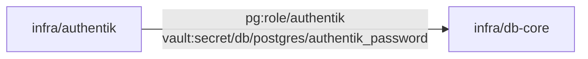
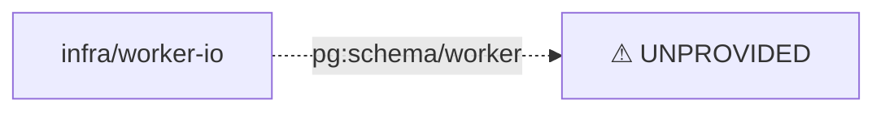

# CIU — Feature reference & CLI surface

The canonical, at-a-glance list of what CIU does and how to drive it. Normative
detail lives in [SPEC.md](SPEC.md) (`S-xx` IDs); the task-oriented guide is
[CIU.md](CIU.md). When this list and SPEC.md disagree, **SPEC.md wins** — open an
issue.

CIU ships **one** console entrypoint: **`ciu`**, a flat verb dispatcher
(`ciu <verb> …`). The former `ciu-deploy` script is withdrawn; its actions are
now verbs (`ciu up/down/clean/health`).

---

## Capability matrix

| Capability | What it gives you | Spec |
|---|---|---|
| **Layered config** | `defaults` + optional **committed sparse** override → rendered config, per global chain and per stack. CIU never auto-creates an override; an absent one means "defaults apply alone". | S3.1, S3.1a |
| **Jinja2 + `$VAR` + TOML render** | Templates render against merged config + machine facts (UID/GID, network, physical paths, FQDN), then `$VAR`/`${VAR}` expand, then parse as TOML. | S3.2 |
| **State preservation** | `[state]` from a prior `ciu.toml` survives re-render; `[secrets]` never carried. | S3.4 |
| **Six secret directives** | `ASK_VAULT`, `GEN_TO_VAULT`, `GEN_LOCAL`, `ASK_EXTERNAL`, `ASK_FILE`, `GEN_EPHEMERAL` — resolve/generate, write `0440` files, mount at `/run/secrets/<name>`. | S4.2 |
| **Secure-by-default first run** | `GEN_*` mint a strong random secret once and reuse it (the file *is* the state). | S4.11 |
| **Leak prevention** | stringify-guards (S4.21), post-render plaintext scan of compose **and** overlay (S4.22), redacted `--print-context` (S4.23). | S4.21–S4.23 |
| **Secret consumption channels** | A declared secret counts as consumed via compose `services.*.secrets`, a configfile `secret('<name>')`, **or** a hook marked `consumed_by = "hook"`. Consumed-by-nothing → warn; undeclared reference → abort. | S4.20 |
| **Secret exposure to env** | `expose_env = "NAME"` injects a value into compose process env (discouraged; logged). Invalid on `ASK_FILE`. | S4.19 |
| **Configfile mounts** | Render an app config file (DSNs/URLs via `secret()`), mount it read-only at a container path through the overlay. | S5.1–S5.4 |
| **Replicated-service fan-out** | A base configfile section `[<root>.svc.configfile.*]` fans out to instance keys `svc-1`, `svc-2`, … (1-based); an exact compose key wins; no match → preserved selector **+ `[WARN]`**. | S5.3 |
| **Dev loop (`ciu dev`)** | `[<root>.dev]` declares `prebuild`/`command`/`port`/`mount`/`depends_on`; runs an HMR/codegen loop in one ephemeral container, gated on dependency health. | S5a |
| **Hostdir provisioning** | Auto-named `vol-*` dirs, correct owner/mode, fixed-UID patterns (postgres 999), `seed=` first-run content; ownership fixed via a root helper container when the operator isn't root. | S6.1–S6.7 |
| **Complete teardown** | `clean`/`--reset` removes containers (any state) + project volumes + `vol-*` + rendered outputs; enforces a **post-clean invariant** (zero project containers AND volumes), erroring on survivors. | S6.4 |
| **Phased orchestration** | Stacks run in numeric phase order; health-gated (`starting` ≠ healthy); per-service `enabled` bool or `[deploy.control]` flag name. | S7.1–S7.7 |
| **Host profiles** | `--profile` selects phases/stacks and applies `topology_overrides` for cross-host addressing. Distinct from compose profiles. | S7.4, S7.5a |
| **Dual shipping** | Maintainer may commit a hand-written `docker-compose.yml`; `ciu` never overwrites it. `up --shipped` runs it *through* CIU (env/network/preflight); without deploy tags it names the compose project from the workspace identity (`REPO_NAME-INSTANCE_ID-stack`), so clean enumerates exactly what up created. | S8.5, S8.6, S8.7 |
| **Hooks** | `pre_secrets` / `pre_compose` / `post_compose` with a context object: `ctx.secret_file()`, structured `apply_to_config`/`persist:"state"` returns. | S9.1–S9.4 |
| **Hook readiness helpers** | `ctx.wait_healthy(service)` / `ctx.wait_tcp(host, port)` so a `post_compose` hook waits for a service instead of racing `compose up`. | S9.3 |
| **Fail-fast validation** | Static catalog (S11) + typed exit codes; vault-backed stack aborts if no token resolves. | S10.3, S11, S7.6 |
| **Read-only runtime diagnosis** | `ciu diagnose` correlates OOM/exit/restart/health evidence, memory+swap configuration, and bounded logs into actionable findings without reading environment/secrets or changing containers. | S10.5 |
| **Per-stack status report** | `ciu status` resolves every `--profile`-selected stack's compose project, containers, and health in one read-only pass; a stack not yet deployed reports an empty container list (not an error), and a Docker daemon that cannot be reached aborts loudly instead of rendering an empty/healthy-looking report. | S7.10 |
| **DooD path correctness** | Physical bind paths computed so a stack runs identically in devcontainer / native / CI. | S1.4, S1.9 |
| **Declarative provisioning graph** | Stacks declare `requires`/`provides` typed refs in their root-key table; CIU lints the graph up-front and probes live state per-phase during `ciu up`. Purely opt-in: stacks without these keys are unaffected. | S13 |
| **`ciu check` — full config validation** | Walks the whole config pipeline without deploying, entirely in memory and side-effect-free (no hostdir, no materialized secret, no rendered file, no hook `run()`, no Docker): stack shape, secret directive grammar/placement, the requires/provides graph lint, governance shape, configfile template/schema existence, hook loading, each hook's optional `validate_config()` preflight, the S4.21-guarded compose render, the leak scan, and the declared-vs-consumed secret cross-check. Replaces using `ciu up --dry-run` as a validation tool — that path still creates hostdirs and still runs hooks for real. Stage 7 validates the two `[registry.*]` fields CIU itself reads (Pydantic, via the optional `ciu[registry]` extra) plus any consumer-declared `validate_registry`; it ships no model for registry tables CIU has never read. `--json` emits one versioned per-stage envelope. Safe to run in CI. | S13.4, S13.4a, S13.4b |
| **`ciu graph` — dependency visualisation** | Renders the requires/provides graph to STDOUT as Mermaid (default), Graphviz DOT, or JSON. Pipe into docs; unprovided deps appear as dashed `UNPROVIDED` edges. | S13.5 |
| **SSH access plane (`ciu ssh`)** | Interactive shell or one-shot command on a remote host. Key-per-host, host-key pinned, optional paramiko or subprocess transport. | S14.1 |
| **Push-deploy (`ciu up --host`)** | Render-on-target push: bundle-syncs the repo to the host, then runs `ciu env generate && ciu render && ciu up` remotely. Secrets never leave the target host. | S14.2 |
| **Render-safe host inventory** | `.ciu.hosts.toml` / `~/.ciu/hosts.toml` — never touched by `ciu render` / `ciu clean`; SSH keys via `ASK_VAULT:` or filesystem path. | S14.3 |
| **Fail-closed host-key pinning** | Connections are refused when no `known_host` is pinned; `CIU_SSH_INSECURE_TOFU=1` is a documented bootstrap-only escape hatch. | S14.4a |
| **Docker-optional activation** | `ciu up --host <name> --thin` pushes a bundle and invokes the target's explicit activation contract; the target needs neither Docker nor CIU's Python runtime. | S14.6 |
| **Governance and KSM policy** | Global and stack resource policy place services under verified cgroup slices, enforce memory/IO limits, and offer built-in KSM preload or per-service wrapper strategy. | S15 |
| **Managed worktree instances** | `ciu worktree` creates/adopts/resumes durable logical identities with exact nested CIU roots, local sparse overrides, collision admission, optional shared-infra join, and a primary-config concurrency cap; `inspect`/`list`/`rm` emit versioned JSON documents with freshly derived Git facts; `up`/`exec` act on one exact selected instance under its own identity record (`[ciu.instance.generated]`; its `ciu.env` before 7.7.0, S3.1c), and `exec --target` runs inside a declared already-running container with a worktree-mount proof; `ciu capabilities --json` exposes the closed machine-contract allowlist. | S16, S16.4, S16.5, S16.6, S16.7 |
| **Image provenance evidence** | `ciu provenance --json` verifies running images against the commit under test AND against a declared vendor baseline (`[deploy.provenance] vendor_images` → `vendor-pinned`, vendor drift → `mismatch`), making `verified-match` reachable on all-vendor deployments; documents are emitted at `schema_version: 2`; the explicit break-glass `--no-preflight` produces no verdict. | S17 |
| **Assay-backed implementation gate** | The release gate runs the full suite (100% line+branch) inside `tester-unified` and is judged by the released, hash-pinned Assay CLI (vendored zipapp, `sha256sum`-verified each run): Assay judges the changed-line floor on `base..HEAD` (R1) from the coverage artifact and emits a retained verdict; the gate slice comes only from `$CGROUP_PARENT_DEV_BACKGROUND` (verified loaded, fail-closed); the gate's status is the Assay job's own. | S18 |

---

## CLI reference

`ciu <verb> -h` prints that verb's own options. Exit codes: `0` ok · `1` runtime
failure · `2` config/validation error · `3` environment/bootstrap error (S10.3).

| Verb | Purpose | Key options |
|---|---|---|
| `ciu version` | Print the CIU package version | Top-level `ciu --version` is withdrawn |
| `ciu init` | Guided repo scaffolding (S19): validated global defaults template, gitignore entries, optional stack skeletons; never overwrites an existing target | `--project-name NAME`, `--environment-tag TAG`, `--stacks A,B`, `--hooks NAME1,NAME2` (S19.1: copies shipped, revision-stamped hook templates into every scaffolded stack; unknown name or no `--stacks` target refuses with exit 2 before any write) |
| `ciu env` | Show `ciu.env` key=value pairs (read-only) | — |
| `ciu env generate` | (Re)generate `ciu.env` from system state | `--define-root PATH` |
| `ciu render` | Render `ciu.global.toml` + per-stack `ciu.toml` | `--profile NAME`, `--define-root PATH`, `--host NAME` (remote) |
| `ciu profiles` | List host profiles | — |
| `ciu layouts` | List declared deploy layouts (S7.5c) — shows what is DECLARED; `up --layout` validates | — |
| `ciu up` | Render + materialise secrets + `compose up` | `--profile NAME` \| `--dir PATH`, `--phases N,M`, `--dry-run`, `-y`, `--ignore-errors`, `--no-preflight`; `--host NAME` push-deploys to a remote host (S14.2); `--thin` docker-optional push→activate (S14.6), `--bootstrap`/`--rollback` select activation verbs |
| `ciu down` | Stop containers (volumes preserved) | `--profile NAME`, `--host NAME` |
| `ciu clean` | **Complete** teardown: containers (any state) + volumes + `vol-*` + rendered; enforces post-clean invariant (exit 1 on survivors) | `--profile NAME`, `-y`, `--ignore-errors` |
| `ciu health` | Health gate over the selection | `--profile NAME`, `--host NAME` |
| `ciu health --preflight` | Probe images for missing healthcheck tools | `--strict` |
| `ciu diagnose` | Explain common container failures without changing state | `--project NAME`, `--logs N`, `--json` |
| `ciu status` | Per-stack compose project, containers, and health (read-only) | `--profile NAME`, `--json` |
| `ciu bake` | `docker buildx bake --load` (production image); with `--profile`, targets are resolved via the same selection chain as `ciu up --profile` (CIU-QOL-7) | `[targets …]` \| `--profile NAME`, `--no-cache` |
| `ciu ksm build` | Build CIU's shipped KSM shim cache | `--force` |
| `ciu dev <stack>` | Run the stack's `[<root>.dev]` dev loop (S5a) | `--profile NAME`, `--no-prebuild`, `--define-root PATH` |
| `ciu secrets list` | List materialised secret names | `-d PATH` |
| `ciu secrets reset` | Delete secret store files | `--name N`, `-y` |
| `ciu check` | Validate the whole config pipeline in memory (no deploy) | `--profile NAME`, `--live` (also probe live state), `--json` (versioned per-stage report), `--phases N,M` |
| `ciu graph` | Render the dependency graph to STDOUT (no deploy) | `--format mermaid\|dot\|json`, `--profile NAME`, `--phases N,M` |
| `ciu ssh <host>` | Interactive shell or one-shot command on a remote host | `--admin` (use admin key), `-- <cmd...>` (one-shot command) |
| `ciu worktree` | Create, adopt, ensure, remove, inspect, list, start, or exec managed CIU instances; survey and prune local branches | `create LOGICAL --prefix P --feature F`; `adopt LOGICAL PATH`; `ensure LOGICAL`; legacy `add NAME`; `rm LOGICAL -y [--json]`; `list [--json]`; `inspect LOGICAL [--json]`; `branches [--base REF] [-y] [--json]` (S16.8); `up LOGICAL`; `exec LOGICAL [--target ALIAS] -- ARGV...` (S16, S16.6, S16.7) |
| `ciu capabilities` | Versioned, closed machine-contract allowlist (D-009) | `--json` (S16.5) |
| `ciu host-secrets <host>` | Host-scoped local secrets (S14.3a): materialize/list/resolve path for pre-Vault bootstrap credentials | `--materialize`, `--list`, `--path NAME`, `-y` |
| `ciu provenance` | Verify running images against the commit under test and the declared vendor baseline | `--ignore-mismatch` (`--force`), `--no-preflight`, `--json`, `--define-root PATH`; `--no-preflight` and `--json` are incompatible |

For the complete, copy/paste-oriented CLI surface, use `ciu` for the command
index and `ciu <verb> --help` for the verb's accepted options. The help output
also documents legacy engine options that remain available only through
`ciu up --dir`, such as `--render-toml`, `--reset`, and `--shipped`.

### Withdrawn flat forms → public verbs

The `ciu` dispatcher rejects the flat engine forms below. They are retained
here only as a migration map; use the public verb in all scripts and docs.

| Legacy | public verb |
|---|---|
| `ciu -d <stack>` | `ciu up --dir <stack>` |
| `ciu -d <stack> --render-toml` | `ciu up --dir <stack> --render-toml` (single stack); `ciu render` for a profile selection |
| `ciu -d <stack> --dry-run` | `ciu up --dir <stack> --dry-run` |
| `ciu -d <stack> --reset` | `ciu up --dir <stack> --reset` (single stack); `ciu clean` for a profile selection |
| `ciu -d <stack> --shipped` | `ciu up --dir <stack> --shipped` |
| `ciu --generate-env` | `ciu env generate` |
| `ciu --version` | `ciu version` |

---

## Common workflows

```bash
# First-time machine setup: write the identity table + ciu.env (UID/GID,
# network, paths, FQDN)
ciu env generate

# Bring up everything for the active host profile
ciu up

# Bring up only one stack (engine path), rendering but not starting it
ciu up --dir applications/app-config --dry-run

# Iterate on a UI/dev server with HMR against the live backend (S5a)
ciu up --dir infra/api          # start the dependency first
ciu dev applications/webapp-ui  # fetch:openapi → gen:api → vite dev, HMR on its port

# Inspect secrets and health
ciu secrets list -d infra/vault
ciu health --preflight --strict
ciu diagnose --project myproject

# Tear everything down to a clean slate (disposable greenfield)
ciu clean -y      # exits non-zero if any project container/volume survives (S6.4)
```

---

## Worktree and evidence workflows

Use an isolated worktree when a parallel change needs a real stack without
adopting the primary checkout's containers, network, or volumes:

```bash
# Prepare a separate instance; this does not start it.
ciu worktree create feature-x --prefix myapp --feature api-retry --profile dev
# Output reports both the Git checkout and exact CIU root. Creation never starts it.
ciu worktree ensure feature-x --json
# Enter the reported CIU root, then: eval "$(ciu env print)" && ciu up

# Before a live test/evidence lane, record the artifact identity CIU inspected.
ciu provenance --json

# CIU cleans the instance before removing the checkout.
cd -
ciu worktree rm feature-x -y
```

For a diverging application tier that shares already-running identity, secret,
or observability services, use `worktree create --shared-infra ...` exactly as
shown in [CONFIG.md's shared-infra example](CONFIG.md#shared-infra-join-example-s161).

This makes CIU a useful companion to **nyxloom** for parallel implementation
work and to **assay** for proving a live lane exercised the intended image.
CMRU remains responsible for releases: it runs CIU's `tester-unified` gate and
records the project-scoped source history in [../CHANGES.md](../CHANGES.md).

The boundary is intentional: CIU provisions and identifies the live lane;
Assay records a declared test/evidence result and may consume the JSON verdict;
Nyxloom coordinates work, rather than either tool silently dispatching a remote
CIU workload. A remote lane needs an explicit worker/credential/teardown
contract, not a hidden side effect of `ciu provenance`.

---

## Provisioning graph workflows

```bash
# Validate the whole config pipeline in memory (safe at any time, no stack required,
# nothing written: no hostdir, no secret, no rendered file, no hook run())
ciu check

# Same, as one versioned JSON object (per-stage pass/fail + findings)
ciu check --json

# Validate AND probe live state (run after the stack is up)
ciu check --live

# Render the dependency graph as Mermaid and view it
ciu graph
# or: ciu graph --format dot | dot -Tsvg > graph.svg

# On a greenfield first-up, the static lint runs up-front; live probing is per-phase
ciu up    # works without --no-preflight — probes run after each provider phase
```

### Example Mermaid output

Given a two-stack selection (db-core provides, authentik requires), `ciu graph`
emits this to stdout (pipe it into a Markdown file to render in GitHub / docs):


```mermaid
flowchart LR
  n0["infra/authentik"]
  n1["infra/db-core"]
  n0 -->|"pg:role/authentik<br/>vault:secret/db/postgres/authentik_password"| n1
```

An unprovided requirement renders as a dashed edge to a sentinel node:


```mermaid
flowchart LR
  n0["infra/worker-io"]
  UNPROVIDED["⚠ UNPROVIDED"]
  n0 -.->|"pg:schema/worker"| UNPROVIDED
```

---

## Remote deployment workflows

```bash
# Open an interactive shell on a remote host (reads .ciu.hosts.toml)
ciu ssh core1

# Run a one-shot command
ciu ssh core1 -- docker ps

# Push-deploy: sync the bundle and render+run on the target
ciu up --host core1 --profile infra

# Use the admin key for a higher-privilege session
ciu ssh core1 --admin -- journalctl -u docker -n 50

# First bootstrap: bring up Vault/Consul/db-core on a fresh host via push-deploy
# (use CIU_SSH_INSECURE_TOFU=1 only until you pin the host key)
CIU_SSH_INSECURE_TOFU=1 ciu up --host core1 --dir infra/vault
ciu up --host core1 --dir infra/vault    # second run: TOFU env unset, key now pinned
```

---

## Edge cases worth knowing

- **Replicated services & configfiles (S5.3).** One section
  `[<root>.worker.configfile.main]` fans out to `worker-1`, `worker-2`, … . An
  exact compose key named `worker` takes precedence (no fan-out). A selector
  that matches neither is preserved **and warned** — it would otherwise mount to
  a phantom service.
- **Sparse committed overrides (S3.1a).** `ciu.global.toml.j2` and per-stack
  `ciu.toml.j2` are optional, **committed**, secret-scanned, and never
  auto-created. Author only the keys that differ from defaults; lists replace
  (no concat); disable a default with the falsy value, not key deletion.
- **Hooks race startup (S9.3).** `post_compose` runs immediately after
  `compose up`; a hook that talks to a service must `ctx.wait_healthy(...)` /
  `ctx.wait_tcp(...)` first.
- **Teardown must be complete (S6.4).** An exited one-shot init/sidecar pins
  named volumes; `clean` removes exited containers and `--remove-orphans`, then
  asserts zero project containers and volumes remain.
- **Secret declared but unused (S4.20).** Warns (does not fail) — unless it is
  consumed via a configfile `secret()` or a `consumed_by = "hook"` marker.
- **Your Postgres/MinIO service can be keyed anything (S13.2, CIU-70).** A `pg:`
  or `minio:` probe execs into the container of the stack that **provides** the ref,
  not into a hardcoded `postgres`/`minio` service key — so `pg`, `db`,
  `postgres_primary`, and two Postgres services in one deployment all probe
  correctly. Nothing declares the ref → the probe says exactly that instead of
  reporting a missing role; a container that is absent or stopped is reported as
  `NOT checked`, never as "the role does not exist".
- **`pg:schema` probes the application database (S13.2).** `information_schema.schemata`
  is per-database; `pg:schema/<name>` connects with `psql -d <registry.postgresql.database>`,
  not the default `postgres` db. Set `registry.postgresql.database` in your global config.
- **Greenfield `ciu up` with provisioning (S13.3).** Static lint runs once up-front
  (verifying graph completeness). Live probing runs per-phase — only when a phase is
  about to deploy, after earlier phases are already up. No `--no-preflight` needed on
  a full greenfield run.
- **`consul:token` Vault path is config-driven (S13.2).** Default path template is
  `consul/acl/tokens/{svc}`. Override with `[registry.consul] token_vault_path = "…"`.
- **Host-key pinning is fail-closed (S14.4a).** A missing `known_host` in the hosts
  inventory causes `ciu ssh` and `ciu up --host` to refuse the connection. Set
  `CIU_SSH_INSECURE_TOFU=1` only during initial bootstrap to discover and pin the key.
- **KSM opt-in is fail-closed (S15.11).** `ksm_optin = "builtin"` is the
  recommended CIU-shipped shim. A custom shim must be an existing regular file
  at CIU's logical source path; CIU maps it for Docker only after validation,
  so Docker cannot phantom-mount an empty directory. `--no-ksm` is passthrough:
  it stops CIU injection but cannot disable KSM an image enables itself.
- **`--thin` is the docker-optional push→activate path (S14.6).** `ciu up --host <name>
  --thin` pushes an artifact to `bundle_dir` (rsync, with a tar+scp fallback for hosts
  without rsync) and runs the project's shell activation contract
  (`bootstrap|apply|health|rollback`) — no Docker or general-purpose Python needed on
  the target (fits a Passenger webhoster). `--bootstrap`/`--rollback` select the other
  verbs; `ciu health --host <name> --thin` runs the `health` verb. The render-on-target
  path (default, no `--thin`) is unchanged and needs Docker on the target.
