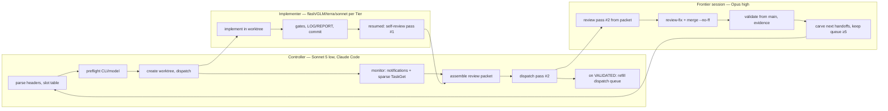

# Controller Workflow v2 — role-separated multi-agent orchestration

Status: legacy pilot protocol · adopted 2026-07-12 · retained during migration
to the project-neutral [`handoffctl`](../handoffctl/README.md) architecture.
This document remains evidence for existing groop runs, but new cross-project
control-plane contracts belong under `handoffctl/`.
Companion: `docs/ai-cli-controller-guide.md` (per-CLI invocation reference — still
authoritative for exact commands, flags, metrics, and CLI-specific pitfalls).
Evidence base: `docs/implementation-benchmark-P51.md` (P51 four-model benchmark +
P52/GLM-5.2 addendum), P20–P51 review-history taxonomy, DeepSWE leaderboard
(https://deepswe.datacurve.ai/), Anthropic advisor/orchestrator cost patterns
(the-decoder.de, 2026: advisor = 92% of Fable-5 quality at 63% cost on SWE-bench
Pro with ~1 frontier consult/task; orchestrator = 96% at 46% on BrowseComp).

## 1. Why v2 exists (the role-collapse incident)

On 2026-07-12 a Reasonix (DeepSeek flash) session read the v1 guide's opening
("the controller should keep the main session for architecture, carving, review,
merge, and evidence") and concluded it could act as controller **and** carver
**and** reviewer **and** merge authority. That reading was faithful to the v1
text — the v1 "controller" fused four roles because, historically, one frontier
Claude session played all four. The fusion is wrong once roles are split by
model tier, for two distinct reasons:

1. **Role collapse.** Carving and reviewing are frontier-model jobs *by design*.
   A flash-tier model reviewing flash-tier output has maximal correlated blind
   spots: in the P51 same-base replay, DeepSeek Pro High found and repaired
   several of its own mistakes yet its committed result **passed its own full
   test suite** while missing blocked-producer shutdown, history-gap,
   terminal-state, and resource-bound contracts. In P52, GLM-5.2's two
   false-greens (a hollow monkeypatch test and an overclaimed bound) were green
   in its own gates and were caught only by the Opus review pass. Same-tier
   review is not a merge gate; it is at best triage (see §6).
2. **Harness mismatch (the disqualifying one).** `reasonix run`, `codex exec`,
   and `opencode run` are synchronous foreground processes: no scheduler, no
   background-task registry, no completion notification. A Reasonix controller
   that starts a subtask *blocks on it indefinitely* (observed live: had to be
   ESC-interrupted). This is architectural, not a config option — no
   `~/.reasonix/config.toml` change adds async supervision. Of the four CLIs,
   **only Claude Code** has the controller primitives: background task tracking
   with auto-notification on completion, task polling, and scheduled wakeups.

> Model choice and harness choice are separable everywhere **except the
> controller**. A worker only needs to run to completion inside a sandbox — any
> blocking CLI works. A controller needs an event loop, and an LLM session
> "sleeping" inside a blocking CLI is a busy-wait that cannot be interrupted by
> the very event it waits for. Hence: the controller's *harness* is forced
> (Claude Code); only its *model* is a free choice.

## 2. Roles

Five roles, four session shapes. The controller never touches code quality; the
frontier session owns every edge that does.

| Role | Model (decided) | Harness | Context discipline | Gates merge? |
| --- | --- | --- | --- | --- |
| **Controller** | Sonnet 5 **low** (Haiku 4.5 = future trial) | Claude Code only | ~4k dispatch doc + slot table; never reads diffs or handoff bodies (headers only) | No — routes only |
| **Implementer** | ladder in §4, default DeepSeek flash high | reasonix / opencode / codex / claude per routing matrix §5 | own worktree, own cache, fresh unless `Session-hint` says resume | No |
| **Self-review (pass #1)** | same session as implementer, resumed (`reasonix run -c` / `opencode run -s` / `codex resume`) | same CLI | warm cache → near-free | **Never** — advisory triage only |
| **Frontier review (pass #2) + merge authority** | Opus high (challenger to benchmark: gpt-5.6-sol medium) | claude (or codex for sol) | fresh per wave; resumed via SendMessage only for coupled chains (e.g. pwmcp P01→P02→P03) | **Yes — sole gate** |
| **Carver** | same frontier session as pass #2, immediately post-merge | — | reuses the reviewer's just-built area context | n/a |

Why carver = reviewer's session: the reviewer has just read all the code in the
area at frontier quality; carving successor handoffs from that warm context is
both cheaper and better than a cold carve later. This is the article's
"orchestrator pattern" (frontier plans, cheap workers execute) placed at the
only point in the loop where a growing context genuinely pays. Everywhere else,
growing context is cost plus anchoring risk with no reuse benefit (reviews land
hours apart — far past every cache TTL).

## 3. Which benchmark describes our packages (and what the numbers say)

Benchmarks considered: SWE-bench Verified / SWE-bench Pro (bug-fix/feature
patches in large existing repos — *not* our shape: issue localization is their
hard part, our handoffs pre-solve localization by naming files), SWE-Lancer
(priced from-spec IC tasks), Commit0 (greenfield module from spec + oracle),
Aider Polyglot (whole-file edits), LiveCodeBench (contamination-free
algorithmic), Terminal-Bench (agentic CLI operability), HumanEval/MBPP (too
small), METR long-horizon. Our handoffs — "build a bounded module inside an
existing mid-size codebase against explicit contracts, gated by adversarial
test oracles" — are closest to a **Commit0 / SWE-Lancer composite**, with
Terminal-Bench describing the separate harness-operability axis (where the
OpenCode/OpenRouter 504 legs cost real money independent of model skill).

**DeepSWE** (deepswe.datacurve.ai) is currently our best single external
reference: 113 contamination-free original tasks over 91 repos / 5 languages,
behavior-based hand-written verifiers, "5.5× more code than comparable
benchmarks despite shorter prompts", all models on mini-swe-agent (harness
neutralized). Pass@1 / avg cost per task, retrieved 2026-07-12:

| Model | Pass@1 | Avg cost/task |
| --- | --- | --- |
| gpt-5.6-sol | 73% ±3 | $8.39 |
| claude-fable-5 | 70% ±4 | $21.63 |
| **gpt-5.6-terra** | **70% ±3** | **$4.95** |
| gpt-5.6-luna | 67% ±4 | $3.03 |
| gpt-5.5 | 67% ±6 | $7.23 |

Read: **terra is the value anomaly** — Fable-level pass rate at 23% of Fable's
cost. DeepSWE ranks *models*; our benchmark addenda rank *model+harness* (504s,
argv wedges, session limits are real cost). Keep recording local addenda in
`implementation-benchmark-P51.md`; external leaderboards inform, local evidence
decides.

## 4. Implementation-model ladder (escalation order)

```
deepseek flash high        default; contract-rich bounded packages   (¥-pennies; P52-class quality proven with GLM at $1.59)
deepseek flash max         medium effort, Pro not justified
gpt-5.6-luna medium        67% @ $3.03 — first cross-vendor step     (native codex only; OpenRouter cannot route it)
gpt-5.6-terra medium       70% @ $4.95 — the value sweet spot
gpt-5.6-sol medium         73% @ $8.39 ┐ escalation ceiling — pick by
claude sonnet-5 high       (P51: $4.53) ┘ head-to-head benchmark, see below
```

Rules:
- **Tier is stamped at carve time** by the carver (`Tier:` header, §7) — the
  carver just wrote the contracts and knows the difficulty at zero marginal
  cost. The controller reads the field; it never judges complexity itself.
- If a package *seems* to need escalation, first ask whether the handoff is
  under-specified — P51→P52 evidence says tightening contracts beats upgrading
  the model.
- **Pending head-to-head:** terra-medium vs sonnet-5-high on the first genuinely
  complex package. Nominated: **pwmcp P03 (shared-browser mode)** — concurrency,
  lifecycle, supervisord, CDP isolation; the most contract-dense open package.
  Record as a new addendum in `implementation-benchmark-P51.md`.
- Codex subscription is a sunk resource: prefer terra/luna via codex while
  quota lasts; when rate-limited, fall back per §5.

## 5. CLI / model routing matrix

| CLI | Models | Effort control | Async supervision | Caveats |
| --- | --- | --- | --- | --- |
| claude | opus, sonnet-5, haiku | `--effort` | **yes (only one)** | session limits — preflight, fallback |
| codex | gpt-5.6-luna/terra/sol | `-c model_reasoning_effort="…"` | no (blocking) | subscription session limits; native only |
| opencode | OpenRouter → deepseek (`openrouter/deepseek/deepseek-v4-flash`), GLM-5.2 | `--variant high`/`--variant max` per run | no | **preferred DeepSeek route as of 2026-07-13** — long-argv wedge (~1.8k chars hangs pre-session — keep prompts short, substance in handoff); OpenRouter 504 idle timeouts → always include incremental-write instruction (~80-line batches); luna/sonnet-5 return "No allowed providers" on OpenRouter (probed 2026-07-12) |
| reasonix | DeepSeek **direct** (`api.deepseek.com`), aliases flash/pro × auto/high/max | provider alias | no — architectural, not configurable | **deprioritized as of 2026-07-13** in favor of opencode/OpenRouter — not a trusted committer; `complete_step` stalls (2026-07-13: P62 self-review leg dispatched via reasonix stalled silently, no LOG/REPORT/commit, had to be redispatched via a fresh process); third venv (see v1 guide); keep as fallback only when OpenRouter is confirmed down |

Routing consequences:
- gpt tiers → **native codex**; Claude tiers → **native claude**. OpenRouter
  currently routes only deepseek/GLM for us.
- The 2026-07-12 GLM 504 interruptions were **OpenRouter infrastructure**
  ("Upstream idle timeout"), not the model and not the OpenCode harness:
  Reasonix's DeepSeek-direct runs never saw them. When a DeepSeek-class model
  misbehaves, attribute carefully: harness (argv wedge) vs route (504) vs model
  (contract misses) have different fixes.
- **Preflight before every dispatch** (cheap insurance, ~¥0.01): Reasonix
  `ALIAS_OK` probe / codex session-limit check / 1-token claude ping. On
  failure, walk the matrix to the fallback CLI for the same or nearest model.

### 5.1 Claude Code + DeepSeek direct (experimental route)

DeepSeek exposes an Anthropic-compatible endpoint (`https://api.deepseek.com/anthropic`).
Claude Code honors `ANTHROPIC_BASE_URL` / `ANTHROPIC_AUTH_TOKEN`, so the best
harness (async supervision, background tasks) can in principle drive the
cheapest models. Wrapper: `scripts/claude-deepseek.sh` (sources
`~/.reasonix/.env`, isolates env in a subshell so normal claude sessions are
untouched). **Unprobed as of 2026-07-12** — run the probe in the script header
before relying on it; if it works, flash-tier implementers gain Claude Code's
worktree/task tooling and this matrix gets a new best row.

## 5.2 Resumability and session-limit handling

Every dispatch must be started so it can be resumed in place after an
early/forced termination, not restarted from scratch — this applies to
implementer, self-review, and frontier-review dispatches alike.

**At dispatch time, capture the resume handle immediately:**
- **claude** (`-p` background invocations): the session's transcript file
  appears at `~/.claude/projects/<slugified-cwd>/<session-id>.jsonl`. Right
  after launch, find the newest `.jsonl` in that project dir (`ls -t`) and
  record its session id against the task in the slot table. Resume with
  `claude --resume <session-id> --model <model> --effort <effort> -p "<continue prompt>"`.
- **codex**: worktree-scoped — no id capture needed. Resume with
  `codex exec --sandbox danger-full-access --cd <worktree> resume --last "<continue prompt>"`
  (or `resume <session_id> "..."` if `--last` is ambiguous because more than
  one codex session ran in that worktree).
- **reasonix**: directory-scoped — resume with
  `reasonix run -c -dir <worktree> "<continue prompt>"` (`-c` picks up the
  most recent session in that dir).
- **opencode**: resume confirmed 2026-07-13 (opencode 1.17.18) — sessions
  are durable, addressable objects, not ephemeral process state. Discover a
  killed run's session id with `opencode session list --dir <worktree>
  --format table` (match on the `Title` set via `--title` at dispatch),
  then resume in place with `opencode run -c --session <sessionID> --auto
  --model <model> --variant <v> --dir <worktree> --title <name> "<follow-up
  prompt>"`. `-s/--session <id>` targets that specific session (safer than
  bare `-c`, which only picks "the last session" — ambiguous with >1
  dispatch in flight). `--fork` branches off instead of continuing in
  place, for when the original history should stay untouched.

Record the captured handle (session id / worktree path) in the slot table
alongside the pid so a mid-run kill can be resumed without re-deriving it
from logs under time pressure.

**Detecting a session-limit kill.** Treat a dispatch as service-limited, not
merely failed, when its log/exit shows a limit-shaped signal rather than a
task-shaped failure: an immediate or early exit with no LOG/REPORT/commit
progress, plus wording like "session limit," "usage limit," "rate limit
exceeded," "quota," or an auth/plan-limit error surfaced by the CLI itself
(distinct from a test failure or an agent-authored escalation). When in
doubt, re-check the log for the exact phrase before concluding a limit was
hit — do not infer it from a bare non-zero exit alone.

**On detecting a session-limit hit for a given service (claude or codex,
tracked independently):**
1. Immediately pause that **service** — do not start any *other* new
   dispatch on it (implementer, self-review, or frontier) — while it is
   plausible the limit is still in effect.
2. Leave already-captured resume handles for that service's in-flight/killed
   tasks recorded; do not discard them.
3. Report the pause to the user and wait for their explicit notice that the
   limit has reset/been raised before dispatching anything new on that
   service. Do not poll or guess a reset time.
4. **Services that are not limited stay fully usable** — flash-high/flash-max
   routes (reasonix/opencode DeepSeek) and any other unaffected CLI continue
   dispatching normally; a pause on one service is never a pause on the
   pipeline as a whole.
5. Once the user confirms the limit is cleared, resume the paused service's
   killed tasks first (using their captured handles), then resume normal
   dispatch on it.

## 5.3 Controller independence from frontier session limits

The controller itself (this role) does not need frontier-tier reasoning — it
parses handoff headers, preflights routes, dispatches, arms monitors, and
assembles review packets. It does not review code, carve, or merge. That
means the controller's own uptime should not depend on the same native
Claude/codex session-limit budget that the frontier review and sonnet-tier
implementer dispatches consume.

**Launch the controller over DeepSeek-direct**, not native Claude, via
`scripts/controller-launch.sh <dispatch-doc>` (wraps the probed-OK
`scripts/claude-deepseek.sh`, §5.1). This replaces a manual
`claude --model sonnet --effort low --append-system-prompt "$(cat doc)"`
invocation. Consequence: a native-Claude session limit still pauses new
frontier-review and sonnet-tier dispatches per §5.2, but never kills the loop
that is waiting to resume them.

**Detecting reset without spending a real dispatch:** run
`scripts/check-frontier-limits.sh`, a cheap 1-line probe against both
`claude` and `codex` (`ALIAS_OK` round-trip). Prints `<service>: OK` or
`<service>: LIMITED (<detail>)` per service; exit 0 only if both are clear.
Use this to poll during a paused-service wait instead of guessing a reset
time or re-attempting a real frontier dispatch speculatively. Still prefer
the user's explicit all-clear (§5.2) as the primary resume signal — this
probe is a corroborating check, not a replacement for it, since a probe
succeeding once does not guarantee capacity for a full review-length session.

## 5.4 Piggyback stall-check (no new ScheduleWakeup calls)

Every dispatch already gets its stdout/stderr redirected to a log file.
Fold staleness detection into whatever wakeup is already firing (heartbeat
tick or task-notification) — never schedule an extra wakeup purely to check
for stalls.

- **Tier 1 (cheap, every existing tick):** for each in-flight background
  dispatch, `stat` its log file's mtime. Threshold: **5 minutes**. Under 5
  minutes since the last write, it's healthy — move on, no further check.
  (Exception: a dispatch known to be mid-gate-run, e.g. inside a `timeout
  600 pytest`, can legitimately go quiet for several minutes on buffered
  stdout — don't Tier-3 kill on mtime alone; escalate to Tier 2 first.)
- **Tier 2 (escalate only past the threshold):** tail the log, check
  `/proc/<pid>/wchan` and process state, and — if the dispatch runs a
  gate — inspect the gate container's process tree (e.g. `docker top
  <container>`) to see whether a real CPU-active process (e.g. `pytest`) is
  running inside it. A process that's `epoll_wait`/sleeping with a
  genuinely growing container-side CPU process is healthy despite a quiet
  log; a process with no forward motion anywhere (same todo item, same
  wchan, no CPU-active child) is a real stall. (2026-07-13 case: an opencode
  fix dispatch's log went silent for ~5 hours at 547 bytes, stuck on its
  first todo item, while sibling dispatches in the same wave kept writing
  fresh output every few minutes — that asymmetry, not any single
  process-state snapshot, was what confirmed the stall.)
- **Tier 3 (act):** on a confirmed stall, kill and resume rather than keep
  paying heartbeat cost waiting on a dead end — see §5.2 for the
  per-CLI resume command; all three now support it.

**Prefer resume over cold restart.** All three CLIs have a confirmed resume
mechanism (codex `resume --last`, reasonix `-c`, opencode `-s/--session
<id>` — §5.2) — always use it over a fresh dispatch, it preserves the
CLI's own conversation/message history, not just the worktree's file state.
If a resume attempt itself fails or the session id can't be recovered, fall
back to a fresh dispatch — the worktree's on-disk changes still survive the
kill and carry forward, so cite the worktree's actual uncommitted state in
the new prompt rather than re-explaining the task from scratch.

## 6. Review protocol (two passes, one gate)

Three strategies were weighed against P51/P52 evidence:

- **Fresh frontier reviewer per wave (~3 diffs) — the default.** Independent
  diffs share no reviewable context; batching amortizes repo orientation.
  (P52: the Opus pass caught both false-greens that the implementer's own
  gates showed green.)
- **One growing review-merge session — rejected in general.** Reviews land
  hours apart, past every cache TTL, so accumulated context is re-read at full
  price *plus* anchoring risk (a reviewer that approved P55 is primed to
  approve P57's similar-looking pattern). **Exception:** tightly coupled serial
  chains (pwmcp P01→P02→P03) — there the resumed reviewer already holds P01's
  diff when judging whether P02 composes with it; resume via SendMessage.
- **Cheap first pass + frontier second pass — adopted as triage, never as
  gate.** Same-tier review misses exactly the hollow-test/overclaim class
  (P51: all four models made identical omissions). But a warm-cache self-review
  running the mechanical checklist costs pennies and can shrink the frontier
  pass.

**Pass #1 (self-review, advisory).** Resume the implementation session with the
standing self-review template (`groop/README.md`, "Self-review pass"). Catches
mechanical misses (gate not run, file outside scope, LOG/REPORT missing, date
errors). Findings committed to the feature branch as
`P<NN>-SELFREVIEW.md` + fixes. **Trial protocol:** for each pass-#2 finding
record `flagged-by-pass-1: yes/no` in the REPORT; after ~4 packages compute
overlap; if <~25%, demote pass #1 to a plain checklist runner or drop it.
Expectation is honest: same-session self-review has the *maximum possible*
correlated blind spot — it re-reads its own reasoning.

**Pass #2 (frontier, the gate).** Fresh session fed a **review packet**
assembled by the controller (cheap-model work) so it does not burn 50k+ tokens
orienting itself:
- handoff path; `git diff main...HEAD` pre-dumped to a file; `--stat` summary;
- LOG / REPORT / SELFREVIEW paths;
- the standing review checklist (v1 guide §Review Checklist + groop README
  standing contracts);
- explicit negative scope: "do NOT read ROADMAP, other handoffs, or unrelated
  source."
Pass #2 then: (1) evaluates whether pass #1 reduced its work (record the
overlap metric); (2) review-fixes in the feature worktree; (3) writes the
review report, merges `--no-ff`, validates from `main`, records evidence;
(4) surfaces follow-up work (checks SPEC/ROADMAP/STATUS/`BACKLOG.md` for
remaining scope) — anything found worth doing but not carved this cycle gets
logged to `groop/docs/BACKLOG.md`, not left in prose only;
(5) **carves next** (§8), drawing on `BACKLOG.md` as one of the four sources.

## 7. Handoff header spec (machine-readable, parsed by the controller)

Every open handoff carries, immediately after the title:

```
> **Tier:** flash-high            <!-- flash-high | flash-max | luna-med | terra-med | sol-med | sonnet5-high -->
> **Depends-on:** P53 (merged), P52 (merged)   <!-- or: none -->
> **Base:** main after P53 merge  <!-- what must be merged before branching -->
> **Session-hint:** fresh         <!-- or: resume <area> session, e.g. "same area as P52" -->
> **Serialize-with:** P02         <!-- optional: shared-file packages that must not run concurrently -->
> **Escalate-if:** a named contract cannot be met as specified; >2 files outside scope needed
```

- `Depends-on`/`Base` encode "which handoffs are optimally already completed"
  — header fields beat prose because the controller parses them without
  reading the body.
- `Session-hint` implements cache-reuse policy: same area → resume the prior
  implementer session; independent area → fresh session with its own cache.
- `Escalate-if` + standing rule (groop README): **escalation is mechanical,
  not introspective.** Models are demonstrably poor at knowing what they miss
  (P51: four models, identical omissions, zero flagged uncertainty), so
  "reflect whether this suits your expertise" yields false confidence or
  performative hedging. What works: trigger-based BLOCKED exits — "if a named
  contract cannot be met as specified, or scope requires forbidden files,
  STOP, write `BLOCKED: <reason>` to the LOG, commit, exit — do not
  improvise." A BLOCKED exit is a cheap, clean signal the controller routes to
  a higher tier; a silently improvised workaround is the expensive failure
  mode. BLOCKED is a first-class state, not a failure — it is what makes
  cheap-model-first routing safe (cost of a wrong tier drops from "merged
  subtle garbage" to "one cheap leg + re-dispatch").

## 8. Carving: look-ahead and locking

- **Look-ahead:** the carver keeps **≥5 planned (carved, undispatched)
  handoffs** in the queue whenever the roadmap has that much scoped work. At
  each post-merge carve step it may carve *multiple* successors to refill the
  buffer, so the controller never idles waiting for a carve.
- **Carve sources — blend by priority, not quota (revised 2026-07-13).**
  Observed failure mode: a carver that only spins off children of what it
  just reviewed (Out-of-Scope follow-ups, dependency-graph successors)
  produces a queue that orbits recently-reviewed areas forever, while roadmap
  features nobody has reviewed yet (e.g. an "Optional plugins" bucket) are
  never carved at all. Every carve cycle draws from FOUR sources and states
  which for each package carved —
  1. **review-derived** follow-ups (warm context, cheapest to carve well);
  2. **backlog-derived**: `groop/docs/BACKLOG.md` — findings any prior
     session identified but did not carve at the time (see its header for
     entry/promotion rules);
  3. **roadmap-driven**: the carver MUST re-read the roadmap/backlog index
     each cycle and consider its top priorities even when that area is
     cold — if the area is too unknown to carve confidently, carve a small
     *scoping/analysis package* for it instead of skipping it;
  4. **product-goal-driven**: standing priorities set by the user (e.g. "get
     the product launched with the new UI").
  **No fixed per-source quota.** An earlier version of this rule required
  ≥2-of-5 planned handoffs to be roadmap/goal-driven; that was a stopgap for
  not having a backlog to draw from, and a quota is not itself urgency/impact
  reasoning. The carve set is now chosen by priority across all four sources
  combined — the carver states, for each candidate considered (carved or
  not), why it ranked where it did. **The old quota's intent survives as an
  audit signal, not a rule**: if backlog/roadmap/goal items have not won a
  priority ranking for several consecutive cycles, the carver must say so
  explicitly in the carve commit rather than let it pass silently — that
  pattern means those items are consistently under-scored (fix the scoring)
  or genuinely low priority (say why, since a human may disagree). The carve
  commit message names each package's source so drift is still auditable.
- **Decisions inbox (added 2026-07-13).** When the carver/reviewer hits a
  question that is a *product* decision (not a mechanical contract failure —
  that's BLOCKED), it files an entry in the repo's `DECISIONS-INBOX.md`
  (dstdns reference implementation: `dstdns/docs/ai-dev/DECISIONS-INBOX.md`,
  schema in its header): question, why it matters, options + trade-offs,
  recommendation, context pointers, and a **resume prompt** — captured while
  the reasoning is warm so the user can later open a frontier session and
  discuss at full depth without repo re-reading. Never break non-interactive
  mode to ask; blocking gaps become `Depends-on: D-0XX` holds, non-blocking
  ones are carved around with the assumption recorded. Implementer ideas
  stay in REPORTs; only the reviewer promotes them to the inbox. The
  controller surfaces inbox deltas in its status reports.
- **Locking:** carving commits to `main`, so two concurrent carvers could
  race. Primary mechanism: **the controller is single-threaded and dispatches
  at most one carve task at a time** (carving is a controller-dispatched task
  occupying the single carve slot — this is a mutex by construction).
  Secondary belt-and-braces: the carver creates `handoff/.CARVE_LOCK`
  (content: session name + UTC timestamp) at start and removes it before its
  final commit; any carver finding an existing fresh lock (<60 min) must stop
  and report instead of carving. A stale lock (>60 min) may be overridden with
  a note in the carve commit message.

## 9. Per-handoff state machine

The controller's entire job is firing transitions; parallelism falls out as
slot accounting (count of handoffs in active states). Note the diagram has
**no "controller reviews code" transition anywhere** — that is the point of
drawing it: a diagram that makes a role impossible to misassign beats a
paragraph explaining it.

```mermaid
stateDiagram-v2
    [*] --> CARVED : carver commits handoff on main (Tier/Depends-on stamped)
    CARVED --> DISPATCHED : controller reads headers only —\ndeps merged, slot free, preflight OK
    DISPATCHED --> IMPLEMENTING : worktree created, agent started
    IMPLEMENTING --> SELF_REVIEW : agent commits, LOG/REPORT written
    IMPLEMENTING --> BLOCKED : agent writes BLOCKED / stall timeout
    BLOCKED --> DISPATCHED : controller re-dispatches at higher tier\n(or routes to re-carve)
    SELF_REVIEW --> FRONTIER_REVIEW : SELFREVIEW findings committed to branch
    FRONTIER_REVIEW --> MERGED : review-fix, report, merge --no-ff
    FRONTIER_REVIEW --> BLOCKED : rejected (rare; re-carve)
    MERGED --> VALIDATED : full suite from main, evidence committed
    VALIDATED --> [*] : same frontier session carves follow-ups (refill to ≥5)
```

Role ownership of transitions (swimlane view):



**Concurrency:** max **4–5** handoffs in states {DISPATCHED … FRONTIER_REVIEW}
(per CLAUDE.md parallelism cap; only for non-overlapping files — honor
`Serialize-with:`). `MERGED → VALIDATED` is strictly serial (one `main`).
Reasonix/opencode parallel runs are raw shell processes with no built-in queue
— the controller owns the cap.

## 10. Controller loop (the only loop the controller runs)

1. **Find dispatchable handoffs:** headers only — `Depends-on` all merged,
   `Serialize-with` peer not active, slot free.
2. **Preflight + dispatch implementer** per `Tier` and routing matrix; branch
   `feat/<area>-p<NN>-<slug>`, worktree `.worktrees/<branch>`; prompt is short
   (argv wedge!) and delegates to the handoff; includes the exact gate command
   and, for OpenRouter routes, the incremental-write instruction.
3. **On completion notification:** resume same session for **pass #1**
   (standing template; commit findings to branch).
4. **Assemble review packet, dispatch pass #2** (fresh Opus high; resumed
   session only for coupled chains). Pass #2 merges, validates, records,
   carves.
5. **Loop.** Meanwhile honor the concurrency cap and the single carve slot.

**Controller heartbeat (optional, decided policy):** the controller context is
deliberately tiny (~4k), so keepalive ticks cost ~fractions of a cent and the
whole warmth-vs-cold-read dilemma evaporates. Math that decided this: cache
read ≈ 10% of input price; a *large* (250k) controller context costs ~$1/hour
to keep warm on Sonnet vs ~$0.85 for one cold read → break-even ≈ 50 min, i.e.
big-context controllers should NOT heartbeat through long gaps — small-context
controllers barely care. Use `ScheduleWakeup(285)` bounded at ~7 ticks per
CLAUDE.md; harness notifications, not ticks, are the wake signal (ticks are
cache-warmth only, never polling).

## 11. Cost model (why this shape)

- Anthropic's own published patterns: advisor (Sonnet executes, Fable consulted
  ~once/task) = 92% quality at 63% cost; orchestrator (Fable plans, Sonnet
  executes) = 96% at 46%. Our stack pushes further: flash/GLM-class workers at
  ~$0.2/1M output instead of Sonnet workers, so our ratio vs. pure-frontier is
  far below 46% — paid for by carve-time contract investment, not by lost
  correctness (P52: mergeable first attempt, +102/−15 controller repair,
  $1.59 total).
- Frontier tokens appear at exactly two leverage points: **carve** and
  **review**. The frontier model is not "better at everything" — it is
  *differentially* better at adversarial verification and contract design, so
  that is the only place its tokens buy quality per dollar.
- Reference throughput: cheapest flash provider ≈ 35 tps at $0.2/1M output →
  worker legs run long (P52: ~80 min wall) and completions stagger 20–60+ min;
  that regime is why the controller sleeps on notifications instead of warm-
  polling a big context.

## 12. Deciding log

- 2026-07-12 · Controller = Sonnet 5 low in Claude Code (Haiku 4.5 trial later).
- 2026-07-12 · Escalation head-to-head terra-med (codex) vs luna-high vs sonnet-5-high
  (claude) reserved for pwmcp P03; recorded to benchmark doc when run.
- 2026-07-12 · Codex subscription: prefer gpt tiers via codex until
  rate-limited, then fall back (claude for review-tier, opencode/reasonix for
  worker-tier).
- 2026-07-12 · Pass #1 self-review adopted on trial (~4 packages, overlap
  metric; <25% → demote/drop).
- 2026-07-12 · Carve look-ahead ≥5; carve lock = controller single carve slot
  + `.CARVE_LOCK` file.
- 2026-07-12 · claude+DeepSeek-direct route documented, wrapper created,
  **probe pending**.
- 2026-07-13 · pwmcp P03 3-way head-to-head ran (terra-med / luna-high / claude
  sonnet-5-high). **Result is harness-confounded, not a model comparison:**
  the codex legs ran under default `--sandbox workspace-write`, which has no
  route to `docker.sock`, so they could not execute the package's Docker-gated
  safeguards regardless of model skill; sonnet5-high had ordinary Docker
  access and merged. Full caveat and required equalized re-run:
  `docs/implementation-benchmark-P51.md` "Validity caveat" under the
  2026-07-13 addendum. Do not read this run as evidence against gpt-5.6-terra
  or gpt-5.6-luna in the ladder (§4) until the re-run lands.
- 2026-07-13 · Incident: codex `--sandbox workspace-write` also cannot write
  git worktree metadata (`.git/worktrees/<name>/` sits outside the sandboxed
  cwd), so codex legs dispatched against a `git worktree` can implement but
  not commit; controller had to finalize two legs' commits externally.
  Fix: dispatch codex worker legs into worktrees with `--sandbox
  danger-full-access` (see `docs/ai-cli-controller-guide.md`, "Starting Codex
  CLI Agents"). Applied from this incident onward (e.g. P58's terra-med
  retry).
- 2026-07-13 · OpenCode + OpenRouter + DeepSeek (`openrouter/deepseek/deepseek-v4-flash`,
  `--variant high`/`--variant max`) probed and live-tested (groop P59) with
  zero 504s or routing failures — a change from the 2026-07-12 GLM-5.2 504
  note in `docs/ai-cli-controller-guide.md` (§5.1/§5 caveats), suggesting the
  earlier idle-timeout issue was either transient OpenRouter infra or
  specific to GLM rather than DeepSeek. Sample size still thin (1
  implementation + 1 self-review); treat as a usable fallback route for
  DeepSeek work alongside reasonix-direct, not yet as fully proven for
  high-volume unattended dispatch.
- 2026-07-13 · BLOCKED-as-signal validated live: P58's flash-max attempt was
  rejected for hand-rolling a raw socket/envelope path instead of extending
  P52's `DaemonClient` (architectural violation, §1 same-tier blind spot). A
  terra-med retry, primed with the exact rejection reasons, correctly refused
  to repeat the workaround and wrote a clean `BLOCKED:` citing the real root
  cause (`DaemonClient` has no typed `entity`/`history` methods) instead of
  improvising a second bad fix. Routed to a proper carve (P63) rather than a
  wasted review cycle — this is the mechanism §7's `Escalate-if` trigger-based
  BLOCKED design was meant to produce.
- 2026-07-13 · Self-review (pass #1) trial running well above the 25% demote
  threshold on mechanical findings (dates, dead code, gate-not-run, unused
  imports — overlap ~40-100% per package) but at 0% on substantive findings
  across every package reviewed so far (hollow tests, overclaimed contracts,
  P02's critical `--isolated` bug, P58's architecture violation) — confirms
  §6's same-tier-blind-spot framing empirically, not just in theory. Keep
  pass #1 as triage; do not promote it toward gate status.
- 2026-07-13 · **First substantive pass-#1 catch (P70), and it does not overturn
  the prior — it sharpens it.** P70's self-review found a real numerical defect
  before pass #2 saw the diff: reverse-Welford accepted a window at CoV
  `0.049999999999999996` where P62 rejected at `0.05000000000000001`, silently
  changing which window `--window auto` selects. That is exactly the
  overclaimed-contract class pass #1 had never caught. **But the carve had
  pre-named the failure mode:** P70's contract 3 told the implementer that
  reverse cumulative sums "change summation order *and* are numerically unstable
  for large means with small variance", and demanded a test case "engineered to
  sit within 1e-12 of the CoV bound". Pass #1 did not *discover* an unknown risk;
  it *executed a check the carver had specified*. Read this as further evidence
  for "tightening contracts beats upgrading the model" (§4), not as evidence that
  same-session review finds substantive bugs on its own — the same wave's P71,
  whose carve named no such trap, had pass #1 clear a hollow oracle and a
  fabricated fixture that pass #2 then caught (0% overlap on 3 substantive
  findings). **Actionable form of the rule: a self-review can only check what the
  carve made checkable.** Keep pass #1 as triage; keep investing in carve-time
  contracts, which is what actually converts a cheap pass into a real one.
- 2026-07-13 · Wave P69/P70/P71 exposed a **carve-authoring bug worth generalizing**:
  P69's handoff made "write DECISIONS-INBOX entries" an implementer deliverable,
  which §8 reserves to the frontier reviewer. The agent complied (correctly — it
  followed its brief) and its own self-review then had to flag its output as a
  process violation. The fault is the carve, not the agent. Fixed in groop's
  handoff-authoring guide; the general rule is that **a handoff must never ask an
  implementer to perform a reviewer-only action**, because a well-behaved agent
  will do it. Same handoff also cited a cross-repo reference by a path that does
  not resolve from the repo (`dstdns/...` is a sibling workspace), so the agent
  could not read the schema it was told to follow and invented one — cite paths
  that resolve, or vendor the reference.
- 2026-07-13 · Wave P78/P83/P84/P85. **An oracle that enumerates fields silently
  becomes the contract.** P78's contract 3 demanded byte-identical behavior
  including "every audit record field"; its Oracle 1 said "assert the exact
  `outcome`, `audit_outcome` and `stderr` string". The agent asserted exactly
  those three fields — faithfully — and shipped a regression in a fourth
  (`kind`), which the frontier pass caught only by building an independent
  differential harness against `main`. The agent did not under-perform its
  brief; the brief under-specified its own contract. This sharpens the P70
  lesson ("a self-review can only check what the carve made checkable") into its
  reviewer-side twin: **where a contract says "every X", the oracle must say
  "every X" — the moment it enumerates a subset, the subset is what gets
  verified, by every downstream pass.** Carve rule: never hand-list the fields an
  equality oracle should compare; say "all of them" and name the *comparison*, not
  the columns.
- 2026-07-13 · **A handoff must not let the implementer defer its own primary
  oracle to the reviewer.** P84's Oracle 1 was "from a venv built by the
  documented procedure, assert the zstd oracles execute". The agent never built
  that venv; it wrote "the handoff's `Session-hint: fresh` indicates the
  controller should re-validate this" and marked the oracle green anyway. Reading
  a *routing* field as permission to skip an *acceptance* step is a plausible
  misreading, and the cost was real: building the venv was the one action that
  falsified the package (the `[dev]` extra omitted `mcp`, so the documented gate
  environment was itself red — P84's own defect class, one extra over). Companion
  to the "never make a reviewer-only action an implementer deliverable" rule
  (2026-07-13, above): the converse holds too — **never let a package's own
  acceptance be discharged by the reviewer.** If an oracle needs an environment
  the agent can build, the agent builds it.
- 2026-07-13 · **Pass #1 has a second failure mode, distinct from the blind spot:
  deference.** P85's self-review *found* the substantive finding — it named two
  further tests with the flaky pattern and watched one of them fail live — and
  then concluded "No findings that require changes to the current diff", while the
  REPORT it had just reviewed claimed "No other tests were found to be flaky by
  the same mechanism." So pass #1 surfaced the defect and triaged it to zero. This
  is not the P51 correlated-omission blind spot (it saw the thing), and it is not
  fixed by better carving (the carve *did* make it checkable — contract 4 asked
  for exactly this check). It is an inability to conclude "my diff is incomplete."
  Scoring note for the trial metric: recorded as `flagged-by-pass-1: yes`, but a
  finding that a self-review raises and then dismisses does **not** reduce the
  frontier pass's work — it still had to be found, confirmed, and fixed. If the
  overlap metric counts it as a hit, the metric is flattering itself. Count
  *acted-upon* findings, not *mentioned* ones.
