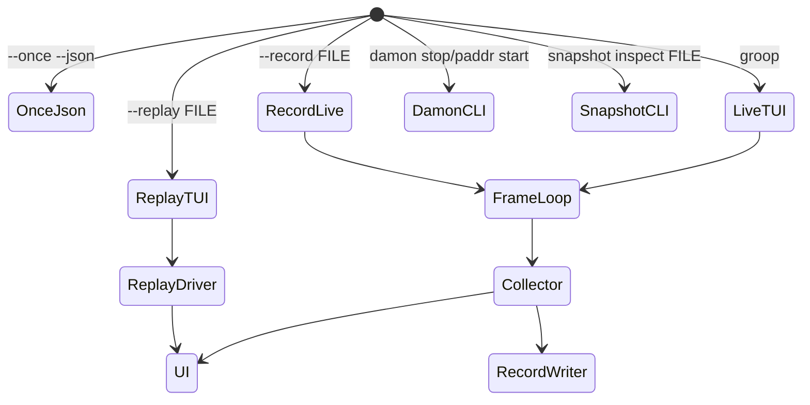
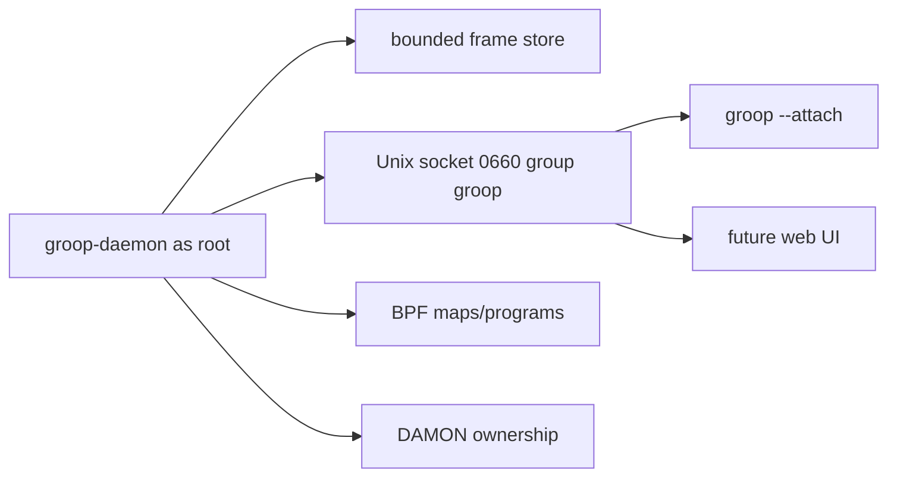

# groop Architecture

`groop` is split around a stable frame contract: collectors and providers create
`Frame` objects, record/replay preserves them, and the UI renders them. Textual
is intentionally isolated under `src/groop/ui/`.

## Dataflow

```mermaid
flowchart LR
    Cgroup[cgroup v2 files] --> Collector
    Proc[/proc] --> Collector
    Zram[ZRAM sysfs + /proc/swaps] --> Collector
    Docker[Docker inspect] --> Collector
    Systemd[systemctl show] --> Drift
    NetHost[host network provider] --> Collector
    Netns[netns provider] --> Collector
    Damon[DAMON sysfs] --> DamonPassive

    Collector --> Frame[Frame model]
    DamonPassive --> Frame
    Drift --> Frame
    Diag[Diagnostics] --> Frame

    Frame --> Record[RecordWriter JSONL/zstd]
    Record --> Replay[RecordReader/ReplayDriver]
    Replay --> UI
    Frame --> UI[Textual UI]
    Frame --> Snapshot[Incident snapshot bundle]
```

## Module Map

| Module | Role |
|---|---|
| `model.py` | Dataclasses and canonical JSON serialization. |
| `registry.py` | Metric definitions, source semantics, help/glossary source. |
| `config.py` | TOML parsing and defaults. |
| `collect/` | cgroup, host, docker, process, and collector orchestration. |
| `providers/` | Network provider abstraction and current host/netns providers. |
| `drift/` | systemd/live-origin classification and governance drift. |
| `diag/` | pressure score and findings rules. |
| `damon/` | passive DAMON parsing plus controlled vaddr/paddr session APIs. |
| `record/` | live stream, JSONL reader/writer, replay, and history ring. |
| `snapshot/` | incident bundle creation and inspection. |
| `daemon/` | Read-only Unix-socket frame broker spike. |
| `ui/` | Textual app, banner, table/tree, drill-down, host-memory status, keys. |

## Layering Rules

- `ui/` is the only package allowed to import Textual.
- `--once --json` must work without importing Textual.
- Frame serialization must go through `model.py`.
- Metrics emitted into frames must exist in `registry.py`.
- Kernel/docker/systemd read failures become source-labelled degraded values or
  metadata, not crashes or fabricated zeroes.
- Host compressed-swap backend classification belongs in `collect/host.py` or a
  small helper under `collect/`; per-cgroup ZRAM compression attribution is not
  available from current kernel files, so cgroup rows must remain source-labelled
  estimates on zram/mixed hosts.
- Mutating DAMON control paths require root, explicit confirmation, ownership
  markers, and audit logs.

## Runtime Modes



## Future Daemon Boundary

P16 adds the first daemon spike: `groop daemon serve --socket PATH` runs a
read-only Unix-socket broker around the same frame model. A client sends one
JSON object per connection:

```json
{"op":"current"}
{"op":"stream","limit":3}
```

Responses are JSON lines: zero or more `{"type":"frame","frame":...}` objects
using canonical `Frame` JSON, followed by `{"type":"end","count":N}`. Unknown
operations return `{"type":"error",...}`. There is deliberately no file-read,
command-execution, or mutation verb.

Default socket permission is `0660`; deployment should place the socket under a
root-owned runtime directory such as `/run/groop/groop.sock` with a dedicated
`groop` group. The daemon may run as root to read root-only sources, but clients
receive only the daemon-approved frame stream.

A future attached client should see the same stream shape as standalone live
mode, with the transport changing from in-process iterator to Unix socket.



## Contract Pressure Points

- A future `EntityFrame.diagnostics` block could preserve exact pressure
  breakdowns instead of recomputing them in UI.
- `NetSample` may need optional traffic-class metadata from `[net.classes]`.
- Daemon frames may need sensitivity metadata for fields exposed to non-root
  clients. Prefer additive metadata over changing metric compact forms.
