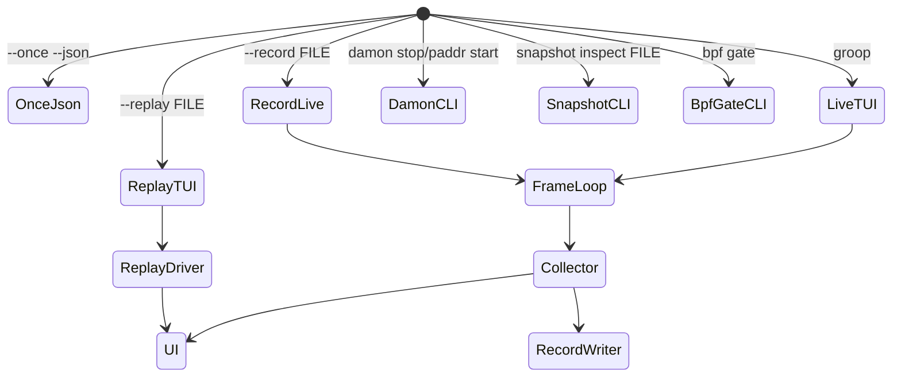
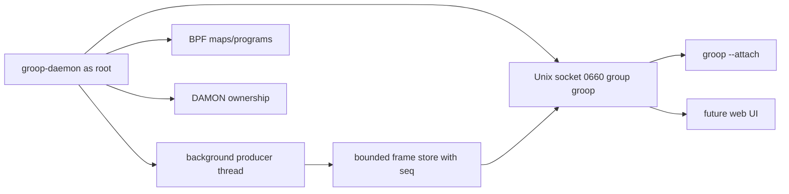

# groop Architecture

`groop` is split around a stable frame contract: collectors and providers create
`Frame` objects, record/replay preserves them, and the UI renders them. Textual
is intentionally isolated under `src/groop/ui/`.

## Dataflow

```mermaid
flowchart LR
    Cgroup[cgroup v2 files] --> Collector
    Proc[/proc] --> Collector
    Zram[ZRAM sysfs + /proc/swaps] --> Collector
    Gpu[DRM sysfs /sys/class/drm] --> Collector
    Docker[Docker inspect] --> Collector
    DockerLabels[Docker Config.Labels] --> CiuDetect[CIU detection]
    CiuDetect --> Collector
    Systemd[systemctl show] --> Drift
    NetHost[host network provider] --> Collector
    Netns[netns provider] --> Collector
    BpfGate[BPF gate CLI] --> NetHost
    Damon[DAMON sysfs] --> DamonPassive

    Collector --> Frame[Frame model]
    DamonPassive --> Frame
    Drift --> Frame
    Diag[Diagnostics] --> Frame

    Frame --> Record[RecordWriter JSONL/zstd]
    Record --> Replay[RecordReader/ReplayDriver]
    Record --> Report[groop report steady-state profile]
    Replay --> UI
    Frame --> UI[Textual UI]
    Frame --> Snapshot[Incident snapshot bundle]
```

## Module Map

| Module | Role |
|---|---|
| `model.py` | Dataclasses and canonical JSON serialization. |
| `registry.py` | Metric definitions, source semantics, help/glossary source. |
| `config.py` | TOML parsing and defaults. |
<<<<<<< HEAD
| `collect/` | cgroup, host (including ZFS ARC and GPU DRM), docker, process, and collector orchestration. |
=======
| `collect/` | cgroup, host (including ZFS ARC), docker (including CIU stack metadata detection), process, and collector orchestration. |
>>>>>>> feat/groop-p76-ciu-stack-metadata
| `providers/` | Network provider abstraction and current host/netns providers. |
| `drift/` | systemd/live-origin classification and governance drift. |
| `diag/` | pressure score and findings rules. |
| `damon/` | passive DAMON parsing plus controlled vaddr/paddr session APIs. |
| `record/` | live stream, JSONL reader/writer, replay, and history ring. |
| `snapshot/` | incident bundle creation and inspection. |
| `daemon/` | Request-independent Unix-socket frame broker with background producer, bounded sequenced history, non-consuming fan-out, lifecycle (P51), and a versioned, bounded, peer-aware read API envelope with typed errors, sensitivity metadata, peer credentials, and proven resource bounds (P52). |
| `bpf_gate.py` | Safe no-op BPF preflight and baseline measurement helper. |
| `report.py` | Read-only steady-state profile computation from a P2-format recording: per-entity/per-slice p50/p95/max for key memory/PSI gauges plus derived rates. |
| `actions/` | Immutable action previews and one private, audit-first execution chain for catalog, governance, kill, and update verbs. Verb-specific gates are ordered pre-audit gates except documented post-audit revalidation required to preserve an existing audit trail. |
| `ui/` | Textual app, banner, table/tree, drill-down, host-memory status, keys. |

## Layering Rules

- `ui/` is the only package allowed to import Textual.
- `--once --json` must work without importing Textual.
- Frame serialization must go through `model.py`.
- Metrics emitted into frames must exist in `registry.py`.
- Kernel/docker/systemd read failures become source-labelled degraded values or
  metadata, not crashes or fabricated zeroes.
- Host compressed-swap backend classification belongs in `collect/host.py` or a
  small helper under `collect/`; per-cgroup ZRAM compression attribution is not
  available from current kernel files, so cgroup rows must remain source-labelled
  estimates on zram/mixed hosts.
- Mutating DAMON control paths require root, explicit confirmation, ownership
  markers, and audit logs.

## Runtime Modes



## Future Daemon Boundary

P51 introduces a request-independent background producer: the daemon starts a
producer thread before serving requests and stops it deterministically after the
server closes. `current` returns the latest published frame; `stream` reads from
published history with optional sequence/cursor. Multiple concurrent clients
observe the same sequence without accelerating, consuming, or starving each
other.

P52 adds a versioned, bounded, peer-aware read API envelope over the P51
broker. Requests carrying a `v` field are dispatched through `DaemonApi`
(single-line envelope response with `id` echo, typed error codes, sensitivity
metadata, and peer credentials). Requests without `v` flow through the P51
multi-line protocol unchanged. `SO_PEERCRED` is observed at accept time; an
injectable authorization hook may deny with a typed error.



## Contract Pressure Points

- A future `EntityFrame.diagnostics` block could preserve exact pressure
  breakdowns instead of recomputing them in UI.
- `NetSample` may need optional traffic-class metadata from `[net.classes]`.
- Daemon frames carry sensitivity metadata (closed enum: public,
  operational, sensitive) in `metrics_meta` for non-root consumers; the
  metric compact form is unchanged.
