# groop Roadmap

This roadmap turns completed handoff findings and `TUI-SPEC.md` into the next
engineering slices. It is intentionally ordered for low regret: stabilize and
measure the current product before adding privileged infrastructure.

## Direction

1. **Close safety boundaries before adding actions.** P81 redaction, P87 owner
   refusal and P93 owner routing precede new externally reachable or mutating
   surfaces.
2. **Build one bounded query/history core.** CLI, TUI, MCP and web consume the
   same registry-backed semantics, projections, coverage, gaps and resets.
3. **Make source, cost and permission visible.** Daemon/local fallback,
   persistence, process coverage and detail-provider leases never hide
   degradation or warm-up.
4. **Optimize for named operator investigations.** Process, per-CPU, lifecycle,
   device and incident work is admitted by `docs/OPERATOR-QUESTIONS.md`, not by
   provider novelty.
5. **Keep root-owned state in the daemon and owner actions with the owner.** The
   TUI/browser remain clients; unsupported or ambiguous lifecycle ownership is
   a typed refusal, never a raw-runtime fallback.

## Operator-console product convergence — 2026-07-15

The **operator-console** milestone must optimize for a coherent operator product
rather than continuing provider breadth. Historical v0/v1/v1.5/v2/v3 labels
are capability eras; package SemVer is assigned independently. Accepted
direction and all closed product calls are in
`TUI-SPEC.md` §0.2 and `docs/DECISIONS-INBOX.md`; the measurable use-case set is
`docs/OPERATOR-QUESTIONS.md`.

Recommended dependency order:

1. Reconcile documentation/current-state authority and close the product calls
   that alter public contracts.
2. Build one frame query engine over recordings and daemon history, with
   gauge/rate/delta/integral semantics and explicit coverage/gap/reset metadata.
3. Make zero-argument source auto-selection and daemon backfill visible and
   testable; add daemon storage/status telemetry.
4. Separate projection, visibility, and profile; preserve sibling-local tree
   sorting, permit only approved subtree aggregates, and make any global rank
   an explicit flat projection with labelled scope. Add separately provenanced
   policy/tags without changing observed identity, totals or authorization.
5. Add the bounded process model/projection. Candidate selection is the union
   of CPU-hot, I/O-hot, selected/pinned and recently-hot processes, using cheap
   broad counter baselines plus bounded expensive enrichment and history. Cover
   `pidstat`-class CPU, faults, I/O and context switches plus
   cgroup/container/CIU ownership. Implement D-019's configurable 20+20/16/
   60-second/hard-64 defaults, validation and coverage telemetry.
6. Add `mpstat`-class per-CPU history and imbalance findings plus cheap routine
   host-capacity gaps from D-010: mount byte/inode/read-only state and host PID/
   file-table pressure.
7. Add D-009's visible, expiring detail-observation leases, then bounded
   listener/file-descriptor/blocked-process ownership. Safe detail providers may
   auto-lease; privileged providers require explicit manual activation.
8. Add lifecycle facts, stable workload/incarnation identity, derived Previous
   instance/Recent exit links, and bounded findings-driven event/log evidence.
9. Add persistent daemon history only with simultaneous age/byte caps,
   measured write amplification, corruption recovery, permissions, and
   observable coverage.
10. Re-carve the React web surface to D-003/D-011's accepted same-origin,
   projected-history, redaction, and executable frontend-test contracts; dispatch
   only with D-002's trusted-operator loopback-token boundary and after
   P81/shared-query prerequisites are explicit. SSH/tunnel lifecycle remains
   outside Groop. Implement D-018's Overview/Explore/Entity/Incidents routes,
   persistent observation status, truthful visual semantics and bounded three-
   entity comparison instead of a free-form dashboard.
11. Run D-010's versioned sysadmin/DevOps scenario suite as the release oracle;
    close projection/provider gaps without cloning unbounded specialist tools.
12. Broaden BPF/socket/device/GPU providers only when a named operator scenario
    cannot be satisfied by the preceding work.

P73/P77 were re-carved on 2026-07-15 to the accepted D-002/D-003/D-011/D-018
contracts and are intentionally dependency-blocked. Do not implement a second
aggregation engine in MCP, HTTP, or the browser.

Lifecycle mutation remains a separate safety track under decided D-016. Its
urgent P87 stopgap first closes the full-ID protected-service bypass and refuses
raw Docker mutations for recognized owner-managed workloads. P93 then freezes
and fixture-tests `docs/LIFECYCLE-ADAPTERS.md`'s owner-chain protocol and migrates
existing actions; it may not grow Docker into a generic recreate fallback.
Finish systemd/Compose/CIU/Wings routing before scenario-driven Podman/Quadlet
and later adapters.

### Executable frontier

| Order | Packages | Dispatch rule |
|---|---|---|
| 1 | ~~P81, P87, P66, P86~~ | **Merged 2026-07-15** (frontier-reviewed, review-fixed, validated from `main`). |
| 2 | ~~P88~~ | **Merged 2026-07-15** (three review-fixes: integral pairing, raw row cap, eviction inversion). |
| 3 | **P89**, **P90**, **P91** | The current frontier. Parallel after P88: visible source/backfill, CPU+I/O process union, and capped persistence. |
| 4 | **P93**, **P94** | Owner-chain protocol after P87; shared detail leases/providers after P88/P90. These tracks are independent. |
| 5 | **P92**, **P95** | Web transport after P66/P81/P88/P91; lifecycle identity/incidents after P88/P91/P93. |
| 6 | **P73** | After P89/P92; React Overview and Explore. |
| 7 | **P77** | After P73/P90/P91/P94/P95; Entity, Incidents and three-entity Compare. |
| Later | P64/P65 | Optional informational baseline and text rendering after P88; not release blockers. |

P68 (full-frame subscribe), P80 (install execution from a non-executable P25
plan) and P82 (superseded red-gate repair) were deleted. Their old branches are
not merge candidates; see `docs/BRANCH-DISPOSITION.md`.

## Proposed Slices

```mermaid
flowchart TD
    P12[P12 v1/v1.5 acceptance + packaging] --> P13[P13 UI navigation + replay polish]
    P12 --> P14[P14 DAMON modal + live-root acceptance]
    P13 --> P15[P15 snapshot enrichment]
    P12 --> P19[P19 ZRAM + swap backend awareness]
    P19 --> P16[P16 daemon read broker for non-root full reads]
    P14 --> P16
    P16 --> P17[P17 BPF provider measurement gate]
    P17 --> P18[P18 BPF provider implementation]
    P16 --> P20[P20 daemon attach mode]
    P20 --> P22[P22 daemon deployment preflight]
    P22 --> P25[P25 daemon install plan]
    P13 --> P21[P21 v2 action gating skeleton]
    P19 --> P23[P23 ZRAM per-device drill-down]
    P13 --> P24[P24 Replay timestamp jump controls]
    P15 --> P26[P26 Snapshot progress UI]
    P19 --> P27[P27 Swap/refault terminology aliases]
    P6 --> P28[P28 I/O cap saturation]
    P21 --> P29[P29 Inspect-files safety skeleton]
    P20 --> P30[P30 Daemon default client UX]
    P30 --> P31[P31 Daemon client error guidance]
    P31 --> P32[P32 Daemon status command]
    P12 --> P33[P33 Release smoke harness]
    P33 --> P35[P35 Acceptance steady harness]
    P13 --> P34[P34 Host device banner]
    P13 --> P36[P36 CPU sparkline surface]
    P34 --> P37[P37 Network loss diagnostics]
    P35 --> P38[P38 TUI smoke evidence]
    P38 --> P39[P39 Release readiness ledger]
    P39 --> P40[P40 Textual 8 compat]
    P40 --> P41[P41 Rendered replay fidelity]
    P18 --> P42[P42 Daemon BPF snapshot bridge]
    P40 --> P43[P43 Current Textual baseline]
    P14 --> P44[P44 Daemon paddr lifecycle]
    P29 --> P45[P45 Bounded inspect content]
    P21 --> P46[P46 Admin execution kernel]
    P44 --> P47[P47 Daemon component health]:::done
    P45 --> P48[P48 Journald snapshot :done:]
    P46 --> P49[P49 memory.high governance]:::done
    P43 -.-> P50[P50 Mouse table interactions :done:]
    P16 --> P51[P51 Daemon sampling fanout]
    P47 --> P52[P52 Versioned read API]
    P51 --> P52
    P2[P2 Record/replay/history ring] --> P53[P53 Headless record driver]
    P2 --> P54[P54 Steady-state report]
    P53 --> P54
    P2 --> P55[P55 Collector entity/metric filtering]
    P46 --> P56[P56 groop squeeze :done:]
    P16 --> P57[P57 Docker-name entity selectors :done:]
    P52 --> P58[P58 Daemon MCP frontend]
    P57 --> P59[P59 --container entity selector :done:]
    P55 --> P59
    P55 --> P60[P60 free-form --metrics list :done:]
    P54 --> P61[P61 report threshold gating :done:]
    P54 --> P62[P62 report steady-state auto-detect :done:]
    P61 -.-> P62
    P88 --> P64[P64 informational baseline comparison]
    P88 --> P65[P65 query/report table rendering]
    P62 --> P70[P70 detector performance :done:]
    P63[P63 Daemon client versioned read methods :done:] --> P66[P66 Daemon client versioned health]
    P63 --> P67[P67 Versioned read HTTP/WebSocket gateway]
    P52 --> P67
    P69[P69 Web UI scoping + analysis :done:] -.-> P67
    P3 --> P71[P71 ZFS ARC host provider :done:]
    P71 --> P74[P74 GPU host provider :done:]
    P46 --> P72[P72 Admin action kill/update verbs :done:]
    P49 --> P72
    P58[P58 Daemon MCP frontend :done:] --> P75[P75 MCP live acceptance leg :done:]
    P57 --> P76[P76 CIU stack metadata]
    P72 --> P78[P78 Action kernel gate-chain extraction]
    P54 --> P79[P79 Corrupt recording inputs are typed errors]
    P72 --> P87[P87 Docker owner/action safety]
    P54 --> P88[P88 Unified frame query core]
    P63 --> P88
    P88 --> P89[P89 Source auto + backfill]
    P88 --> P90[P90 CPU + IO process projection]
    P88 --> P91[P91 Persistent capped history]
    P87 --> P93[P93 Lifecycle owner protocol]
    P90 --> P94[P94 Detail observation leases]
    P88 --> P94
    P91 --> P95[P95 Lifecycle identity + incidents]
    P93 --> P95
    P88 --> P95
    P66 --> P92[P92 Loopback web transport]
    P81[P81 Shared redaction] --> P92
    P88 --> P92
    P91 --> P92
    P89 --> P73[P73 Overview + Explore]
    P92 --> P73
    P73 --> P77[P77 Entity + Incidents + Compare]
    P90 --> P77
    P91 --> P77
    P94 --> P77
    P95 --> P77
```

P69 was the historical **scoping** package for the web-UI goal, not the UI
itself. Its questions are now closed; D-001 through D-019 and P88/P92/P73/P77
supersede its draft successors. The dashed edge remains only as package-history
provenance.

P61 and P62 are the carved successors of the P54 steady-state-report slice,
both consumers P54 explicitly deferred: P61 (done) adds `--assert GROUP:METRIC:STAT`
pass/fail threshold gating (exit 1 on breach) over the already-computed profile
without recomputing it; P62 adds `--window auto` steady-state detection via a
pinned coefficient-of-variation criterion. Both consume `compute_profile`
rather than changing it, are fixture-testable, and share `cli.py`
`parse_report_args` + `report.py`, so they carry `Serialize-with:` each other.
P61 is flash-high; P62 is terra-med because its stability criterion is a design
decision that must be pinned to a deterministic oracle.

P64 and P65 remain low-priority P88 consumers. P64 is an optional informational
baseline comparison and is not part of release certification (D-007). P65
renders canonical P88/query figures, coverage and typed value states without
recomputation. Both are dependency-blocked on P88.

P59 (done) wires P57's `--container` resolver into P55's collection-path
`--entities`/`--slice` selectors (deferred by P57 while P55 was unmerged). P60
(done) generalizes P55's `--metrics full|compact` enum into an open
registry-validated field/family list. Both are flash-high, fixture-testable, and
share `src/groop/cli.py` argument parsing, so they carry `Serialize-with:`
each other.

## Remaining Estimate

After P43, the roadmap is mostly in three buckets:

| Bucket | Estimated packages | Notes |
|---|---:|---|
| v1/v1.5 release confidence and UI polish | 0 | P43 removes the obsolete Textual `<1` resolver ceiling and closes the last planned v1/v1.5 release-confidence package. Manual live-host acceptance evidence remains. |
| Privileged daemon/admin work | safety track carved | P46/P72/P78 provide the existing kernel/verbs. P87 closes the immediate owner/protected-ID gap; P93 defines owner routing. The contradictory P80 install-execution carve was deleted pending a normalized executable plan/rollback contract. Live BPF remains scenario- and measurement-gated. |
| Optional plugins / future surfaces | scenario-driven | P71 ZFS ARC, P74 host GPU facts, P76 CIU metadata, and P83 CIU grouping are implemented. CIU-gated actions and per-process/container GPU remain optional. New providers are admitted only for a named `docs/OPERATOR-QUESTIONS.md` gap. |

### P69 — Web UI over daemon API (product-goal-driven)

Standing priority set by the user (2026-07-13): a browser-based frontend over
the daemon's read surface rather than direct daemon-socket access. P67 and the
P69 scoping analysis
are merged. P92 now owns the accepted loopback capability-token, same-origin,
projected-query and PWMCP boundary; P94/P95 own detail observation and lifecycle
facts; revised P73/P77 own the four product routes. All remain intentionally
dependency-blocked by the executable frontier above.

**Carved 2026-07-13** as `handoff/P69-web-ui-scoping.md` (product-goal-driven,
sonnet5-high, docs-only). It produces `docs/WEB-UI-SCOPING.md` — read-surface gap
analysis with `file:line` citations, page inventory grounded in the existing TUI
surfaces and sized against real frame bytes, sensitivity/redaction UX against the
CONTRACTS §10 enum, the trust-boundary verdict on P67's handoff (a listening HTTP
port is a real change to the v1 socket-only boundary), and a framework
recommendation with its packaging consequence — plus draft handoff headers for the
implementation packages and `DECISIONS-INBOX.md` entries for the product calls
(framework, auth posture, v2-tag scope). It touches no source, so it can run now,
in parallel with P67, and its verdict on P67's handoff lands *before* P67 is
dispatched.

**Standing decisions (closed 2026-07-15): React, same-origin Groop hosting,
capability-token loopback auth and PWMCP browser gates.** Groop now owns a pinned
PWMCP 1.61.0-r6 consumer deployment in `groop/pwmcp`; CIU 4.6.0 starts it on a
dedicated internal network plus the workspace consumer network with no published
ports. Production Groop remains loopback-only. A browser fixture may bind to the
consumer network only in tests and must retain the token and every production
security check. SSH connection and port forwarding are supplied by the system
and operator.

**P69 successor disposition.** P67 remains useful typed read-gateway code but
its proxy-principal auth is provisional. P92 replaces that boundary and adds
bounded P88 routes plus the browser fixture. P73 is revised to Overview/Explore;
P77 is revised to Entity/Incidents/Compare. P68 was deleted: polling projected
queries is accepted initially, and a full-frame subscription would encode the
wrong API. Any later push transport must carry the same bounded query results.

### P75-P77 - Historical carve, reconciled 2026-07-15

Three packages, one per carve source, per controller-workflow-v2 §8:

- **P75 - MCP live-daemon acceptance leg** (*review-derived*, from P58's pass #2, **done**).
  P58 merged with an evidence gap its own REPORT states: every test drives an
  injected fake client, so nothing had ever run `groop mcp serve` against a real
  daemon. P75 now adds an `mcp-smoke` leg to `groop.acceptance` on the P33/P35/P38
  pattern, recording the largest observed live response against the 4 MiB cap
  rather than merely asserting it fits.
- **P76 - CIU stack metadata** (*roadmap-driven*, Optional-plugins bucket — implemented). The
  bucket's last un-carved item. Not a cold carve: TUI-SPEC §4.3 already specifies
  detection, the label schema, and the numeric-phase rule, and it extends a
  `Config.Labels` parse `dockerjoin` already performs. The TUI-grouping and
  ciu-gated-action successors remain as the bucket's residue.
- **P77 - Web Entity, Incidents and Compare** was rewritten around P88/P90/P91,
  shared redaction, detail leases, lifecycle evidence and the three-entity cap.

### P81-P83 - Historical carve, reconciled 2026-07-15

Three packages, blended per controller-workflow-v2 §8:

- **P81 - Redaction: one enforcement point, no bypass** (*review-derived*, from
  P67's pass #2). Two read frontends -- the P67 HTTP gateway and the P58 MCP
  server -- now enforce the same `Sensitivity` ceiling independently, in two
  different marker dialects, and both redact only `metrics` while `findings[]`
  ships free-text messages that can carry the very values the ceiling exists to
  hide. Latent today (no current rule interpolates a sensitive value into a
  message), which is luck and a small rule set rather than a boundary.
- **P82** is superseded by merged P79/P84 and was deleted. Its feature branch is
  explicitly rejected in `docs/BRANCH-DISPOSITION.md`.
- **P83 - CIU stack grouping in the TUI** (*roadmap-driven*, the Optional-plugins
  bucket residue named directly above). P76 shipped detection only; this is its
  first real consumer. The carve names the numeric-phase trap explicitly, because
  P76's own grouping "oracles" grouped and sorted with lambdas defined inside the
  tests and so passed against an implementation that did not exist.

The historical v1/v1.5 release-confidence work remains complete apart from
live-host evidence. The operator-console milestone is governed by the concrete
frontier table above and D-010's versioned scenario oracle, not an old package
count estimate.

## Near Term

### P44 - Daemon-Owned paddr Lifecycle

Status: done. Explicit `[damon] paddr_enabled = true` makes the root daemon
start or adopt one audited whole-host paddr session. Sessions created by the
current daemon run stop with it; verified adopted sessions remain persistent.
The default remains disabled and foreign sessions remain untouched.

Handoff: `handoff/P44-daemon-paddr-lifecycle.md`.
Report: `handoff/reports/P44-REPORT.md`.

### P45 - Bounded Inspect-Files Content Reads

Status: done. Extends P29 with gated, confined, bounded regular-file reads for
resolved Docker JSON logs and cgroup files, without arbitrary paths,
subprocesses, special files, or mutation. Uses no-follow opens, stat-verified
regular-file checks, descriptor-relative confinement, and bounded UTF-8
payload byte/line limits. CLI: ``groop inspect-files read --kind --target --inspect-files --admin [--json] [--max-bytes] [--max-lines]``.

Handoff: `handoff/P45-inspect-files-bounded-content.md`.

### P46 - Admin Action Execution Kernel

Status: done. Executes only Docker/systemd start, stop, and restart plans
behind root, `--admin`, typed confirmation, strict target validation, durable
audit, argv-only execution, and bounded results. Kill, update,
TUI actions, and daemon RPCs remain later packages.

Handoff: `handoff/P46-admin-action-execution-kernel.md`.

### P47-P49 - Stream Follow-Ups

P47 (Daemon Component Health) — status: **done**.
Implements a thread-safe component health registry, a read-only ``health``
protocol operation, and ``groop daemon health [--json]`` CLI. Models truthful,
bounded collector/BPF/paddr transitions and strictly validates `health-v1`.
See ``handoff/reports/P47-REPORT.md``.

P48 adds bounded journald inspection via fixed absolute
``/usr/bin/journalctl`` argv, completing the three-kind inspect-files
content surface. Status: **done**. P49 is **done**: structured
``memory.high`` governance through systemd via the P46 execution kernel.

Handoffs: `handoff/P48-inspect-files-journal-snapshot.md`,
`handoff/P49-systemd-memory-governance.md`.
Reports: `handoff/reports/P48-REPORT.md`, `handoff/reports/P49-REPORT.md`.

### P50 - Mouse Table Interactions

Status: done. The entity table uses a Textual-native interactive surface
so header clicks sort/toggle direction and row clicks open drill-down, while
retaining keyboard navigation and P41 formatted-cell fidelity.

Handoff: `handoff/P50-mouse-table-interactions.md`.

### P51-P52 - Daemon Read Prerequisites

P51 status: done. One request-independent producer now supplies fresh current
frames and bounded sequenced history with cursor/gap semantics, deterministic
production shutdown, strict request bounds, and P47 collector health.

P52 status: done. Adds a versioned, bounded, peer-aware read API envelope
over the P51 broker: `hello`/negotiate, typed error codes, sensitivity
metadata, `SO_PEERCRED` peer identity, an injectable authorization hook, and
proven resource bounds. Legacy clients without a `v` field are served
unchanged. P58 (MCP frontend) is the first separate consumer.

Handoffs: `handoff/P51-daemon-sampling-fanout.md` and
`handoff/P52-versioned-daemon-read-api.md`.

### P58 - Daemon MCP Frontend

Status: done. `groop mcp serve` supplies the first separate frontend over the
P52 API via P63's typed client: exactly four bounded, read-only stdio MCP
tools for daemon health, ranked overview, entity detail, and one-metric
history. The optional `groop[mcp]` extra is isolated from ordinary CLI paths;
P57 docker selectors, P52 sensitivity redaction, typed safe errors, and the
enforced 4 MiB result cap are part of the frontend contract.

Handoff: `handoff/P58-daemon-mcp-frontend.md`.

### P53-P54 - Headless Recording And Steady-State Report

Both queued, spec-only (no implementation yet). They build on the existing P2
`RecordWriter`/JSONL(.zst) format and frame stream, not a new schema.

P53 adds `groop --record FILE --headless [--interval N] [--duration S |
--frames K]`: drives the existing collector loop and `RecordWriter` without a
`textual` import, with clean SIGINT/SIGTERM finalization. Because a headless
process keeps the collector's raw counters live across consecutive in-process
sweeps, its `_per_s` fields are populated from frame 1 onward — unlike an
externally looped `groop --once`, where every frame is cold and consumers
must derive rates themselves from the embedded raw counters.

P54 adds `groop report FILE [--window last:Ns|all] [--group-by
slice|entity] --json`: reads a P2-format recording (headless or looped
`--once`) and computes per-entity/per-slice p50/p95/max for key gauges (ram,
anon, z_pool, z_eq, swap_disk, psi_* avg10 fields), deriving `_per_s` rates
from embedded raw counters when the recorded live rate is `None`. This is the
"steady-state profile" consumer for the gstammtisch stack measurement
program (`scripts/gstammtisch-guide/plan-stack-resource-tuning.md` PKG-3).
Steady-state window auto-detection is explicitly out of scope for v1.

Handoffs: `handoff/P53-headless-record-driver.md` and
`handoff/P54-steady-state-report.md`.

### P55-P57 - Collector Filtering, Guided Squeeze, And Docker-Name Selectors

P55 adds `--entities GLOB`/`--slice NAME` entity selectors and a `--metrics
compact` gauge-family subset at the `Collector`/`walk_entities` level, so
excluded entities are never read from sysfs, not just pruned from output.
Applies to `--once` today and to any recording path (existing TUI-driven
`--record`, and P53's headless mode once that exists) since both share the
same `Collector`. Extracted from P53's "Amendment 2026-07-10" so the two can
be built in parallel; cites P53's live numbers (a full frame is ~447 KB
across 89 entities) as motivation for scoping a recording to one tier.

Status: **done**.

Handoff: `handoff/P55-collector-entity-metric-filtering.md`.
Report: `handoff/reports/P55-REPORT.md`.

P56 is **done**. ``groop squeeze --target CGROUP_PATH --admin --confirm SQUEEZE``
is a guided, stepped ``memory.high`` working-set measurement that absorbs the
workflow proven live by
``scripts/gstammtisch-guide/files/usr/local/sbin/container-mempress.sh`` into
groop natively, gated through the existing P21/P46 admin action posture
(root, ``--admin``, typed confirmation, per-session audit) with direct cgroupfs
writes, a P2-compatible JSONL log, mandatory ``memory.high`` restore on
exit/``SIGINT``, and 31 focused tests.

Live validation on gstammtisch 2026-07-10 found a warm boundary ≈ 1.8 GB
(refaults 375/s at 1536M) and a hot floor ≈ 1.5 GB (5810 refaults/s cliff at
1280M) via two stratified runs. The two-run stratification pattern (warm
boundary first, then tighter hot floor) is documented as recommended operator
guidance in OPERATIONS.md.

P57 remains queued, spec-only (no implementation yet). P57 adds

P57 adds `--container NAME_OR_PREFIX`, resolved via the existing docker
metadata join (`src/groop/collect/dockerjoin.py`) that the collector already
runs every sweep, wherever groop currently takes a raw cgroup-path/entity
identifier (`inspect-files --target`, `action --target`, and P55's
`--entities`/P56's `--target` if/when those land). Small, pure ergonomics.

Handoffs: `handoff/P55-collector-entity-metric-filtering.md`,
`handoff/P56-groop-squeeze.md`, and
`handoff/P57-docker-name-entity-selectors.md`.

### P12 — Release Hardening And Acceptance

Status: done. P12 records full tests, compile, fixture JSON, replay smoke,
package build, wheel install, version, and bounded once/json CPU/RSS evidence.

Remaining release evidence: full 5-minute live TUI CPU/RSS, live DAMON
acceptance, and any future BPF gate measurements.

### P13 — UI Navigation And Replay Polish

Status: done. Tree expand/collapse, replay controls/status, reserved v2 action
messaging, profile warning polish, operations docs, and focused Textual tests
landed in P13.

Remaining UX work: deeper key/profile customization can be carved later if needed.

### P24 - Replay Timestamp Jump Controls

Status: done. P24 adds replay first/last (`home`/`end`) and frame/timestamp jump
prompt (`j`) controls, `ReplayDriver.seek_timestamp()`, compact status/help
lines, and focused tests. The existing pause/step/speed model is preserved.

Handoff: `handoff/P24-replay-timestamp-jump.md`.
Report: `handoff/reports/P24-REPORT.md`.

### P14 — DAMON Control Modal And Live-Root Acceptance

Status: done with a live-root gap. P14 added Textual typed-confirmation modals
for vaddr and paddr, groop-owned cleanup controls, fixture safety tests, and
operations/measurement docs.

Remaining gate: run live-root acceptance on a deliberate test host and record
the results in `MEASUREMENTS.md`. `damon_stat` conflict handling remains
conservative/read-only.

### P15 — Snapshot Enrichment

Status: done. P15 added fresh systemctl/docker metadata collection, richer
inspect output, hash failure reporting, redaction tests, and operations docs.
The snapshot progress gap was closed by P26.

### P26 - Snapshot Progress UI

Status: done. P26 makes TUI snapshot creation visibly running (immediate status
update), guarded against duplicate concurrent starts, and reports success/failure
through the status line without changing bundle contents. Focused tests cover
the progress flag, duplicate-start guard, success path reporting, and handled
exception failure reporting.

Handoff: `handoff/P26-snapshot-progress-ui.md`.
Report: `handoff/reports/P26-REPORT.md`.

### P19 — ZRAM And Swap-Backend Awareness

Status: done with a terminology-alias gap. P19 detects active
zswap/zram/disk/mixed backends, adds host-level ZRAM metrics, corrects banner
wording, and documents the per-cgroup attribution boundary. P23 closed the
per-device drill-down gap.

Aliases landed in P27; canonical keys preserved, backend-aware labels added, diagnostic wording updated.

### P27 - Swap/Refault Terminology Aliases

Status: done. P27 keeps canonical frame keys stable while allowing
clearer `swap_dev`, `rf_dev_per_s`, and `rf_dev` profile/UI aliases and
backend-aware labels/diagnostic wording.

Handoff: `handoff/P27-swap-refault-aliases.md`.
Report: `handoff/reports/P27-REPORT.md`.

### P28 - I/O Cap Saturation

Status: done. P28 populates the existing diagnostics input
`io_cap_saturation_pct` from `io.max` and I/O rate counters, leaving
network-loss attribution as the remaining diagnostics input gap.

Handoff: `handoff/P28-io-cap-saturation.md`.
Report: `handoff/reports/P28-REPORT.md`.

### P29 - Inspect-Files Safety Skeleton

Status: done. P29 adds a disabled-by-default, read-only file/log inspection
planning module (`groop inspect-files plan`) with explicit --inspect-files
and --admin gating, three allowlisted plan kinds (docker-json-log,
systemd-journal, cgroup-files), deterministic JSON/text rendering, path/argv
safety validation, and structural no-subprocess/no-file-read guarantees.

Handoff: `handoff/P29-inspect-files-safety-skeleton.md`.
Report: `handoff/reports/P29-REPORT.md`.

### P30 - Daemon Default Client UX

Status: done. P30 makes `--attach` use the packaged default socket
(`/run/groop/groop.sock`) when no explicit path is given, and adds
`groop daemon current --socket PATH [--pretty-json]` as a read-only one-frame
retrieval command. No install execution, systemd mutation, protocol changes,
or daemon-side privilege changes.

Handoff: `handoff/P30-daemon-default-client.md`.
Report: `handoff/reports/P30-REPORT.md`.

### P31 - Daemon Client Error Guidance

Status: done. P31 adds a shared `_format_daemon_error()` helper that preserves
original error text and adds actionable next steps: preflight/install-plan for
the default socket, preflight --socket for custom sockets, and compatible-daemon
guidance for protocol/response errors. Both `--attach` and `daemon current` use
the same helper.

Handoff: `handoff/P31-daemon-client-error-guidance.md`.
Report: `handoff/reports/P31-REPORT.md`.

### P32 - Daemon Status Command

Status: done. P32 adds a read-only `groop daemon status` command that combines
P22 preflight checks with a P30/P31 current-frame protocol check, so non-root
users can tell whether the default daemon deployment is usable without falling
back to live collection.

Handoff: `handoff/P32-daemon-status-command.md`.
Report: `handoff/reports/P32-REPORT.md`.

### P33 - Release Smoke Harness

Status: done. P33 adds a rootless `python -m groop.acceptance smoke` module for
repeatable safe-path release evidence: one-frame collection, serialization,
optional replay summary, wall/CPU/RSS measurement, and paste-friendly JSON/text
output.

Handoff: `handoff/P33-release-smoke-harness.md`.
Report: `handoff/reports/P33-REPORT.md`.

### P34 - Host Device Banner

Status: done. P34 adds host-level per-device network and block-device rate
summaries to the system banner using `Frame.host_meta`, without claiming
per-cgroup attribution. It intentionally keeps block/network fixture data
deterministic and excludes `loop*`, `ram*`, `zram*`, `veth*`, bridge, docker,
and loopback devices from the banner summary.

Handoff: `handoff/P34-host-device-banner.md`.
Report: `handoff/reports/P34-REPORT.md`.

### P35 - Acceptance Steady Harness

Status: done. P35 extends the P33 acceptance module with a rootless
multi-sample collector loop that records wall/CPU/RSS evidence and optional
threshold checks. This is collector steady-state evidence, not a replacement for
the final live Textual TUI measurement.

Handoff: `handoff/P35-acceptance-steady-harness.md`.
Report: `handoff/reports/P35-REPORT.md`.

### P36 - CPU Sparkline Surface

Status: done. P36 adds stable ASCII CPU trend sparklines using existing
UI history data through a `cpu_trend` virtual table column, improving the quick
trend-read promised by the spec without changing collector/model contracts.

Handoff: `handoff/P36-cpu-sparkline-surface.md`.
Report: `handoff/reports/P36-REPORT.md`.

### P37 - Network Loss Diagnostics

Status: done. P37 adds host/interface-scoped drop/error diagnostics from
`/proc/net/dev`, NET banner LOSS annotations, and a root-entity diagnostic
finding while keeping exact per-cgroup attribution reserved for v2 BPF/daemon
work.

Handoff: `handoff/P37-network-loss-diagnostics.md`.
Report: `handoff/reports/P37-REPORT.md`.

### P38 - TUI Smoke Evidence Harness

Status: done. P38 adds a rootless `python -m groop.acceptance tui-smoke`
command that exercises the existing Textual `--ui-smoke` path in a child
process, records wall/CPU/RSS evidence, and preserves the acceptance module's
no-Textual-import-on-import contract.

Handoff: `handoff/P38-tui-smoke-evidence.md`.
Report: `handoff/reports/P38-REPORT.md`.

### P39 - Release Readiness Ledger

Status: done. P39 adds a canonical release-readiness document mapping
`TUI-SPEC.md` §9 gates to tests, acceptance commands, measurements, and
remaining manual live-host evidence. This is the last planned v1/v1.5 release
confidence package before manual live-host evidence capture.

Handoff: `handoff/P39-release-readiness-ledger.md`.
Report: `handoff/reports/P39-REPORT.md`.

### P40 - Textual 8 Test Compatibility

Status: done. P40 replaces direct dependence on the removed `Static.renderable`
attribute with a version-compatible `_static_text()` helper using the public
`Static.render()` method. All 23 UI
tests pass under Textual 8.2.8 / Python 3.14 without weakening behavior
assertions or adding version skips/xfails.

Handoff: `handoff/P40-textual-8-test-compatibility.md`.
Report: `handoff/reports/P40-REPORT.md`.

### P41 - Rendered Replay Fidelity

Status: done. P41 closes spec section 9 item 10 with a multi-tick
record/replay test comparing production-formatted row keys, columns, and plain
cell text at a fixed profile and width through `ReplayDriver`. JSONL is always
covered; compressed JSONL runs when the optional zstandard dependency exists.

Handoff: `handoff/P41-rendered-replay-fidelity.md`.
Report: `handoff/reports/P41-REPORT.md`.

### P43 - Current Textual Dependency Baseline

Status: done. P43 replaces the historical pre-1.0 dependency range (`>=0.58,<1`)
with a current Textual 8.2.8-or-newer baseline (`textual>=8.2.8`) with no
artificial upper ceiling. Source metadata and built-wheel METADATA both declare
`Requires-Dist: textual>=8.2.8`. A clean resolver installation in an isolated
venv selects Textual 8.2.8 or newer. The packaging-metadata regression test
suite (`test_packaging_metadata.py`) proves the lower bound and absence of an
upper cap by reading pyproject.toml; the wheel test is verified against the
built artifact.

The full suite, UI tests, acceptance tests, replay smoke, P38 TUI smoke, and
`py_compile` all pass in the resolved environment. The historical P40 evidence
of `textual>=0.58,<1` is preserved and clearly marked as superseded.

Handoff: `handoff/P43-textual-current-baseline.md`.
Report: `handoff/reports/P43-REPORT.md`.

### P23 - ZRAM Per-Device Drill-Down

Status: done. P23 preserves per-device zram state as structured host-level frame
metadata (`Frame.host_meta["zram_devices"]`) and renders it in the host-memory
surface. It does not claim per-cgroup zram compression or physical-memory
attribution, because the kernel does not expose those values per cgroup.

Handoff: `handoff/P23-zram-device-drilldown.md`.
Report: `handoff/reports/P23-REPORT.md`.

## Medium Term

### P16 — Daemon Read Broker For Non-Root Full Reads

Status: done as a spike. P16 added a read-only Unix-socket JSON-lines broker,
current/stream protocol, bounded in-memory history, socket tests, and daemon
threat-model docs.

Remaining work: authorization hardening on a real host and any production
packaging beyond the packaged templates plus P25 install plan.

### P17 — BPF Measurement Gate

Status: done. The safe unprivileged measurement helper and design doc landed,
and `MEASUREMENTS.md` now records the live-BPF blocker on this host.

### P18 — BPF Network Provider

Goal: implement exact per-cgroup socket counters behind the existing provider
interface, owned by daemon/helper state rather than by the TUI.

### P42 — Daemon BPF Snapshot Bridge

Status: done. P42 adds ``groop/src/groop/daemon/bpf_snapshot.py`` containing
``BpfSnapshotBridge``, which reads pinned BPF counter maps via
``bpftool --json map dump pinned PATH`` through an argv-only injectable command
runner, decodes P17/P18 logical dimensions, builds ``cgroup_map`` from a
configured cgroup-v2 root, and atomically writes the P18 ``snapshot.json``
contract. Path confinement, output bounds, last-good preservation, and
non-world-writable permissions are enforced. The bridge integrates into
``groop daemon serve`` via ``--bpf-root``/``--bpf-interval`` (disabled by
default) and ``[bpf_snapshot]`` config section. The controller-validated gate is
48 focused tests and 431 passing full-suite tests plus one optional skip. BPF
program compilation and privileged attach/pin/detach lifecycle remain future
work.

Handoff: `handoff/P42-daemon-bpf-snapshot-bridge.md`.
Report: `handoff/reports/P42-REPORT.md`.

### P20 — TUI Attach Mode

Status: done. `groop --attach <socket>` now consumes daemon frames over the
P16 socket protocol, preserves the same UI model as standalone live mode, and
supports `--once --json` plus UI smoke.

Handoff: `handoff/P20-daemon-attach-mode.md`.

### P22 — Daemon Deployment Preflight

Status: done. `groop daemon preflight`, packaged systemd/tmpfiles templates,
and the deployment checklist landed for deliberate root-daemon setup with a
group-readable socket.

Handoff: `handoff/P22-daemon-deployment-preflight.md`.

Remaining work: any extra host-specific hardening the operator wants on top of
the read-only socket boundary and P25 install plan.

### P25 - Daemon Deployment Install Plan

Status: done. P25 renders a safe, non-mutating install plan for the
packaged systemd and tmpfiles templates so operators can deploy the root daemon
deliberately and then verify it with P22 preflight.

Handoff: `handoff/P25-daemon-install-plan.md`.
Report: `handoff/reports/P25-REPORT.md`.

## Later

### P21 — Admin Action Gating Skeleton

Status: done. P21 adds disabled-by-default, preview-only admin action planning
with explicit `--admin`, exact argv previews, and optional audit logging,
without executing Docker/systemd commands.

Handoff: `handoff/P21-admin-action-gating-skeleton.md`.

- Real Docker/systemd action execution.
- `systemctl set-property` governance edits.
- Docker/CIU action integration.
- File/log/content inspection behind explicit `--inspect-files`.
- GPU and ZFS optional providers.
- Web UI over daemon API — see P69 (product-goal-driven, promoted from
  "Optional plugins" 2026-07-13).

## Product Decisions

`docs/DECISIONS-INBOX.md` is authoritative. D-001 through D-019 are all decided
and cover framework, browser trust/release boundary, source fallback, history,
projection/sort, lifecycle, provider/detail activation, scenario acceptance,
process/per-CPU semantics and budgets, policy classification, owner-routed
actions and release naming. The completed interview is retained as provenance in
`handoff/GROOP-OBSERVABILITY-DISCUSSION.md`; agents must not restart it or infer
different answers from older roadmap prose.
