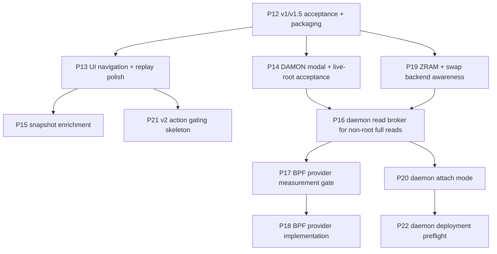

# groop Roadmap

This roadmap turns completed handoff findings and `TUI-SPEC.md` into the next
engineering slices. It is intentionally ordered for low regret: stabilize and
measure the current product before adding privileged infrastructure.

## Direction

1. **Certify v1/v1.5 before expanding scope.**
   The current code is a strong prototype, but release claims still need live
   acceptance evidence and UX hardening.
2. **Make compressed swap backend-aware before more tuning advice.**
   ZRAM, zswap, disk swap, and mixed setups need explicit labels so formulas and
   findings do not imply disk IO where the host is using RAM-backed swap.
3. **Keep root-owned state out of the ephemeral TUI.**
   DAMON control currently works from CLI/API, but BPF, root-only reads, and
   long-lived paddr should be daemon-owned before becoming defaults.
4. **Make every data source explainable.**
   Source labels, registry metadata, and drill-down explanations are part of the
   product, not decoration.
5. **Prefer additive provider interfaces.**
   BPF, GPU, ZFS, daemon attach, and future web UI should reuse the frame/model
   boundary instead of creating parallel schemas.

## Proposed Slices

## Near Term

### P12 — Release Hardening And Acceptance

Status: done. P12 records full tests, compile, fixture JSON, replay smoke,
package build, wheel install, version, and bounded once/json CPU/RSS evidence.

Remaining release evidence: full 5-minute live TUI CPU/RSS, live DAMON
acceptance, and any future BPF gate measurements.

### P13 — UI Navigation And Replay Polish

Status: done. Tree expand/collapse, replay controls/status, reserved v2 action
messaging, profile warning polish, operations docs, and focused Textual tests
landed in P13.

Remaining UX work: timestamp jump replay controls and deeper key/profile
customization can be carved later if needed.

### P14 — DAMON Control Modal And Live-Root Acceptance

Status: done with a live-root gap. P14 added Textual typed-confirmation modals
for vaddr and paddr, groop-owned cleanup controls, fixture safety tests, and
operations/measurement docs.

Remaining gate: run live-root acceptance on a deliberate test host and record
the results in `MEASUREMENTS.md`. `damon_stat` conflict handling remains
conservative/read-only.

### P15 — Snapshot Enrichment

Status: done with a progress-UI gap. P15 added fresh systemctl/docker metadata
collection, richer inspect output, hash failure reporting, redaction tests, and
operations docs.

Remaining polish: a nonblocking progress screen for slow providers can be carved
later if snapshot latency becomes visible in real use.

### P19 — ZRAM And Swap-Backend Awareness

Status: done with a per-device drill-down gap. P19 detects active
zswap/zram/disk/mixed backends, adds host-level ZRAM metrics, corrects banner
wording, and documents the per-cgroup attribution boundary.

Remaining polish: render per-device ZRAM details and consider compatibility
aliases for the legacy `swap_disk`/`rf_d` names.

## Medium Term

### P16 — Daemon Read Broker For Non-Root Full Reads

Status: done as a spike. P16 added a read-only Unix-socket JSON-lines broker,
current/stream protocol, bounded in-memory history, socket tests, and daemon
threat-model docs.

Remaining work: production service/unit packaging, authorization hardening on a
real host, and `groop --attach` client mode.

### P17 — BPF Measurement Gate

Status: done. The safe unprivileged measurement helper and design doc landed,
and `MEASUREMENTS.md` now records the live-BPF blocker on this host.

### P18 — BPF Network Provider

Goal: implement exact per-cgroup socket counters behind the existing provider
interface, owned by daemon/helper state rather than by the TUI.

### P20 — TUI Attach Mode

Status: done. `groop --attach <socket>` now consumes daemon frames over the
P16 socket protocol, preserves the same UI model as standalone live mode, and
supports `--once --json` plus UI smoke.

Handoff: `handoff/P20-daemon-attach-mode.md`.

### P22 — Daemon Deployment Preflight

Status: done. `groop daemon preflight`, packaged systemd/tmpfiles templates,
and the deployment checklist landed for deliberate root-daemon setup with a
group-readable socket.

Handoff: `handoff/P22-daemon-deployment-preflight.md`.

Remaining work: production installation automation and any extra hardening the
operator wants on top of the read-only socket boundary.

## Later

- v2 admin action gating skeleton: disabled-by-default hotkeys, `--admin`,
  exact-command preview, audit logging.
- `systemctl set-property` governance edits.
- Docker/CIU action integration.
- File/log/content inspection behind explicit `--inspect-files`.
- GPU and ZFS optional providers.
- Web UI over daemon API.

## Open Product Decisions

- Is v1.5 allowed to ship with CLI-only DAMON start and TUI notices, or must the
  full modal land before a release tag?
- How important is exact BPF network accounting compared with improving
  diagnostics, snapshots, and UI usability?
- Should `groop` target a local package release first (`pipx` from wheel), or
  remain a repo-local tool until daemon/BPF work starts?
