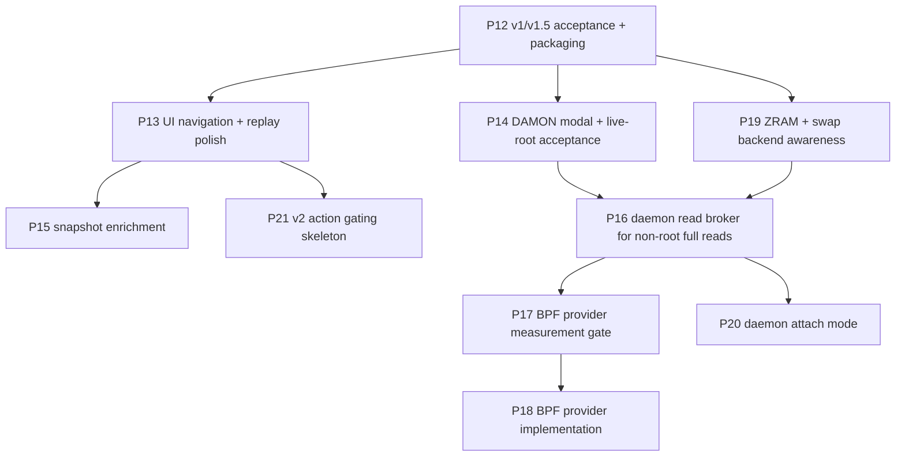

# groop Roadmap

This roadmap turns completed handoff findings and `TUI-SPEC.md` into the next
engineering slices. It is intentionally ordered for low regret: stabilize and
measure the current product before adding privileged infrastructure.

## Direction

1. **Certify v1/v1.5 before expanding scope.**
   The current code is a strong prototype, but release claims still need live
   acceptance evidence and UX hardening.
2. **Make compressed swap backend-aware before more tuning advice.**
   ZRAM, zswap, disk swap, and mixed setups need explicit labels so formulas and
   findings do not imply disk IO where the host is using RAM-backed swap.
3. **Keep root-owned state out of the ephemeral TUI.**
   DAMON control currently works from CLI/API, but BPF, root-only reads, and
   long-lived paddr should be daemon-owned before becoming defaults.
4. **Make every data source explainable.**
   Source labels, registry metadata, and drill-down explanations are part of the
   product, not decoration.
5. **Prefer additive provider interfaces.**
   BPF, GPU, ZFS, daemon attach, and future web UI should reuse the frame/model
   boundary instead of creating parallel schemas.

## Proposed Slices

## Near Term

### P12 — Release Hardening And Acceptance

Status: done. P12 records full tests, compile, fixture JSON, replay smoke,
package build, wheel install, version, and bounded once/json CPU/RSS evidence.

Remaining release evidence: full 5-minute live TUI CPU/RSS, live DAMON
acceptance, and any future BPF gate measurements.

### P13 — UI Navigation And Replay Polish

Status: done. Tree expand/collapse, replay controls/status, reserved v2 action
messaging, profile warning polish, operations docs, and focused Textual tests
landed in P13.

Remaining UX work: timestamp jump replay controls and deeper key/profile
customization can be carved later if needed.

### P14 — DAMON Control Modal And Live-Root Acceptance

Goal: full Textual typed-confirmation modal for vaddr and paddr, `damon_stat`
conflict handling if feasible, and recorded live-root acceptance on a deliberate
test host.

Why next: P9/P11 are technically safe, but the TUI control flow is still a
planning notice rather than an applied modal.

### P15 — Snapshot Enrichment

Goal: snapshots should collect fresh systemctl/docker/provider metadata at
snapshot time, show nonblocking progress, and document privacy clearly.

Why next: snapshots are already useful, and enrichment improves forensic value
without changing core contracts.

### P19 — ZRAM And Swap-Backend Awareness

Goal: detect active zswap/zram/disk swap backends, add host-level zram metrics,
and make table/banner/drill-down wording correct on zram-only and mixed hosts.

Why now: this is a v1.5 usability fix. It prevents the UI from calling zram
pressure "disk swap" and gives operators an immediate view of what swap backend
is active before they interpret refault and swap-device columns.

## Medium Term

### P16 — Daemon Read Broker For Non-Root Full Reads

Goal: specify and prototype a local Unix-socket daemon that owns collection,
history, root-only reads, and future BPF/DAMON state so non-root users can see
daemon-approved full read-only data without running the TUI as root.

Output should include an API sketch, threat model, service unit draft, and one
read-only proof path.

### P17 — BPF Measurement Gate

Goal: create the benchmark harness and measurement evidence required before any
BPF provider can be enabled by default.

This should update `MEASUREMENTS.md` with baseline and BPF-loaded traffic tests.

### P18 — BPF Network Provider

Goal: implement exact per-cgroup socket counters behind the existing provider
interface, owned by daemon/helper state rather than by the TUI.

### P20 — TUI Attach Mode

Goal: `groop --attach <socket>` consumes daemon frames/history while preserving
the same UI model as standalone live mode.

## Later

- v2 admin action gating skeleton: disabled-by-default hotkeys, `--admin`,
  exact-command preview, audit logging.
- `systemctl set-property` governance edits.
- Docker/CIU action integration.
- File/log/content inspection behind explicit `--inspect-files`.
- GPU and ZFS optional providers.
- Web UI over daemon API.

## Open Product Decisions

- Is v1.5 allowed to ship with CLI-only DAMON start and TUI notices, or must the
  full modal land before a release tag?
- How important is exact BPF network accounting compared with improving
  diagnostics, snapshots, and UI usability?
- Should `groop` target a local package release first (`pipx` from wheel), or
  remain a repo-local tool until daemon/BPF work starts?
