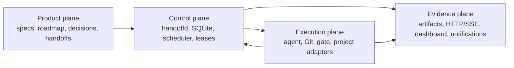

# handoffctl architecture

Status: **design / pilot**. Components described here are proposed unless a
later roadmap entry explicitly records implementation evidence.

## 1. Architectural decision

Process orchestration is deterministic software, not an AI role. An ordinary
daemon can supervise asynchronous subprocesses, dependencies, leases, logs,
budgets, retries, and notifications without consuming tokens or retaining a
controller conversation. Models are invoked only where judgment adds value.

This separates four planes:



### Product plane

Each repository owns its product requirements, roadmap, active milestone,
decisions, acceptance oracles, and project policy. `handoffctl` may validate and
index these sources but must not silently rewrite product intent.

### Control plane

`handoffd` is proposed as a single host service capable of registering several
repositories. It owns task/attempt transitions, dependency readiness,
priorities, WIP limits, provider capacity, retry budgets, and host-wide resource
leases. SQLite is the durable source for events and current projections.

The daemon does not read code to make architectural judgments. It dispatches a
model role only when a typed transition requires judgment.

### Execution plane

Adapters isolate volatile tools and project details:

- Agent adapters launch and resume Claude, Codex, OpenCode, and Reasonix; capture
  session handles; normalize output, usage, cost, errors, and completion.
- The Git adapter creates, validates, and retires worktrees and binds attempts
  to immutable base/head commit identifiers.
- Gate adapters run declared commands with timeouts and capture environment and
  artifact provenance.
- Project adapters describe canonical test environments and resource policy.
  For example, a dstdns adapter can express its test-runner-only gate and a
  host-wide exclusive live-stack lease without embedding that knowledge in the
  generic daemon.

### Evidence plane

All actors emit normalized append-only events. Current state is a projection,
not a second authority. Logs and large artifacts remain files referenced by
digest and restricted path; the database stores metadata, redacted summaries,
and hashes.

## 2. Data ownership and instruction hierarchy

The proposed precedence is:

1. `AGENTS.md`: universal repository hard rules and canonical pointers.
2. `.handoffctl/project.json`: machine policy, gates, paths, resources, and
   instruction entry points.
3. Product specifications, roadmap, and decisions: behavioral truth.
4. Handoff: exact task scope, risks, context, and observable acceptance.
5. Versioned role templates: implementer, self-review, frontier review, carver.
6. Runtime route resolution: actual CLI, model, provider, and effort.
7. Immutable run events and evidence.

Tool-specific instruction files should be thin shims. They must not carry a
second copy of changing project policy or routing tables. Handoffs specify a
risk class and required capabilities; current configuration maps those to a
provider. Dated dispatch documents are historical snapshots, not live state.

## 3. Durable domain model

The domain deliberately separates dimensions that are often collapsed into a
single task status.

### Task

A task is stable across retries and providers. It owns the contract,
dependencies, source lineage, decisions, declared resources, and completion
state.

Proposed states:

```text
DRAFT -> NEEDS_DECISION | READY_TO_CARVE
READY_TO_CARVE -> CARVED -> QUEUED -> ACTIVE
ACTIVE -> AWAITING_REVIEW | BLOCKED
AWAITING_REVIEW -> REVIEW_REJECTED | MERGE_READY
MERGE_READY -> MERGED -> VALIDATING -> COMPLETED
any nonterminal -> SUPERSEDED | CANCELLED
```

### Attempt

An attempt records one concrete role/provider execution:

```text
CREATED -> PREFLIGHTING -> RUNNING -> EXITED
RUNNING -> STALLED | INTERRUPTED | FAILED
STALLED -> RUNNING | INTERRUPTED | ABANDONED
```

Retries always create or resume an identified attempt; they never overwrite
prior evidence. Task status, attempt status, gate status, decision status,
provider status, and lease status remain orthogonal.

### Gate

A gate declares a command or adapter action, canonical environment, timeout,
required artifacts, and whether it gates implementation, review, merge, or
post-merge validation. Results bind to the exact commit and environment
fingerprint.

### Lease

A lease protects a named resource across projects, such as a live stack, merge
lane, GPU, test container, or release publisher. It has an owner attempt,
acquisition and expiry timestamps, renewal token, and deterministic recovery
rule. Timestamp marker files are not sufficient mutual exclusion.

### Evidence

Evidence records source and reviewed commits, merge commit, gate invocation,
environment fingerprint, exit result, artifact digests, and redacted human
summary. A claim is accepted only when its evidence binds to the exact artifact
being advanced through the state machine.

## 4. Scheduling and stopping

The scheduler evaluates only typed facts: dependencies, leases, priorities,
budgets, provider availability, WIP limits, and explicit milestone state. It
does not infer product priority from source code.

Queue targets are conditional. The daemon requests a carve only when:

- a user-approved active milestone exists and is incomplete;
- ready roadmap scope can yield an observable oracle;
- no blocking decision or external dependency controls the next useful work;
- configured cost/time/retry budgets permit another package; and
- the ready queue is below the project target.

The carver returns exactly one outcome:

```text
CANDIDATES_READY
MILESTONE_COMPLETE
ROADMAP_EXHAUSTED
SPEC_GAP
DECISION_REQUIRED
EXTERNAL_BLOCKER
BUDGET_EXHAUSTED
```

These outcomes stop self-propagating review-derived work. A warm reviewer may
propose candidates, but proposals do not become dispatchable until project
policy and the active milestone admit them.

## 5. Multi-project operation

The daemon registry keys every entity by `(project_id, local_id)` and never
assumes package numbers are globally unique. Project adapters expose:

- repository root and default branch;
- instruction and product-truth entry points;
- handoff discovery/import;
- canonical gate environments;
- worktree rules;
- resource declarations and global resource aliases;
- redaction rules; and
- cleanup/retention policy.

The scheduler applies host-wide fairness and resource leases across projects.
One project cannot monopolize all agent/provider slots unless explicitly
configured. Merge lanes remain project-local; physical resources can be global.

## 6. Zero-AI dashboard

The dashboard is conventional software over the event database. It must not
call an LLM directly or indirectly.

Proposed implementation:

- SQLite WAL with append-only `events` and materialized current-state tables.
- A loopback HTTP server with JSON read APIs.
- Server-Sent Events for state and sanitized log-tail updates.
- Static client rendering for dependency DAGs, timelines, and tables.

Required views:

- active tasks by project, milestone, phase, agent, provider, and lease;
- completed, failed, rejected, blocked, superseded, and cancelled history;
- dependency DAG and swimlane/Gantt sequence/parallelism view;
- task drill-down for contract, attempts, sanitized live output, commands,
  gates, commits, diffs, retries, decisions, and evidence;
- actual versus estimated token/cost totals, preserving currency and showing
  cached/new input separately;
- provider/rate-limit state, resource ownership, and worktree cleanup status.

The pilot dashboard is read-only. State-changing operations remain explicit CLI
commands with an audit event. The server binds to loopback by default; remote
exposure requires authentication and a TLS-capable proxy.

## 7. Notifications and Claude Remote Control

Notifications originate from deterministic state events such as
`DECISION_REQUIRED`, `BLOCKED`, `PROVIDER_LIMITED`, `BUDGET_WARNING`, and
`MILESTONE_COMPLETE`. Notification adapters may target a desktop mechanism,
web push, email, or another configured service without invoking AI.

Claude Remote Control is an optional operator surface for a native Claude
frontier review or decision session. It is not the notification bus, dashboard,
or scheduler:

- mobile push timing is selected by Claude rather than a per-event contract;
- Remote Control requires Claude.ai authentication and direct Anthropic
  connectivity;
- a Claude CLI process using a third-party `ANTHROPIC_BASE_URL` cannot also be
  the Remote Control session; and
- Claude Channels inject events into a running agent and can incur model use,
  so they are outside the zero-AI control path.

Claude lifecycle hooks may forward Claude-specific notifications to the same
external notifier, but `handoffd` remains authoritative for workflow events.

## 8. Security boundary

Agent output, repository content, handoff prose, logs, and external tool output
are untrusted input. The design requires:

- allowlisted adapter executables and structured argv; never execute a command
  supplied by model output;
- project-declared gates rather than arbitrary handoff shell fields;
- explicit worktree and filesystem boundaries;
- least-privilege provider credentials and no credential values in events;
- redaction before database/dashboard ingestion;
- raw transcript files with stricter permissions than dashboard projections;
- loopback-only defaults and authenticated remote access;
- protected resource and merge operations with auditable authorization;
- bounded log/artifact sizes and path traversal refusal; and
- prompt-injection-resistant separation of product instructions from untrusted
  evidence and runtime output.

The dashboard must never make an arbitrary filesystem path supplied in an event
downloadable. Artifact references are resolved through an allowlisted state
root and verified digest.

## 9. Correctness boundary

No orchestration system guarantees semantic program correctness. `handoffctl`
can guarantee process invariants: independent review policy, exact-commit
binding, declared gates, serialized merge, bounded retries, durable evidence,
and explicit decision authority. The normative invariants are in
[SPEC.md](SPEC.md).
