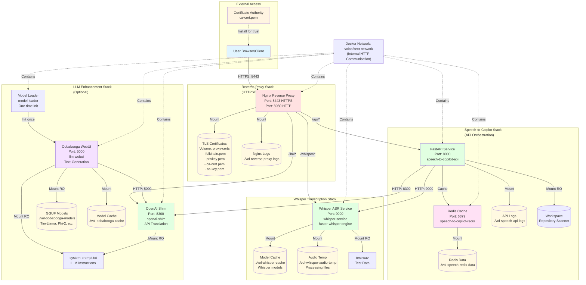
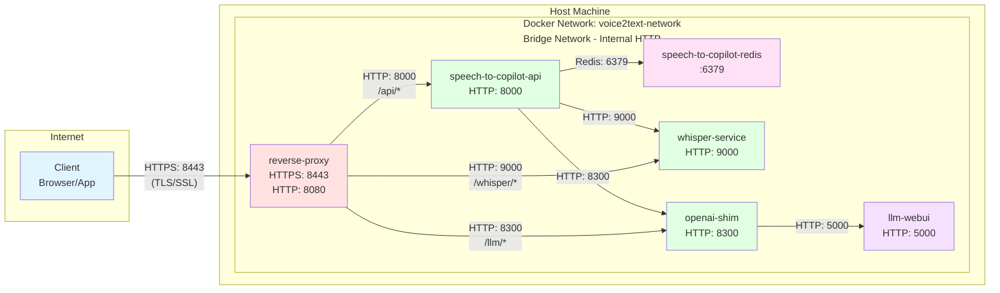
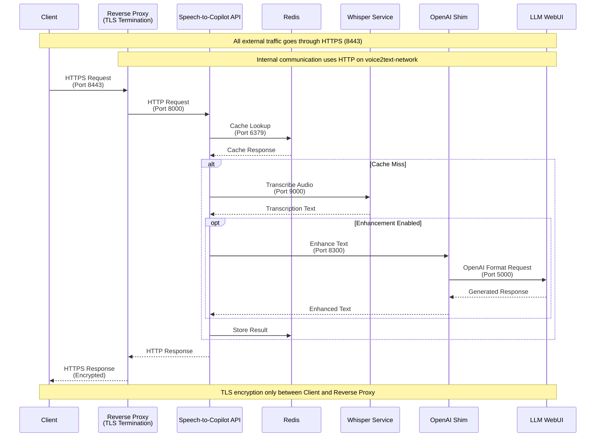
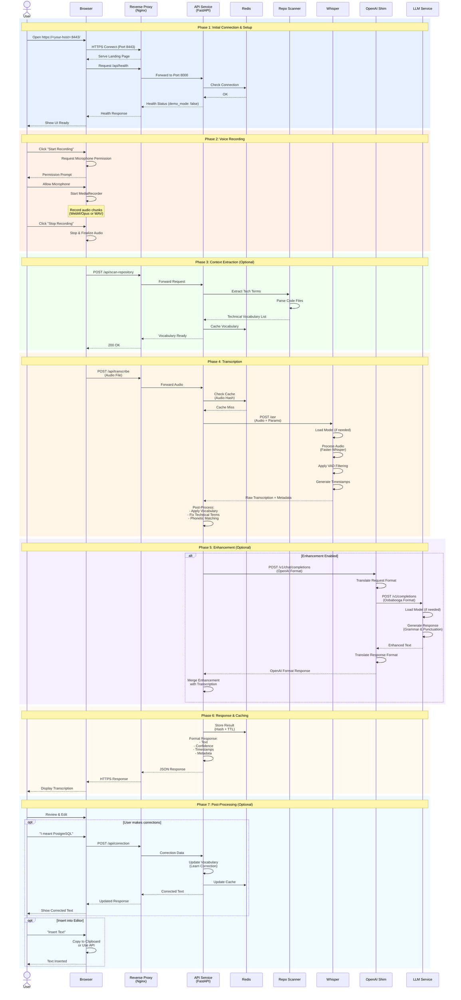
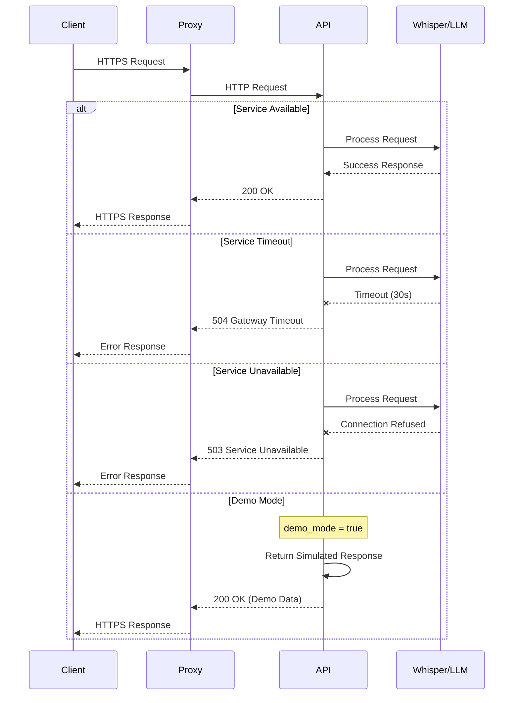
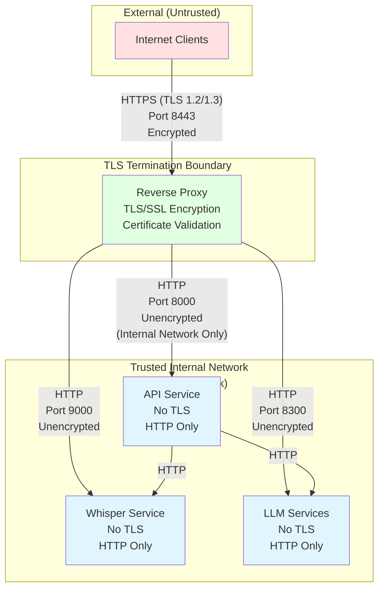
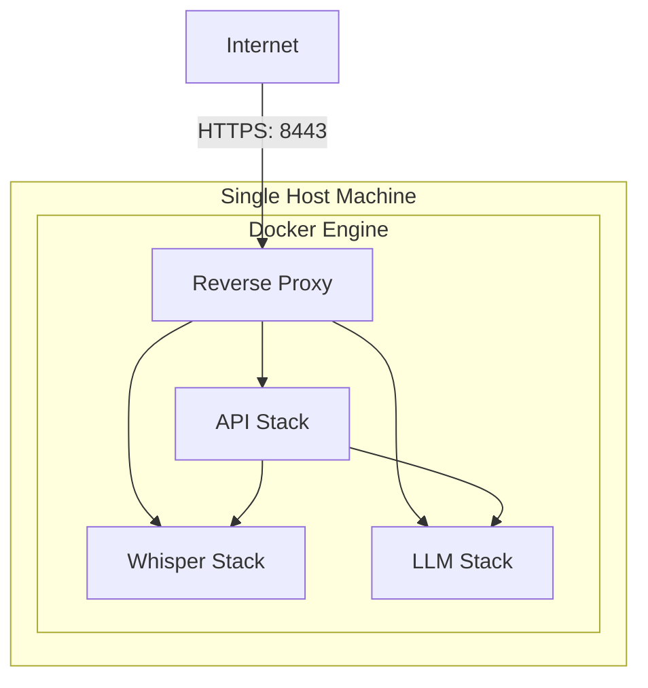
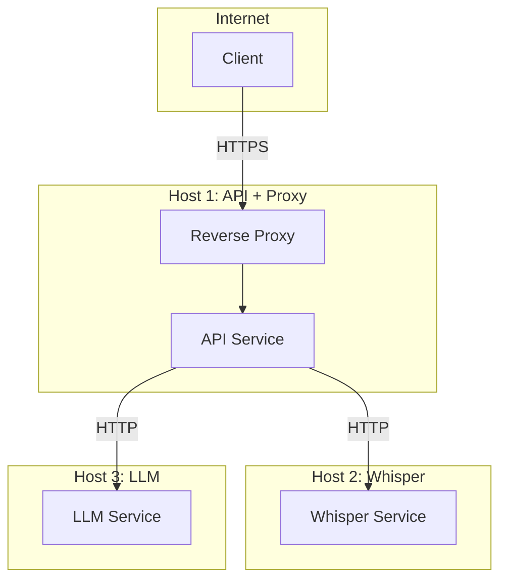

# Voice2Text-AI Architecture

This document provides comprehensive architectural diagrams for the Voice2Text-AI system.

## Table of Contents

- [System Architecture](#system-architecture)
- [Network and Communication](#network-and-communication)
- [Component Communication](#component-communication)
- [Data Flow - User Voice Processing](#data-flow---user-voice-processing)
- [Container and Volume Persistence](#container-and-volume-persistence)

---

## System Architecture



---

## Network and Communication



### Port Mapping

| Service | Internal Port | External Port | Protocol | Purpose |
|---------|--------------|---------------|----------|---------|
| reverse-proxy | 8443 | 8443 | HTTPS | External secure access |
| reverse-proxy | 8080 | 8080 | HTTP | HTTP redirect to HTTPS |
| speech-to-copilot-api | 8000 | - | HTTP | Internal API (via proxy) |
| whisper-service | 9000 | - | HTTP | Internal transcription API |
| openai-shim | 8300 | - | HTTP | Internal LLM API translation |
| llm-webui | 5000 | - | HTTP | Internal LLM service |
| speech-to-copilot-redis | 6379 | - | Redis | Internal cache |

---

## Component Communication



---

## Data Flow - User Voice Processing

This swimlane diagram shows a typical flow when a user sends voice for processing.



### Error Handling Flow



---

## Container and Volume Persistence

```mermaid
graph TB
    subgraph HostFilesystem["Host Machine Filesystem"]
        ProxyLogs[./vol-reverse-proxy-logs<br/>Nginx access & error logs]
        APILogs[./vol-speech-api-logs<br/>FastAPI application logs]
        RedisData[./vol-speech-redis-data<br/>Redis persistence (RDB/AOF)]
        WhisperCache[./vol-whisper-cache<br/>Downloaded Whisper models<br/>base, medium, large-v3]
        WhisperTemp[./vol-whisper-audio-temp<br/>Temporary audio files<br/>Processing workspace]
        LLMModels[./vol-oobabooga-models<br/>GGUF/ggml model files<br/>TinyLlama, Phi-2, Mistral]
        LLMCache[./vol-oobabooga-cache<br/>Transformers cache<br/>Tokenizers, configs]
        TestData[./test.wav<br/>Sample audio file<br/>For testing]
        SystemPrompt[./config/system-prompt.txt<br/>LLM system instructions]
        WorkspaceDir[${HOME} or custom path<br/>Code repository<br/>For tech term extraction]
    end
    
    subgraph DockerVolumes["Docker Named Volumes"]
        ProxyCerts[(voice2text-proxy-certs<br/>TLS certificates<br/>- fullchain.pem<br/>- privkey.pem<br/>- ca-cert.pem<br/>- ca-key.pem)]
    end
    
    subgraph Containers["Docker Containers"]
        Proxy[reverse-proxy]
        API[speech-to-copilot-api]
        Redis[speech-to-copilot-redis]
        Whisper[whisper-service]
        LLM[llm-webui]
        Shim[openai-shim]
    end
    
    ProxyCerts -->|Mount| Proxy
    ProxyLogs -->|Bind Mount| Proxy
    
    APILogs -->|Bind Mount| API
    WorkspaceDir -->|Bind Mount (RO)| API
    
    RedisData -->|Bind Mount| Redis
    
    WhisperCache -->|Bind Mount| Whisper
    WhisperTemp -->|Bind Mount| Whisper
    TestData -->|Bind Mount (RO)| Whisper
    
    LLMModels -->|Bind Mount (RO)| LLM
    LLMCache -->|Bind Mount| LLM
    SystemPrompt -->|Bind Mount (RO)| LLM
    
    SystemPrompt -->|Bind Mount (RO)| Shim
    
    style ProxyCerts fill:#fff4e1
    style ProxyLogs fill:#fff9e1
    style APILogs fill:#fff9e1
    style RedisData fill:#fff9e1
    style WhisperCache fill:#fff9e1
    style WhisperTemp fill:#fff9e1
    style LLMModels fill:#fff9e1
    style LLMCache fill:#fff9e1
    style TestData fill:#e1fff4
    style SystemPrompt fill:#e1fff4
    style WorkspaceDir fill:#e1fff4
    style Proxy fill:#ffe1e1
    style API fill:#e1ffe1
    style Redis fill:#ffe1f5
    style Whisper fill:#e1ffe1
    style LLM fill:#f5e1ff
    style Shim fill:#e1ffe1
```

### Volume Descriptions

| Volume Path | Type | Purpose | Persistence | Size |
|------------|------|---------|-------------|------|
| `voice2text-proxy-certs` | Named Volume | TLS certificates (CA + server) | Until manually removed | ~10 KB |
| `./vol-reverse-proxy-logs` | Bind Mount | Nginx access/error logs | Host filesystem | Growing |
| `./vol-speech-api-logs` | Bind Mount | FastAPI application logs | Host filesystem | Growing |
| `./vol-speech-redis-data` | Bind Mount | Redis persistence (RDB snapshots) | Host filesystem | ~10-100 MB |
| `./vol-whisper-cache` | Bind Mount | Whisper model files (downloaded once) | Host filesystem | 1-3 GB per model |
| `./vol-whisper-audio-temp` | Bind Mount | Temporary audio processing files | Host filesystem | ~100 MB (cleared) |
| `./vol-oobabooga-models` | Bind Mount | GGUF/ggml LLM model files | Host filesystem | 2-7 GB per model |
| `./vol-oobabooga-cache` | Bind Mount | Transformers cache (tokenizers, configs) | Host filesystem | ~500 MB |
| `${HOME}` or custom | Bind Mount (RO) | Source code for tech term extraction | Host filesystem | Read-only |
| `./test.wav` | Bind Mount (RO) | Test audio file | Host filesystem | ~140 KB |
| `./config/system-prompt.txt` | Bind Mount (RO) | LLM system instructions | Host filesystem | ~1 KB |

### Volume Creation

All `./vol-*` directories are automatically created by `CIU` with correct UID/GID ownership:

```bash
# Automatic creation via CIU
cd <stack-directory>
python3 ../../scripts/ciu/ciu.py  # Scans TOML for *_HOSTDIR_* variables and creates directories
```

---

## Security Considerations



### Security Notes

1. **TLS Encryption**: Only between client and reverse proxy
2. **Internal Network**: HTTP within Docker network (trusted)
3. **Certificate Management**: Auto-generated self-signed CA or Let's Encrypt
4. **No Authentication**: Currently no API keys (add if exposing publicly)
5. **CORS**: Configured in API service for browser access
6. **Volume Permissions**: Bind mounts use host UID/GID for proper access control

---

## Deployment Patterns

### Pattern 1: All-in-One (Default)

All stacks on single host machine.



**Use Case**: Development, testing, small deployments

---

### Pattern 2: Distributed Services

Separate heavy services (Whisper, LLM) to dedicated hosts.



**Use Case**: Production, high load, resource isolation

**Configuration Changes**:
```toml
# speech-to-copilot/compose.config.sample.toml
[api]
whisper_service_url = "http://whisper-host.example.com:9000"
llm_service_url = "http://llm-host.example.com:8300"
```

---

## Technology Stack Summary

| Component | Technology | Version | Purpose |
|-----------|-----------|---------|---------|
| Reverse Proxy | Nginx | Alpine | TLS termination, routing |
| API Service | FastAPI (Python) | 3.11+ | Orchestration, business logic |
| Cache | Redis | 7-alpine | Response caching |
| Transcription | Whisper (faster-whisper) | Latest | Speech-to-text |
| LLM | Oobabooga Text-Gen-WebUI | Latest | Text enhancement |
| LLM Shim | Python FastAPI | 3.11 | OpenAI API translation |
| Container Platform | Docker + Compose | Latest | Container orchestration |
| Configuration | CIU | Latest | TOML-based templating |

---

## Related Documentation

- [README.md](README.md) - Main documentation and quick start
- [DEMO-MODE-EXPLAINED.md](DEMO-MODE-EXPLAINED.md) - Demo mode details
- [WHISPER-CUSTOMIZATION.md](WHISPER-CUSTOMIZATION.md) - Whisper configuration
- [WINDOWS-CLIENT-OPTIONS.md](WINDOWS-CLIENT-OPTIONS.md) - Desktop client options
- [TESTING-GUIDE.md](TESTING-GUIDE.md) - Testing procedures
