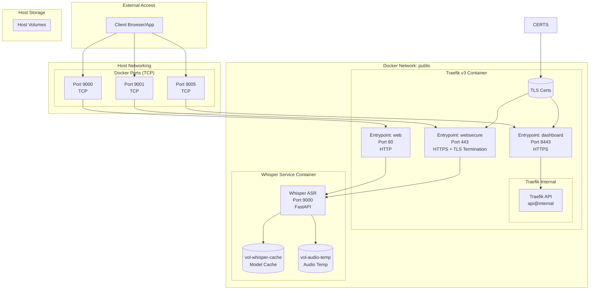
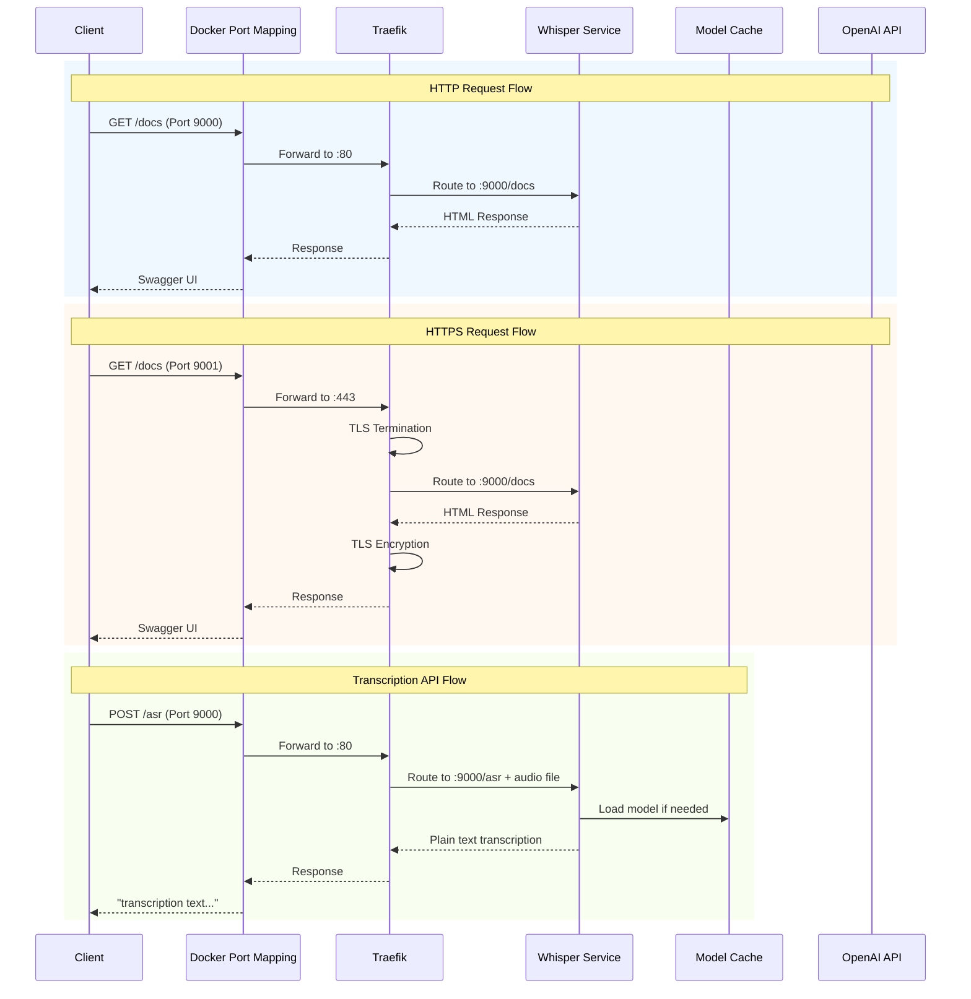
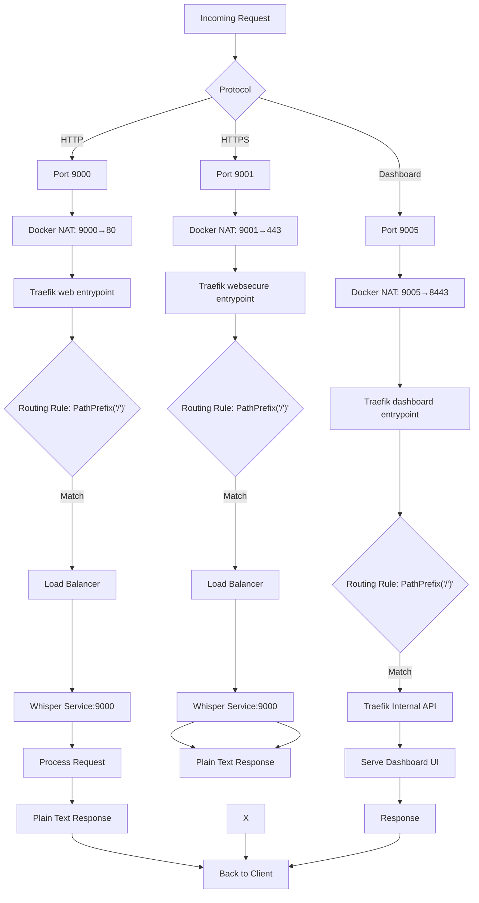
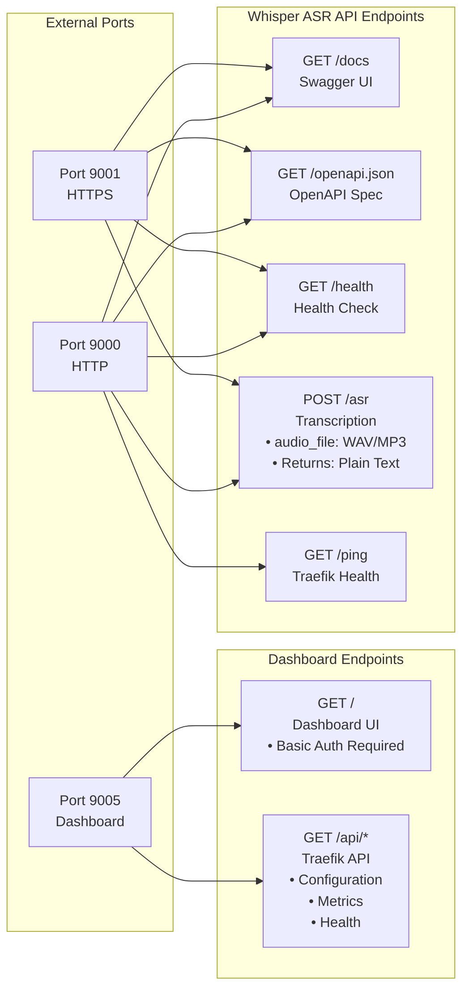

# Whisper ASR Webservice - CPU-Only Transcription
ASR = Automatic Speech Recognition

Based on specs (7 cores, 11GB RAM, Debian 12) and focus on CPU-only operation.

## Quick Start

```bash
cd legacy-experiments/voice2text-ai/whisper-trans
python3 ../../../scripts/ciu/ciu.py

# Test transcription
curl -X POST -F "audio_file=@test.wav" http://localhost:9000/asr
```

---

## 🏗️ Architecture & Engine Options

The `onerahmet/openai-whisper-asr-webservice` container supports **multiple ASR engines**:

| Engine | Setting | CPU Support | Performance | Accuracy |
|--------|---------|-------------|-------------|----------|
| **faster-whisper** | `ASR_ENGINE=faster_whisper` | ✅ Excellent | Fast | Good |
| **whisperX** | `ASR_ENGINE=whisperX` | ✅ Good | Medium | Best + diarization |
| **openai-whisper** | `ASR_ENGINE=openai_whisper` | ⚠️ Slow | Slow | Reference |

### Why Not Use WhisperX Directly?

[WhisperX](https://github.com/m-bain/whisperX) is an excellent library that adds:
- 🎯 Word-level timestamps with forced alignment
- 👥 Speaker diarization (who said what)
- ⚡ ~70x faster than OpenAI's Whisper

**However**, you don't need to use it directly because:

1. **Our container already supports WhisperX** via `ASR_ENGINE=whisperX`
2. WhisperX requires additional models (wav2vec2) that complicate CPU-only setup
3. For basic transcription, `faster_whisper` is simpler and faster on CPU
4. WhisperX's diarization requires GPU for reasonable performance

**Recommendation**: 
- **Default**: Use `faster_whisper` for CPU-only transcription
- **If you need speaker identification**: Enable WhisperX via environment variable

### GenAIscript Whisper Integration

[GenAIscript's Whisper ASR support](https://microsoft.github.io/genaiscript/configuration/whisperasr/) uses the **same container** (`onerahmet/openai-whisper-asr-webservice`) we already run. It's useful if you want to:

- Integrate transcription into GitHub Actions
- Use audio transcription in genAIscript workflows
- Process recordings in CI/CD pipelines

No changes needed - our existing stack is compatible with GenAIscript.

---

## Features

- Best transcription quality: Faster-Whisper with large model
- Advanced post-processing: Grammar, punctuation, text improvement
- Perfect VS Code compatibility: OpenAI-compatible API
- Optimal for your hardware: CPU-optimized with all 7 cores

Audio Length	Processing Time	Quality Level
1 minute	~15-30 seconds	Excellent
5 minutes	~1-2 minutes	Excellent
15 minutes	~3-5 minutes	Excellent
60 minutes	~12-20 minutes	Excellent
Quality features enabled:

- Large-v3 model: Best available accuracy
- VAD filtering: Removes silence/noise
- Word timestamps: Precise timing
- Beam search: Multiple candidate evaluation
- Context awareness: Better sentence flow
- Post-processing: Grammar and punctuation improvement

## Config summary
- Optimal setup:
    - Service: http://localhost:9000/asr
    - Model: large-v3 (best quality)
    - Engine: faster-whisper (optimized)
    - CPU cores: All 7 cores utilized
    - Memory: 10GB allocated (1GB reserved for system)
    - Post-processing: Grammar and punctuation improvement
    - Features: VAD filtering, word timestamps, context awareness
- VS Code Integration:
    - Endpoint: http://your-server-ip:9000
    - API: OpenAI-compatible format
    - Quality: Maximum available


```bash
# Update system
sudo apt update && sudo apt upgrade -y

# Install required packages
sudo apt install -y curl wget htop

# Verify Docker is running
sudo systemctl status docker
docker --version

# Create workspace directory
mkdir -p ~/whisper-service
cd ~/whisper-service

# Create secrets for services
echo 'mySuperSecretToken' > secrets/whisper_api_token 
htpasswd -nbB admin 'YourPassword' | sed -e 's/\$/\$\$/g' > secrets/traefik_dashboard_password

```


## USAGE
```bash
# Start the service
docker-compose up -d

# Monitor initial startup (models will download)
docker-compose logs -f whisper-service

# Wait for "Model loaded successfully" message
# This may take 5-10 minutes for large-v3 model download

# Check service health
curl http://localhost:9000/docs

# Test transcription quality
curl -X POST -H "content-type: multipart/form-data" \
  -F "audio_file=@test-audio.mp3" \
  "http://localhost:9000/asr?output=json&task=transcribe&language=auto&word_timestamps=true&vad_filter=true"

# Best Quality Transcription:
# For maximum quality (slower but best results)
curl -X POST -H "content-type: multipart/form-data" \
  -F "audio_file=@recording.mp3" \
  "http://localhost:9000/asr?output=json&task=transcribe&language=en&word_timestamps=true&vad_filter=true&encode=true"

# For VS Code Extension (after configuration):
# Test the endpoint that VS Code will use
curl -X POST -H "content-type: multipart/form-data" \
  -F "audio_file=@test.wav" \
  "http://localhost:9000/asr?output=json"


# Reduce model size or use quantization
sed -i 's/ASR_MODEL=large-v3/ASR_MODEL=medium/' docker-compose.yml
sed -i 's/MODEL_QUANTIZATION=float32/MODEL_QUANTIZATION=int8/' docker-compose.yml
docker-compose restart whisper-service


# Use medium model with quantization
sed -i 's/ASR_MODEL=large-v3/ASR_MODEL=medium/' docker-compose.yml
sed -i 's/MODEL_QUANTIZATION=float32/MODEL_QUANTIZATION=int8/' docker-compose.yml

# Run monitoring
./monitor-quality.sh
# Check detailed logs
docker-compose logs -f whisper-service


```


## Modify VS Extension Settings (Easiest)

target [extension from speak-y](https://marketplace.visualstudio.com/items?itemName=Speak-Y.speech-to-text-whisper)


```json
{
  "speechToTextWhisper.apiKey": "not-needed-for-local",
  "speechToTextWhisper.apiEndpoint": "http://your-server-ip:9000",
  "speechToTextWhisper.model": "large-v3",
  "speechToTextWhisper.language": "auto",
  "speechToTextWhisper.temperature": 0.0,
  "speechToTextWhisper.enablePostProcessing": true
}
```

### Alternative modification if above does not work:
src/core/WhisperClient.ts

```ts
// FIND this line (around line 85):
const url = `${this.baseURL}/v1/audio/transcriptions`;

// REPLACE with:
const url = `${this.baseURL}/asr`;

# Update request parameters:
// FIND this section (around line 190):
formData.append('file', audioBlob, `audio.${extension}`);
formData.append('model', model);

// REPLACE with:
formData.append('audio_file', audioBlob, `audio.${extension}`);
formData.append('output', 'json');

# Handle response format:
// FIND response processing (around line 340):
if (responseFormat === 'text') {
    transcriptionText = await response.text();
} else {
    responseData = await response.json() as TranscriptionResult;
    transcriptionText = responseData.text;
}

// REPLACE with:
const responseData = await response.json();
transcriptionText = responseData.text || responseData.transcript;

```

## Using reverse proxy to secure communication
The first hop (host:externalPort → proxy:internalPort) is just Docker’s port-publish NAT. It doesn’t terminate HTTP/TLS; it just forwards bytes. The real application-layer hop/decision is proxy/Traefik → target service port.

So conceptually:

- Layer 3/4 translation: Host port publish (iptables / userland proxy)
- Layer 7 routing: Traefik (TLS termination, headers, auth, path/host routing)
- Upstream service: Whisper container port 9000


# creation of secrets, test files...

```bash
# test wav file
apt install -y espeak-ng
espeak-ng -w test.wav "Hello world, this is a test for Whisper transcription."

# htpasswd secret
apt install -y apache2-utils
htpasswd -nbB admin 'YourPassword' | sed -e 's/\$/\$\$/g'
```

# Docker Compose Configuration Explanation

This setup uses Docker Compose to orchestrate a Whisper transcription service with Traefik reverse proxy. Here's how the configuration works:

## Architecture Overview

```
Internet → Traefik (Ports 9000/9001/9005) → Whisper Service (Port 9000)
```

- **Traefik v3**: Reverse proxy handling routing, TLS termination, and load balancing
- **Whisper Service**: FastAPI-based ASR webservice using Faster-Whisper
- **Network**: Single 'public' bridge network for internet access and service communication

## Key Configuration Components

### 1. Networks
```yaml
networks:
  public:
    external: false  # Bridge network for inter-service communication
```
- Allows Traefik to communicate with Whisper service
- Provides internet access for model downloads

### 2. Services

#### Whisper Service
- **Image**: `onerahmet/openai-whisper-asr-webservice:latest`
- **Labels**: Define Traefik routing rules
- **Volumes**: Bind mounts for model cache and audio temp files
- **Healthcheck**: Monitors `/docs` endpoint

#### Traefik Service
- **Image**: `traefik:v3`
- **Entrypoints**: 
  - `web`: HTTP on port 80 (mapped to 9000)
  - `websecure`: HTTPS on port 443 (mapped to 9001)  
  - `dashboard`: Dashboard on port 8443 (mapped to 9005)
- **Providers**: Docker (for service discovery) and File (for dynamic config)
- **TLS**: Certificates mounted from host paths

### 3. Routing Labels

Labels on the `whisper-service` container tell Traefik how to route requests:

```yaml
labels:
  - traefik.enable=true
  - traefik.http.routers.whisper-http.entrypoints=web
  - traefik.http.routers.whisper-http.rule=PathPrefix(`/`)
  - traefik.http.services.whisper-svc.loadbalancer.server.port=9000
```

- `traefik.enable=true`: Include this container in routing
- `routers.*`: Define routing rules for different entrypoints
- `services.*`: Define how to reach the backend service

### 4. Environment Variables

All configuration uses environment variables from `.env`:
- `PUBLIC_HTTP_PORT=9000`: External HTTP port
- `PUBLIC_HTTPS_PORT=9001`: External HTTPS port  
- `WHISPER_*`: Whisper service configuration
- `TLS_*`: Certificate paths

### 5. Secrets

Docker secrets for sensitive data:
- `traefik_dashboard_password`: Hashed password for dashboard access

**Note**: Post-processing is currently disabled for fully local operation. The `whisper_api_token` secret is not used.

## Step-by-Step Testing Guide

The `test-stack.sh` script provides automated testing. Here's what it tests:

### 1. Service Health Check
```bash
docker compose ps
```
Verify both services are "Up" and healthy.

### 2. Traefik Ping
```bash
curl http://localhost:9000/ping
```
Tests Traefik's built-in health endpoint.

### 3. HTTP Routing
```bash
curl http://localhost:9000/docs
```
Verifies HTTP routing to Whisper service's documentation.

### 4. HTTPS Routing  
```bash
curl -k https://localhost:9001/docs
```
Tests HTTPS routing with TLS termination.

### 5. Transcription API
```bash
curl -X POST -F "audio_file=@test.wav" http://localhost:9000/asr
```
Tests the core transcription functionality (returns plain text transcription).

### 6. Dashboard Access
```bash
curl -k https://localhost:9005/
```
Checks dashboard availability (returns 401 for authentication).

## Running the Tests

```bash
# Make script executable (first time only)
chmod +x test-stack.sh

# Run the test suite
./test-stack.sh
```

## Understanding the Flow

1. **Request arrives** at external port (9000/9001)
2. **Docker port mapping** forwards to Traefik's internal port (80/443)
3. **Traefik routing** matches the request based on labels
4. **Load balancing** forwards to Whisper service on port 9000
5. **Whisper service** processes the request and returns response

## Production Considerations

For production deployment:
- Change routing rules from `PathPrefix(`/`)` to `Host(\`${PUBLIC_FQDN}\`)`
- Ensure TLS certificates are valid for your domain
- Configure proper firewall rules
- Set up monitoring and log rotation

## Architecture Diagrams

### Overall System Architecture



### Communication Flow Sequences



### Request Routing Flowchart



### API Endpoints Overview



### Alternative Dashboard Configuration

The dashboard can be configured to be accessible on the same HTTPS port (9001) under a specific path like `/traefik-dashboard` instead of requiring a separate port. This would allow accessing both the Whisper API and Traefik dashboard through the same external port.

**To implement this change:**

1. Modify the dashboard router labels:
```yaml
# Change from separate entrypoint to websecure
- traefik.http.routers.traefik-dashboard.entrypoints=websecure
- traefik.http.routers.traefik-dashboard.rule=PathPrefix(`/traefik-dashboard`)
```

2. Remove the separate dashboard port mapping and entrypoint.

3. Access dashboard at: `https://your-domain:9001/traefik-dashboard/`

This approach consolidates external access to a single HTTPS port while maintaining security through path-based separation.


