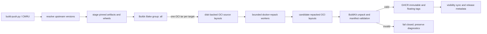
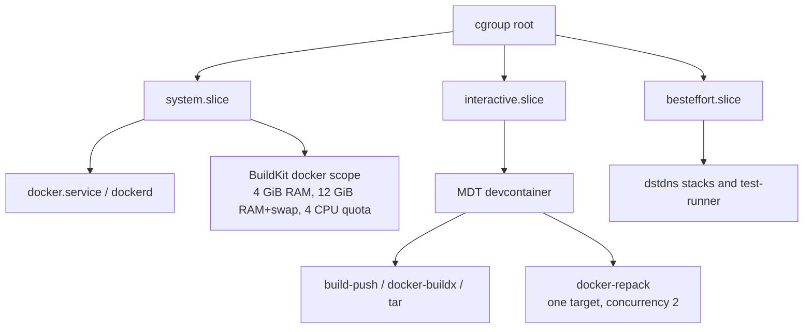

# MDT build and release architecture

This document describes how `modern-debian-tools-python-debug` resolves,
builds, repacks, and publishes its image families, and where each phase consumes
CPU, memory, swap, and I/O. The release configuration is code: defaults and
limits live in [`cmru.build.toml`](../cmru.build.toml), not in an operator's
shell history.

## Intended canonical release path

`RELEASE_IMAGE_FLOW=repack` is the configured release path. It deliberately
avoids a Docker daemon image-store round-trip and does not require `skopeo`.
Every derived artifact must pass validation before publication; repacking is an
optimization, not permission to publish a malformed image.



The phases are:

1. `build-push.py` resolves the current allowed upstream releases, stages
   immutable artifacts and first-party wheels, records their checksums, and
   writes `.build-env.json` so a split build/push invocation uses one resolved
   set of inputs.
2. `docker-bake.hcl` defines the target graph. The `all` group is the release
   matrix; `everything` is a broader local-development matrix.
3. `scripts/release-bake.sh` selects the governed named builder and overrides
   each release target's output to a separate OCI tar. Those tars are extracted
   under the disk-backed `REPACK_WORK_DIR`; they are not loaded into Docker's
   image store. BuildKit can emit one OCI index descriptor per tag even when
   every descriptor points to the same image; the wrapper deduplicates those
   aliases by digest and platform before repacking.
4. `scripts/release-repack.sh` runs a bounded `docker-repack` worker for each
   target. Repacking deduplicates filesystem content and changes the layer
   graph and image digest. Its output is a candidate, not yet a releasable
   artifact.
5. A minimal BuildKit invocation imports each repacked OCI layout as an OCI
   build context. This forces BuildKit to unpack the filesystem and exports the
   canonical in-image manifest to release scratch. Publication only follows a
   successful import. Neither operation loads the image into Docker's daemon
   image store.

An OCI layout is an on-disk image format, not a registry upload protocol.
BuildKit can consume a local layout as a build context, while tools such as
`skopeo` can copy one directly to a registry. This implementation uses the
former, so it has no `skopeo` prerequisite. Merely having `index.json` and
`blobs/` does not mean `docker buildx imagetools create` can upload the local
blobs: that command normally composes manifests from content the destination
registry can already resolve.

### Current repack validation status

The 2026-07-14 transition run caught a `docker-repack` output layer containing
a regular file and descendants below that same path. BuildKit correctly
rejected it during the validation import, before any tag was pushed. Until the
repacker defect is fixed and covered by an automated structural regression
test, the configured `repack` lane is expected to fail closed for the affected
image. Do not bypass this check with a raw OCI-layout copy: that would upload
the invalid layer rather than repair it. The explicit `push` lane remains the
unrepacked recovery path when a release is required.

The source and repacked layouts are temporary release scratch. Do not place
`REPACK_WORK_DIR` on tmpfs: two large targets can require many GiB while source
and destination layouts coexist.

### Cache ownership

The named `docker-container` builder owns a persistent BuildKit cache distinct
from Docker's default builder. Its first release is therefore cold even if a
different builder recently built the same Dockerfile; later releases reuse its
layers and cache mounts. Recreating the builder to correct configuration drift
also discards that builder-local cache.

Volatile OCI labels such as revision, creation time, and release version are
applied after all filesystem instructions in the Dockerfile. Changing release
metadata therefore invalidates only the final metadata step, not apt, Node,
tool, or Python environment layers. Keep new volatile labels in that final
block.

Large context-transfer and Block I/O totals can include staged tool downloads
and prior cache activity. `.dockerignore` must keep `REPACK_WORK_DIR`, logs, and
other generated scratch out of the context. Use an explicit no-cache build only
when validating freshness semantics: it materially increases registry, package
mirror, CPU, and disk load.

## Resource-governance boundaries

There are three accounting domains: the BuildKit container leaf, release
processes in the caller's container, and the host Docker daemon. They
intentionally do not depend on a single global `dockerd` limit.

On the intended systemd/cgroup-v2 host, the relationship is typically:



The exact Docker scope name is runtime-generated. With systemd's cgroup driver,
the builder is normally a separate `docker-<id>.scope` under `system.slice`, a
sibling of `docker.service`, even though `dockerd` is its process-level parent.
Its hard leaf limits still apply. `besteffort.slice` is shown for context: the
dstdns stack uses it, while local release processes inherit the invoking
devcontainer's `interactive.slice`.

| Work | Process/container to inspect | Governance |
| --- | --- | --- |
| Dockerfile steps, cache, layer compression, OCI export and OCI-context publication | `buildx_buildkit_mdt-governed-v10` | Docker hard limits created from `MDT_BUILDER_*`: 4 GiB RAM, 12 GiB combined RAM+swap, four-core quota, CPU shares 128 |
| Resolver, Bake client, artifact staging, OCI export streaming, tar extraction, release orchestration | `build-push.py`, `docker-buildx`, resolver scripts, `tar` | Inherits the caller's cgroup; from the MDT devcontainer this is normally `interactive.slice` |
| Filesystem deduplication and zstd compression | `docker-repack` | Inherits the caller's cgroup, plus low CPU/I/O scheduling priority, configured worker count and compression concurrency; an optional diagnostic virtual-memory ceiling is disabled by default |
| Docker API, container lifecycle, layer/accounting and registry coordination | `dockerd` in `system.slice/docker.service` | Host Docker service policy; CPU here is daemon work and is not evidence that Dockerfile commands escaped the governed builder |
| Registry upload | BuildKit worker, `dockerd`, network stack | Builder limits still apply; host networking and Docker service work remain outside the builder leaf |

`scripts/ensure-release-builder.sh` creates `mdt-governed-v1` with the
`docker-container` driver and verifies its driver and every configured hard
limit before each release. Because it is a project-owned builder, a stale or
mismatched instance is automatically recreated before work starts. The
important distinction is:

- A systemd **slice** controls an aggregate workload tier. The shipped
  devcontainer template requests `interactive.slice`; dstdns stack containers
  normally request `besteffort.slice`. Slice policy is installed and owned by
  the host.
- A Docker **container cgroup leaf** can enforce hard memory and CPU limits even
  though its scope is in `system.slice`. That is how the governed BuildKit
  worker is bounded; `dockerd` itself is not given the builder's 4 GiB cap.
- `cgroup-parent` is not used for the Buildx container. With Docker's systemd
  cgroup driver, Buildx's `cgroup-parent` driver option is not reliable. True
  placement of buildkitd in `besteffort.slice` would require a host-managed
  buildkitd service in that slice and a Buildx `remote` driver.
- Docker has no Buildx driver option for the host's dynamic per-device I/O
  ceilings. A host setup service may additionally find
  `buildx_buildkit_*` containers and apply leaf I/O controls. That is an
  optional host policy, not something this repository silently assumes.

The default controls are deliberately layered. The BuildKit worker's hard
cgroup limits contain a runaway build. Repack is a local process: worker count
and compression concurrency constrain its parallelism, `nice` and idle-class
`ionice` lower its priority, and the caller's cgroup supplies its hard boundary.
One target at a time prevents two large merged filesystems from competing
inside the default 7 GiB interactive tier.
`REPACK_VMEM_KB=unlimited` is intentional: `docker-repack` maps a large merged
filesystem, and virtual address space is not resident RAM. A numeric override
is available for diagnosis, but a low address-space limit causes false
allocation failures before the cgroup is under memory pressure.

The distinction between priority and a limit matters: `nice`, `ionice`, CPU
shares/weight, and I/O weight let more important work win under contention, but
do not stop MDT from using otherwise-idle capacity. The builder's CPU quota and
memory settings are hard leaf limits. Local repack has no extra hard CPU quota;
its hard boundary is whatever the caller and ancestor slice impose.

`memory-swap=12g` is Docker's combined RAM-plus-swap ceiling, not a prohibition
on swap. Paired with `memory=4g`, it permits up to 8 GiB of swap for the builder.
Whether those pages use zswap before disk swap is a host kernel policy.

For the devcontainer's `interactive.slice` placement and host prerequisites,
see [`DEVCONTAINER-LIFECYCLE.md`](../DEVCONTAINER-LIFECYCLE.md#host-resource-governance-cgroupsslices).

### How the cgroup controls compose

A process must satisfy its leaf and every ancestor. The effective ceiling is
therefore the tightest applicable control, not the sum of all configured
values.

- `memory.high` is a reclaim/throttling boundary. Crossing it creates pressure
  and may move cold anonymous pages toward swap; it is not an immediate kill.
- `memory.max` is the hard RAM boundary for that cgroup. Sustained allocation
  that cannot be reclaimed can produce an in-cgroup OOM kill.
- In native cgroup v2, `memory.swap.max` limits swap separately. Docker's
  `--memory-swap` / `HostConfig.MemorySwap` instead expresses the combined
  RAM-plus-swap total when a memory limit is also present.
- `memory.low` and `memory.min` protect pages during reclaim; they do not
  pre-allocate or reserve physical RAM. Protection also has to be valid along
  the ancestor chain to be effective.
- `cpu.max` / Docker quota is a hard time budget. `cpu.weight` and Docker CPU
  shares are proportional preferences that matter when sibling cgroups
  contend; they do not cap an otherwise idle host.
- `io.weight` is likewise proportional under contention. `io.max` is a hard
  per-device bandwidth/IOPS ceiling. Empty `io.max` means no leaf ceiling, but
  an ancestor can still impose one.

This is why diagnosis must inspect both the builder container and its ancestor
slice. An exit 137 can be a leaf limit, an ancestor OOM decision, or an explicit
kill; the number alone does not identify which one.

## Entry points and live logs

The repository-wide release entry point is `./cmru.release.sh`; direct MDT
diagnostics use `./build-push.py --build` or `--rebuild`. Both select unbuffered
Python. When preserving a transcript, enable `pipefail` so a failed release is
not mistaken for a successful `tee` process:

```bash
set -o pipefail
./cmru.release.sh 2>&1 | tee cmru.release.log
```

Without `pipefail`, the pipeline status is normally `tee`'s status. The log can
therefore end in `[ERROR]` while the shell reports zero. `stdbuf` is not needed
for the Python release path; subprocesses that render progress using terminal
control sequences can still look different in a file than on a TTY.

## Reading load correctly

No single `top` row represents the entire build. Use the phase and cgroup to
attribute it:

- High CPU in `buildkitd` or its executor descendants is a Dockerfile build,
  layer export, or publication phase. Check the named builder container first.
- High CPU in the `docker-buildx` client can occur while it receives and writes
  an OCI output stream. That client is local to the caller and inherits the
  caller's slice; Dockerfile executors still run in the governed worker.
- High CPU in `docker-repack` is the deduplication/compression phase. One target
  runs at a time by default, while `REPACK_CONCURRENCY=2` permits two internal
  compression threads.
- High CPU in `dockerd` is real daemon overhead such as API work, snapshots,
  container lifecycle, or data transfer. Its location in `system.slice` is
  normal. It does not mean the BuildKit worker lacks its own limited sibling
  scope.
- High I/O in `tar` is the transition from OCI tar output to directory layout.
  This runs in the caller's cgroup, not inside BuildKit.
- A quiet release client does not imply a stalled build. The long-running work
  may be in BuildKit or a repack worker. `build-push.py` and `cmru.release.sh`
  use unbuffered Python so progress is visible through `2>&1 | tee`.

Useful live checks:

```bash
# Builder identity, driver and current endpoint
docker buildx inspect mdt-governed-v1

# Hard limits actually applied to the builder leaf
docker inspect buildx_buildkit_mdt-governed-v10 --format \
  'memory={{.HostConfig.Memory}} memory+swap={{.HostConfig.MemorySwap}} shares={{.HostConfig.CpuShares}} quota={{.HostConfig.CpuQuota}}/{{.HostConfig.CpuPeriod}}'

# Resource use by the governed worker
docker stats --no-stream buildx_buildkit_mdt-governed-v10

# Attribute host processes by command and cgroup
ps -eo pid,ppid,pcpu,pmem,cgroup,comm,args --sort=-pcpu | head -40

# Host-owned aggregate slice policy and current accounting
systemctl show interactive.slice besteffort.slice \
  -p ControlGroup -p MemoryCurrent -p MemoryHigh -p MemoryMax \
  -p MemorySwapCurrent -p MemorySwapMax -p CPUWeight -p IOWeight
```

Run the `ps` and `systemctl` checks on the host. A container commonly has a
private PID and cgroup namespace, so host PIDs from `docker inspect` may not
exist in its `/proc`, and `/proc/self/cgroup` may only show `0::/`. That view is
deliberately insufficient for proving the host-side parent slice. `docker inspect`
still reports the leaf limits requested through Docker.

Inside a cgroup-v2 container, effective leaf limits are visible without host
privileges:

```bash
cat /sys/fs/cgroup/memory.current
cat /sys/fs/cgroup/memory.high
cat /sys/fs/cgroup/memory.max
cat /sys/fs/cgroup/memory.swap.current
cat /sys/fs/cgroup/memory.swap.max
cat /sys/fs/cgroup/cpu.max
cat /sys/fs/cgroup/cpu.weight
cat /sys/fs/cgroup/io.max
```

For pressure and failure attribution, sample counters before and after the
phase instead of relying only on instantaneous percentages:

```bash
cat /sys/fs/cgroup/cpu.stat       # usage and quota-throttling totals
cat /sys/fs/cgroup/memory.peak    # high-water mark since cgroup creation
cat /sys/fs/cgroup/memory.events  # high/max/OOM/OOM-kill counters
cat /sys/fs/cgroup/memory.pressure
cat /sys/fs/cgroup/io.stat        # cumulative bytes and operations by device
cat /sys/fs/cgroup/io.pressure
```

The host-wide PSI files under `/proc/pressure/` reveal global contention, while
the cgroup files above attribute it to a workload. Zswap is also host-wide
kernel policy rather than an MDT or Docker allocation. On hosts with debugfs
mounted, `/sys/kernel/debug/zswap/` exposes its stored-page, pool-size, reject,
and writeback counters. Compare samples; cumulative writeback or I/O totals do
not describe the current rate.

`docker stats` Block I/O counters are cumulative for the lifetime of the named
builder container. Compare samples or use host I/O telemetry when you need a
rate; a large single value does not mean that throughput is happening now.

Do not compare Docker CPU percentages to whole-host `top` percentages without
normalizing: Docker commonly reports `100%` per fully occupied logical CPU,
while `top` configuration can display either per-CPU or whole-machine values.

## Release modes and their intended use

| `RELEASE_IMAGE_FLOW` | Behavior | Intended use |
| --- | --- | --- |
| `repack` | Bake to OCI layouts, repack, validate by importing, then publish; later push step is a no-op | Intended canonical release and fail-closed gate; currently blocked for the affected image by the known repacker defect above |
| `load` | Build with `--load`; a later push performs a separate unrepacked registry build | Local compatibility/debugging only, not a release gate |
| `push` | Build and publish unrepacked BuildKit output directly | Explicit diagnostic/fallback lane |

`load` exists only to troubleshoot compatibility. `push` does not produce the
optimized repacked artifact, but it is the explicit safe recovery lane while
repack validation is blocked; record that exception in the release evidence.

## Configuration and prerequisites

The governed defaults are in the `[env]` table of
[`cmru.build.toml`](../cmru.build.toml):

- `BUILDX_BUILDER` and `MDT_BUILDER_*` control the BuildKit worker.
- `REPACK_WORK_DIR`, `REPACK_TARGET_SIZE`, `REPACK_JOBS`,
  `REPACK_CONCURRENCY`, `REPACK_COMPRESSION_LEVEL`, and `REPACK_VMEM_KB`
  control repack. `REPACK_VMEM_KB` accepts `unlimited` or a positive numeric
  diagnostic override. `DOCKER_REPACK_LOG` controls library verbosity without
  hiding the wrapper's target-level progress.
- `RELEASE_IMAGE_FLOW` selects the architecture above.

Required tools are Docker with Buildx/Bake, `jq`, `tar`, and `docker-repack`.
Install `docker-repack` from its official GitHub release, or set
`DOCKER_REPACK_BIN` to a verified binary. The canonical path does **not** check
for or call `skopeo`. The separate historical benchmark script still uses
`skopeo` to import an already-loaded local daemon image; that does not describe
the release architecture.

## Failure boundaries

- If the named builder differs from the configured driver or limits,
  `ensure-release-builder.sh` recreates it before the build. If Docker still
  does not apply the requested limits, the release fails closed.
- If a Bake target has no tags or OCI source layout, publication stops before a
  partial target can be reported as successful.
- A candidate repacked layout must be successfully imported and unpacked by
  BuildKit before its publish command runs. The current import gate caught the
  known file/descendant collision; a raw registry copier is not a substitute
  for validation.
- Each repack worker records its exit code and cleans its target scratch. Any
  worker failure fails the release.
- The repacked artifact has different digests from the Bake source. Signing,
  provenance, manifest verification, and release metadata must refer to the
  published repacked digest, never the transient source layout.
- OOM or exit 137 means a bound was reached; inspect both the process leaf and
  its ancestor slice. Raising a per-worker limit cannot override a tighter
  ancestor, and raising an ancestor does not remove the worker's hard limit.
