# MDT build and release architecture

This document describes how `modern-debian-tools-python-debug` resolves,
builds, repacks, and publishes its image families, and where each phase consumes
CPU, memory, swap, and I/O. The release configuration is code: defaults and
limits live in [`cmru.build.toml`](../cmru.build.toml), not in an operator's
shell history.

## Canonical release path

`RELEASE_IMAGE_FLOW=repack` is the release path. It deliberately avoids a
daemon image round-trip and does not require `skopeo`.

```mermaid
flowchart LR
    A[build-push.py / CMRU] --> B[resolve upstream versions]
    B --> C[stage pinned artifacts and wheels]
    C --> D[Buildx Bake group: all]
    D -->|one OCI tar per target| E[disk-backed OCI source layouts]
    E --> F[bounded docker-repack workers]
    F --> G[repacked OCI layouts]
    G -->|BuildKit OCI context| H[GHCR immutable and floating tags]
    H --> I[visibility sync and release metadata]
```



The phases are:

1. `build-push.py` resolves the current allowed upstream releases, stages
   immutable artifacts and first-party wheels, records their checksums, and
   writes `.build-env.json` so a split build/push invocation uses one resolved
   set of inputs.
2. `docker-bake.hcl` defines the target graph. The `all` group is the release
   matrix; `everything` is a broader local-development matrix.
3. `scripts/release-bake.sh` selects the governed named builder and overrides
   each release target's output to a separate OCI tar. Those tars are extracted
   under the disk-backed `REPACK_WORK_DIR`; they are not loaded into Docker's
   image store. BuildKit can emit one OCI index descriptor per tag even when
   every descriptor points to the same image; the wrapper deduplicates those
   aliases by digest and platform before repacking.
4. `scripts/release-repack.sh` runs a bounded `docker-repack` worker for each
   target. Repacking deduplicates filesystem content, changes the layer graph
   and image digest, and produces the artifact that must be published.
5. A minimal BuildKit invocation imports each repacked OCI layout as an OCI
   build context and publishes all tags for that target. It does not rebuild
   the image.

The source and repacked layouts are temporary release scratch. Do not place
`REPACK_WORK_DIR` on tmpfs: two large targets can require many GiB while source
and destination layouts coexist.

## Resource-governance boundaries

There are two distinct execution boundaries. They intentionally do not depend
on a single global `dockerd` limit.

| Work | Process/container to inspect | Governance |
| --- | --- | --- |
| Dockerfile steps, cache, layer compression, OCI export and OCI-context publication | `buildx_buildkit_mdt-governed-v10` | Docker hard limits created from `MDT_BUILDER_*`: 4 GiB RAM, 12 GiB combined RAM+swap, four-core quota, CPU shares 128 |
| Resolver, artifact staging, OCI tar extraction, release orchestration | `build-push.py`, resolver scripts, `tar` | Inherits the caller's cgroup; from the MDT devcontainer this is normally `interactive.slice` |
| Filesystem deduplication and zstd compression | `docker-repack` | Inherits the caller's cgroup, plus low CPU/I/O scheduling priority, configured worker count, compression concurrency, and a per-worker virtual-memory ceiling |
| Docker API, container lifecycle, layer/accounting and registry coordination | `dockerd` in `system.slice/docker.service` | Host Docker service policy; CPU here is daemon work and is not evidence that Dockerfile commands escaped the governed builder |
| Registry upload | BuildKit worker, `dockerd`, network stack | Builder limits still apply; host networking and Docker service work remain outside the builder leaf |

`scripts/ensure-release-builder.sh` creates `mdt-governed-v1` with the
`docker-container` driver and verifies its driver and every configured hard
limit before each release. Because it is a project-owned builder, a stale or
mismatched instance is automatically recreated before work starts. The
important distinction is:

- A systemd **slice** controls an aggregate workload tier. The shipped
  devcontainer template requests `interactive.slice`; dstdns stack containers
  normally request `besteffort.slice`. Slice policy is installed and owned by
  the host.
- A Docker **container cgroup leaf** can enforce hard memory and CPU limits even
  when its cgroup path is displayed beneath `system.slice/docker.service`.
  That is how the governed BuildKit worker is bounded.
- `cgroup-parent` is not used for the Buildx container. With Docker's systemd
  cgroup driver, Buildx's `cgroup-parent` driver option is not reliable. True
  placement of buildkitd in `besteffort.slice` would require a host-managed
  buildkitd service in that slice and a Buildx `remote` driver.
- Docker has no Buildx driver option for the host's dynamic per-device I/O
  ceilings. A host setup service may additionally find
  `buildx_buildkit_*` containers and apply leaf I/O controls. That is an
  optional host policy, not something this repository silently assumes.

The default limits are deliberately layered. The BuildKit worker's hard cgroup
limits contain a runaway build. Repack is a local process, so
`REPACK_JOBS=1`, `REPACK_CONCURRENCY=2`, `nice`, idle-class `ionice`, and
`REPACK_VMEM_KB=6291456` bound its pressure. One target at a time prevents two
large merged filesystems from competing inside the default 7 GiB interactive
tier. The caller's slice remains the aggregate backstop.

`memory-swap=12g` is Docker's combined RAM-plus-swap ceiling, not a prohibition
on swap. Paired with `memory=4g`, it permits up to 8 GiB of swap for the builder.
Whether those pages use zswap before disk swap is a host kernel policy.

For the devcontainer's `interactive.slice` placement and host prerequisites,
see [`DEVCONTAINER-LIFECYCLE.md`](../DEVCONTAINER-LIFECYCLE.md#host-resource-governance-cgroupsslices).

## Entry points and live logs

The repository-wide release entry point is `./cmru.release.sh`; direct MDT
diagnostics use `./build-push.py --build` or `--rebuild`. Both select unbuffered
Python. When preserving a transcript, enable `pipefail` so a failed release is
not mistaken for a successful `tee` process:

```bash
set -o pipefail
./cmru.release.sh 2>&1 | tee cmru.release.log
```

Without `pipefail`, the pipeline status is normally `tee`'s status. The log can
therefore end in `[ERROR]` while the shell reports zero. `stdbuf` is not needed
for the Python release path; subprocesses that render progress using terminal
control sequences can still look different in a file than on a TTY.

## Reading load correctly

No single `top` row represents the entire build. Use the phase and cgroup to
attribute it:

- High CPU in `buildkitd` or its executor descendants is a Dockerfile build,
  layer export, or publication phase. Check the named builder container first.
- High CPU in `docker-repack` is the deduplication/compression phase. One target
  runs at a time by default, while `REPACK_CONCURRENCY=2` permits two internal
  compression threads.
- High CPU in `dockerd` is real daemon overhead such as API work, snapshots,
  container lifecycle, or data transfer. Its location in `system.slice` is
  normal. It does not mean the BuildKit worker lacks its own child cgroup.
- High I/O in `tar` is the transition from OCI tar output to directory layout.
  This runs in the caller's cgroup, not inside BuildKit.
- A quiet release client does not imply a stalled build. The long-running work
  may be in BuildKit or a repack worker. `build-push.py` and `cmru.release.sh`
  use unbuffered Python so progress is visible through `2>&1 | tee`.

Useful live checks:

```bash
# Builder identity, driver and current endpoint
docker buildx inspect mdt-governed-v1

# Hard limits actually applied to the builder leaf
docker inspect buildx_buildkit_mdt-governed-v10 --format \
  'memory={{.HostConfig.Memory}} memory+swap={{.HostConfig.MemorySwap}} shares={{.HostConfig.CpuShares}} quota={{.HostConfig.CpuQuota}}/{{.HostConfig.CpuPeriod}}'

# Resource use by the governed worker
docker stats --no-stream buildx_buildkit_mdt-governed-v10

# Attribute host processes by command and cgroup
ps -eo pid,ppid,pcpu,pmem,cgroup,comm,args --sort=-pcpu | head -40

# Host-owned aggregate slice policy and current accounting
systemctl show interactive.slice besteffort.slice \
  -p ControlGroup -p MemoryCurrent -p MemoryHigh -p MemoryMax \
  -p MemorySwapCurrent -p MemorySwapMax -p CPUWeight -p IOWeight
```

Inside a cgroup-v2 container, effective leaf limits are visible without host
privileges:

```bash
cat /sys/fs/cgroup/memory.current
cat /sys/fs/cgroup/memory.high
cat /sys/fs/cgroup/memory.max
cat /sys/fs/cgroup/memory.swap.current
cat /sys/fs/cgroup/memory.swap.max
cat /sys/fs/cgroup/cpu.max
cat /sys/fs/cgroup/cpu.weight
cat /sys/fs/cgroup/io.max
```

Do not compare Docker CPU percentages to whole-host `top` percentages without
normalizing: Docker commonly reports `100%` per fully occupied logical CPU,
while `top` configuration can display either per-CPU or whole-machine values.

## Release modes and their intended use

| `RELEASE_IMAGE_FLOW` | Behavior | Intended use |
| --- | --- | --- |
| `repack` | Bake to OCI layouts, repack, publish repacked layouts; later push step is a no-op | Canonical release and gate |
| `load` | Build with `--load`; a later push performs a separate unrepacked registry build | Local compatibility/debugging only, not a release gate |
| `push` | Build and publish unrepacked BuildKit output directly | Explicit diagnostic/fallback lane |

`load` and `push` exist to troubleshoot build behavior. They do not produce the
canonical repacked artifact and must not be used for an MDT release.

## Configuration and prerequisites

The governed defaults are in the `[env]` table of
[`cmru.build.toml`](../cmru.build.toml):

- `BUILDX_BUILDER` and `MDT_BUILDER_*` control the BuildKit worker.
- `REPACK_WORK_DIR`, `REPACK_TARGET_SIZE`, `REPACK_JOBS`,
  `REPACK_CONCURRENCY`, `REPACK_COMPRESSION_LEVEL`, and `REPACK_VMEM_KB`
  control repack. `DOCKER_REPACK_LOG` controls library verbosity without
  hiding the wrapper's target-level progress.
- `RELEASE_IMAGE_FLOW` selects the architecture above.

Required tools are Docker with Buildx/Bake, `jq`, `tar`, and `docker-repack`.
Install `docker-repack` from its official GitHub release, or set
`DOCKER_REPACK_BIN` to a verified binary. The canonical path does **not** check
for or call `skopeo`. The separate historical benchmark script still uses
`skopeo` to import an already-loaded local daemon image; that does not describe
the release architecture.

## Failure boundaries

- If the named builder differs from the configured driver or limits,
  `ensure-release-builder.sh` recreates it before the build. If Docker still
  does not apply the requested limits, the release fails closed.
- If a Bake target has no tags or OCI source layout, publication stops before a
  partial target can be reported as successful.
- Each repack worker records its exit code and cleans its target scratch. Any
  worker failure fails the release.
- The repacked artifact has different digests from the Bake source. Signing,
  provenance, manifest verification, and release metadata must refer to the
  published repacked digest, never the transient source layout.
- OOM or exit 137 means a bound was reached; inspect both the process leaf and
  its ancestor slice. Raising a per-worker limit cannot override a tighter
  ancestor, and raising an ancestor does not remove the worker's hard limit.
