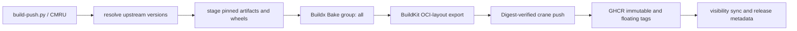
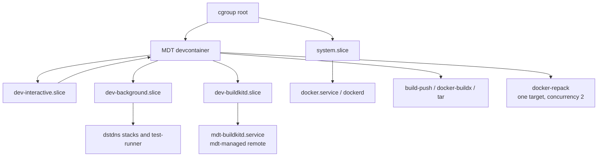

# MDT build and release architecture

This document describes how `modern-debian-tools-python-debug` resolves,
builds, repacks, and publishes its image families, and where each phase consumes
CPU, memory, swap, and I/O. The release configuration is code: defaults and
limits live in [`cmru.toml`](../cmru.toml), not in an operator's
shell history.

## Managed BuildKit backend

Decision (2026-09-14): `BUILDX_BUILDER=mdt-managed` is canonical for every
MDT devcontainer build and every release build. `BUILDKIT_HOST` is the matching
authoritative endpoint, `unix:///run/mdt-buildkitd/buildkitd.sock`. Host setup
renders and maintains a rootless `mdt-buildkitd.service` in
`dev-buildkitd.slice`, labels and verifies that service container, waits for
its socket, then creates or verifies exactly one durable Buildx node:

```text
mdt-managed  --driver remote-->  unix:///run/mdt-buildkitd/buildkitd.sock
                                      |
                                      +-- mdt-buildkitd.service
                                          docker run --cgroup-parent=dev-buildkitd.slice
```

The service's plain Docker cgroup placement is authoritative. The design does
not use the Buildx container-driver `cgroup-parent` option and does not create
`buildx_buildkit_*` workers for release or devcontainer builds. `docker build`
and `docker buildx build` receive the explicit `BUILDX_BUILDER` selection; the
release hook rejects any other builder or endpoint. The finalizer reuses the
named remote idempotently and fails closed on partial/inconsistent environment.

Host shells receive the same exports from `/etc/profile.d/mdt-buildkit.sh`.
The MDT template and derived dstdns container explicitly carry both exports
and a mandatory `/run/mdt-buildkitd` socket mount, so a missing host setup is a
visible container-start failure rather than an embedded-Builder fallback.

The installed Docker-events guard inspects every reserved
`buildx_buildkit_*`/`buildkit_buildkit_*` candidate. It approves only matching
name, configured image, `dev-buildkitd.slice` cgroup parent, and service labels.
The policy vocabulary is `terminate` (default: remove an unapproved worker) or
`report-only` (log without removal). Invalid/missing policy is an error; an
inspect failure is indeterminate and stops the watcher for systemd to restart.

The host wizard follows the same fail-closed resource model. It is slice-first,
asks all four memory controls for every governed slice, permits an explicit
empty value only where the operator chooses no directive, and compares parsed
binary units in KiB. It rejects and re-prompts until configured values satisfy
`MemoryMin <= MemoryLow <= MemoryHigh <= MemoryMax`, and checks child
MemoryHigh/Max/Min totals against live `MemAvailable`. `MemoryMin` is hard
hierarchical protection; `MemoryLow` is soft best-effort protection;
`MemoryHigh` is soft reclaim throttling; `MemoryMax` is the hard RAM ceiling.
The existing `DEV_MEMORY_MIN_GUARANTEED_CEILING` is the sole root `dev.slice`
MemoryMin key and is mirrored on the guaranteed sibling; `DEV_MEMORY_LOW/HIGH/MAX`
are the other root controls. CPUWeight, CPUQuota, IOWeight, swap, and zswap are
walked inside each slice's flow.

Current registry publication uses OCI media types and forced native zstd level
3 compression. BuildKit preserves the normal layer topology and attaches max
provenance plus an SPDX SBOM. These settings live in `cmru.toml`. See
[Image delivery benchmarks](IMAGE-DELIVERY-BENCHMARKS.md) for cold-pull
evidence and [OCI image tooling](OCI-IMAGE-TOOLING.md) for the distinction
between OCI manifests, attestations and MDT's human manifest.

## Canonical release path

`RELEASE_IMAGE_FLOW=load` is the shipped release mode. Despite the historical
name, this is the source-first OCI-layout path: the governed BuildKit worker
builds each target once to a local layout, and the later push phase publishes
that exact layout with digest verification. It does not load the image into the
Docker daemon image store and does not require `skopeo`. Set
`RELEASE_IMAGE_FLOW=push` for the optional direct registry-export path, or
`RELEASE_IMAGE_FLOW=repack` for the optional OCI repack path.


```mermaid
flowchart LR
    A[build-push.py / CMRU] --> B[resolve upstream versions]
    B --> C[stage pinned artifacts and wheels]
    C --> D[Buildx Bake group: all]
    D --> E[BuildKit OCI-layout export]
    E --> F[Digest-verified crane push]
    F --> H[GHCR immutable and floating tags]
    H --> I[visibility sync and release metadata]
```

The phases are:

1. `build-push.py` resolves the current allowed upstream releases, stages
   immutable artifacts and first-party wheels, records their checksums, and
   writes `.build-env.json` so a split build/push invocation uses one resolved
   set of inputs.
2. `docker-bake.hcl` defines the target graph. The `all` group is the release
   matrix; `everything` is a broader local-development matrix.
3. `scripts/release-bake.sh` selects the governed named builder and runs the
   release matrix as one target at a time with an OCI-layout output. BuildKit
   performs Dockerfile execution, cache lookup, layer compression, and local
   layout export inside its limited worker.
4. `build-push.py` extracts the canonical in-image manifests, records release
   metadata, then pushes the same layouts with `crane` and verifies the
   registry digest. No second image build is introduced.

### Optional OCI-layout repack lane

`RELEASE_IMAGE_FLOW=repack` remains available for compression experiments. It
overrides each target's output to a separate OCI tar, extracts those tars under
the disk-backed `REPACK_WORK_DIR`, and runs bounded `docker-repack` workers.
BuildKit can emit one index descriptor per tag even when every descriptor
points to the same image; the wrapper deduplicates those aliases by digest and
platform before repacking.

Repacker output is only a candidate. `scripts/validate-oci-layout.py` first
checks each layer for structurally impossible file/descendant collisions. A
minimal BuildKit import then forces a real unpack and exports the canonical
in-image manifest. Publication only follows both checks. Neither operation
loads the image into Docker's daemon image store.

An OCI layout is an on-disk image format, not a registry upload protocol.
BuildKit can consume a local layout as a build context, while tools such as
`skopeo` can copy one directly to a registry. This implementation uses the
former, so it has no `skopeo` prerequisite. Merely having `index.json` and
`blobs/` does not mean `docker buildx imagetools create` can upload the local
blobs: that command normally composes manifests from content the destination
registry can already resolve.

The layout's JSON `index.json` and image manifests are protocol metadata and
must not be confused with MDT's human-readable in-image `manifest.md`. The
former links content-addressed configs/layers and platforms; the latter
documents installed tools and release policy. See
[OCI image tooling and repack design](OCI-IMAGE-TOOLING.md) for the complete
terminology, registry-client decision and dstdns adoption guidance.

#### Current repack validation status

The 2026-07-14 transition run caught a `docker-repack` output layer containing
a regular file and descendants below that same path. BuildKit correctly
rejected it during the validation import, before any tag was pushed. Until the
repacker defect is fixed and covered by an automated structural regression
test, the optional `repack` lane is expected to fail closed for the affected
image. Do not bypass this check with a raw OCI-layout copy: that would upload
the invalid layer rather than repair it. The shipped `load` lane is the safe
unrepacked release path.

The source and repacked layouts are temporary release scratch. Do not place
`REPACK_WORK_DIR` on tmpfs: two large targets can require many GiB while source
and destination layouts coexist.

### Cache ownership

The named `mdt-managed` remote owns a persistent BuildKit cache distinct from
Docker's embedded builder. Its first release is therefore cold even if another
builder recently built the same Dockerfile; later releases reuse its layers
and cache mounts. Host service replacement may interrupt active builds, but the
named remote is preserved and verified rather than silently recreated.

Volatile OCI labels such as revision, creation time, and release version are
applied after all filesystem instructions in the Dockerfile. Changing release
metadata therefore invalidates only the final metadata step, not apt, Node,
tool, or Python environment layers. Keep new volatile labels in that final
block.

Large context-transfer and Block I/O totals can include staged tool downloads
and prior cache activity. `.dockerignore` must keep `REPACK_WORK_DIR`, logs, and
other generated scratch out of the context. Use an explicit no-cache build only
when validating freshness semantics: it materially increases registry, package
mirror, CPU, and disk load.

## Resource-governance boundaries

There are three accounting domains: the BuildKit container leaf, release
processes in the caller's container, and the host Docker daemon. They
intentionally do not depend on a single global `dockerd` limit.

The release command crosses these domains through the Docker API. Process
parentage and cgroup ownership are therefore not the same thing: `dockerd` can
start a limited BuildKit container while remaining in `docker.service`, and a
Buildx client in the devcontainer can stream data to that worker without
Dockerfile commands joining the devcontainer's cgroup.

On the intended systemd/cgroup-v2 host, the relationship is typically:


```mermaid
flowchart TD
    R[cgroup root] --> S[system.slice]
    R --> V[dev.slice]
    V --> I[dev-interactive.slice]
    V --> B[dev-background.slice]
    V --> K[dev-buildkitd.slice]
    S --> D[docker.service / dockerd]
    K --> W[mdt-buildkitd.service<br/>mdt-managed remote]
    I --> V[MDT devcontainer]
    V --> C[build-push / docker-buildx / tar]
    V --> P[docker-repack<br/>one target, concurrency 2]
    B --> T[dstdns stacks and test-runner]
```

The managed service container is intentionally in `dev-buildkitd.slice`, while
`dockerd` remains in `system.slice`. The `mdt-managed` remote endpoint is a
Unix socket mounted into the devcontainer; no generated Buildx worker scope is
part of the normal path. `dev-background.slice` is shown for context: dstdns
uses it, while release orchestration runs in the invoking devcontainer's
`dev-interactive.slice`.

| Work | Process/container to inspect | Governance |
| --- | --- | --- |
| Dockerfile steps, cache, layer compression, registry export, optional OCI export/import | `mdt-buildkitd` in `dev-buildkitd.slice` via the `mdt-managed` remote | Host systemd `MemoryMin/Low/High/Max`, swap, CPU, IO, and the service cgroup parent |
| Resolver, Bake client, artifact staging, OCI export streaming, tar extraction, release orchestration | `build-push.py`, `docker-buildx`, resolver scripts, `tar` | Inherits the caller's cgroup; from the MDT devcontainer this is normally `dev-interactive.slice` |
| Filesystem deduplication and zstd compression | `docker-repack` | Inherits the caller's cgroup, plus low CPU/I/O scheduling priority, configured worker count and compression concurrency; an optional diagnostic virtual-memory ceiling is disabled by default |
| Docker API, container lifecycle, layer/accounting and registry coordination | `dockerd` in `system.slice/docker.service` | Host Docker service policy; CPU here is daemon work and is not evidence that Dockerfile commands escaped the governed builder |
| Registry upload | BuildKit worker, `dockerd`, network stack | Builder limits still apply; host networking and Docker service work remain outside the builder leaf |

`scripts/ensure-release-builder.sh` verifies `mdt-managed` and its exact remote
endpoint before each release. It has no create/remove path, so a stale or
mismatched instance fails before work starts. The important distinction is:

- A systemd **slice** controls an aggregate workload tier. The shipped
  devcontainer template requests `dev-interactive.slice`; dstdns stack containers
  normally request `dev-background.slice`. Slice policy is installed and owned by
  the host.
- The managed service's Docker container is placed directly in
  `dev-buildkitd.slice`; `dockerd` itself remains in `system.slice`.
- The Buildx node is `remote`, so no Buildx worker container or Buildx
  `cgroup-parent` driver option participates in placement.
- Docker has no Buildx driver option for the host's dynamic per-device I/O
  ceilings. The installed guard terminates or reports accidental
  `buildx_buildkit_*`/`buildkit_buildkit_*` containers according to the
  explicit host policy.

The default controls are deliberately layered. The BuildKit worker's hard
cgroup limits contain a runaway build. Repack is a local process: worker count
and compression concurrency constrain its parallelism, `nice` and idle-class
`ionice` lower its priority, and the caller's cgroup supplies its hard boundary.
One target at a time prevents two large merged filesystems from competing
inside the default 7 GiB interactive tier.
`REPACK_VMEM_KB=unlimited` is intentional: `docker-repack` maps a large merged
filesystem, and virtual address space is not resident RAM. A numeric override
is available for diagnosis, but a low address-space limit causes false
allocation failures before the cgroup is under memory pressure.

`REPACK_JOBS` and `REPACK_CONCURRENCY` are parallelism controls, not CPU limits:
the former selects concurrent image targets and the latter sizes the repacker's
Rayon worker pool. Two workers do not imply a two-core cgroup quota. Conversely,
raising concurrency cannot exceed a tighter ancestor/leaf quota and increases
memory and I/O pressure. Benchmark concurrency 2/4/6 with CPU and I/O PSI before
raising the configured default.

The distinction between priority and a limit matters: `nice`, `ionice`, CPU
shares/weight, and I/O weight let more important work win under contention, but
do not stop MDT from using otherwise-idle capacity. The builder's CPU quota and
memory settings are hard leaf limits. Local repack has no extra hard CPU quota;
its hard boundary is whatever the caller and ancestor slice impose.

The four-core quota is an aggregate budget. A multithreaded build can therefore
show roughly `400%` in Docker's per-core CPU convention without violating it.
Likewise, `dockerd` can show more than `100%` because it is multithreaded and is
not inside the builder leaf. CPU shares 128 are only a contention preference;
the quota is what prevents the builder from consuming more than four complete
cores when the host is otherwise idle.

`memory-swap=12g` is Docker's combined RAM-plus-swap ceiling, not a prohibition
on swap. Paired with `memory=4g`, it permits up to 8 GiB of swap for the builder.
Whether those pages use zswap before disk swap is a host kernel policy.

For the devcontainer's `dev-interactive.slice` placement and host prerequisites,
see [`DEVCONTAINER-LIFECYCLE.md`](../DEVCONTAINER-LIFECYCLE.md#host-resource-governance-cgroupsslices).

### How the cgroup controls compose

A process must satisfy its leaf and every ancestor. The effective ceiling is
therefore the tightest applicable control, not the sum of all configured
values.

- `memory.high` is a reclaim/throttling boundary. Crossing it creates pressure
  and may move cold anonymous pages toward swap; it is not an immediate kill.
- `memory.max` is the hard RAM boundary for that cgroup. Sustained allocation
  that cannot be reclaimed can produce an in-cgroup OOM kill.
- In native cgroup v2, `memory.swap.max` limits swap separately. Docker's
  `--memory-swap` / `HostConfig.MemorySwap` instead expresses the combined
  RAM-plus-swap total when a memory limit is also present.
- `memory.low` and `memory.min` protect pages during reclaim; they do not
  pre-allocate or reserve physical RAM. Protection also has to be valid along
  the ancestor chain to be effective.
- `cpu.max` / Docker quota is a hard time budget. `cpu.weight` and Docker CPU
  shares are proportional preferences that matter when sibling cgroups
  contend; they do not cap an otherwise idle host.
- `io.weight` is likewise proportional under contention. `io.max` is a hard
  per-device bandwidth/IOPS ceiling. Empty `io.max` means no leaf ceiling, but
  an ancestor can still impose one.

This is why diagnosis must inspect both the builder container and its ancestor
slice. An exit 137 can be a leaf limit, an ancestor OOM decision, or an explicit
kill; the number alone does not identify which one.

## Entry points and live logs

The repository-wide release entry point is `./cmru.release.sh`; direct MDT
diagnostics use `./build-push.py --build` or `--rebuild`. Both select unbuffered
Python. CMRU writes the complete transcript to the stable `cmru.release.log`
itself (overwriting the prior run by default), while its outer console shows a
timely phase/result summary. No shell pipeline is needed:

```bash
./cmru.release.sh --project modern-debian-tools-python-debug
```

Use `--show-run-details` when live Docker/pytest lines are wanted at the outer
console too. Use `--log-append` to retain prior root transcripts with a `---`
divider. `stdbuf` is not needed for the Python release path; subprocesses that
render progress using terminal control sequences can still look different in a
file than on a TTY.

## Reading load correctly

No single `top` row represents the entire build. Use the phase and cgroup to
attribute it:

- High CPU in `buildkitd` or its executor descendants is a Dockerfile build,
  layer export, or publication phase. Check the `mdt-buildkitd` service
  container first.
- High CPU in the `docker-buildx` client can occur while it receives and writes
  an OCI output stream. That client is local to the caller and inherits the
  caller's slice; Dockerfile executors still run in the governed worker.
- High CPU in `docker-repack` is the deduplication/compression phase. One target
  runs at a time by default, while `REPACK_CONCURRENCY=2` permits two internal
  compression threads.
- High CPU in `dockerd` is real daemon overhead such as API work, snapshots,
  container lifecycle, or data transfer. Its location in `system.slice` is
  normal. It does not mean the BuildKit worker lacks its own limited sibling
  scope.
- High I/O in `tar` is the transition from OCI tar output to directory layout.
  This runs in the caller's cgroup, not inside BuildKit.
- A quiet release client does not imply a stalled build. The long-running work
  may be in BuildKit or a repack worker. `build-push.py` and `cmru.release.sh`
  use unbuffered Python so progress is visible through `2>&1 | tee`.

Use this phase map before changing a limit:

| Visible load | Likely phase | First check | Usually bounded by |
| --- | --- | --- | --- |
| `buildkitd`, `runc`, compiler, package manager, or compression child beneath the builder | Dockerfile execution or layer export | Builder `docker stats`, `cpu.stat`, `memory.events`, and BuildKit progress | Builder leaf plus its ancestors |
| `docker-buildx`, `tar`, or `build-push.py` in the MDT devcontainer | Resolve/stage/orchestrate or OCI stream handling | Caller cgroup and `dev-interactive.slice` | Devcontainer leaf and `dev-interactive.slice` |
| `docker-repack` in the MDT devcontainer | Optional repack | Repack progress, caller PSI and I/O counters | Caller cgroup, job/concurrency settings, priority, and `dev-interactive.slice` |
| `dockerd` in `docker.service` | Snapshot, content-store, API, container, or registry coordination | Docker events/logs and host disk/network activity | Host policy for `docker.service`; not the builder's leaf |
| `containerd`, `containerd-shim`, or kernel I/O workers | Runtime/snapshotter plumbing | Correlate timestamps and cumulative I/O deltas with the active phase | Their host service/cgroup and host I/O policy |
| No hot process but high load average | Tasks blocked on disk or memory reclaim | `/proc/pressure/{io,memory}`, `vmstat`, and cgroup pressure | Host capacity and the tightest ancestor/leaf controls |

Load average includes runnable and uninterruptible tasks; it is not a CPU
percentage. High load with modest CPU is commonly storage wait or reclaim.
Resident memory, page cache, and swap are also different signals: a high
`memory.current` can be reclaimable cache, while rising `memory.swap.current`,
`memory.events`, or memory PSI identifies actual pressure more directly.

Useful live checks:

```bash
# The stable node name and endpoint are the release contract.
builder=$(python3 -c \
  'import tomllib; print(tomllib.load(open("cmru.toml", "rb"))["env"]["BUILDX_BUILDER"])')
endpoint=$(python3 -c \
  'import tomllib; print(tomllib.load(open("cmru.toml", "rb"))["env"]["BUILDKIT_HOST"])')

# Builder identity, driver and current endpoint; must be remote + endpoint.
docker buildx inspect "$builder"

# Host service identity and cgroup placement
docker inspect mdt-buildkitd --format \
  'image={{.Config.Image}} cgroup={{.HostConfig.CgroupParent}} labels={{json .Config.Labels}}'
systemctl show dev-buildkitd.slice mdt-buildkitd.service -p ControlGroup -p MemoryCurrent -p MemoryHigh -p MemoryMax

# Resource use by the governed worker
docker stats --no-stream mdt-buildkitd

# Attribute host processes by command and cgroup
ps -eo pid,ppid,pcpu,pmem,cgroup,comm,args --sort=-pcpu | head -40

# Host-owned aggregate slice policy and current accounting
systemctl show dev-interactive.slice dev-background.slice \
  -p ControlGroup -p MemoryCurrent -p MemoryHigh -p MemoryMax \
  -p MemorySwapCurrent -p MemorySwapMax -p CPUWeight -p IOWeight
```

Run the name-resolution commands from the
`modern-debian-tools-python-debug` directory. `mdt-managed` is the durable
remote node name and `mdt-buildkitd` is the stable service-container name;
neither is a generated Buildx worker name.

Run the `ps` and `systemctl` checks on the host. A container commonly has a
private PID and cgroup namespace, so host PIDs from `docker inspect` may not
exist in its `/proc`, and `/proc/self/cgroup` may only show `0::/`. That view is
deliberately insufficient for proving the host-side parent slice. `docker inspect`
still reports the leaf limits requested through Docker.

Inside a cgroup-v2 container, effective leaf limits are visible without host
privileges:

```bash
cat /sys/fs/cgroup/memory.current
cat /sys/fs/cgroup/memory.high
cat /sys/fs/cgroup/memory.max
cat /sys/fs/cgroup/memory.swap.current
cat /sys/fs/cgroup/memory.swap.max
cat /sys/fs/cgroup/cpu.max
cat /sys/fs/cgroup/cpu.weight
cat /sys/fs/cgroup/io.max
```

For pressure and failure attribution, sample counters before and after the
phase instead of relying only on instantaneous percentages:

```bash
cat /sys/fs/cgroup/cpu.stat       # usage and quota-throttling totals
cat /sys/fs/cgroup/memory.peak    # high-water mark since cgroup creation
cat /sys/fs/cgroup/memory.events  # high/max/OOM/OOM-kill counters
cat /sys/fs/cgroup/memory.pressure
cat /sys/fs/cgroup/io.stat        # cumulative bytes and operations by device
cat /sys/fs/cgroup/io.pressure
```

On the host, obtain the managed worker's real cgroup path from its service
container PID rather than guessing its slice:

```bash
pid=$(docker inspect mdt-buildkitd --format '{{.State.Pid}}')
cat "/proc/$pid/cgroup"
systemd-cgls --all | rg 'mdt-buildkitd|dockerd|docker-repack|build-push'
```

This is the authoritative way to distinguish the managed worker's limited
service-container scope from `docker.service` and the invoking devcontainer.
The cgroup path can differ with the host's Docker cgroup driver and systemd
configuration. If an accidental `buildx_buildkit_*` container exists, inspect
it only as a guard violation; it is not the canonical worker.

The host-wide PSI files under `/proc/pressure/` reveal global contention, while
the cgroup files above attribute it to a workload. Zswap is also host-wide
kernel policy rather than an MDT or Docker allocation. On hosts with debugfs
mounted, `/sys/kernel/debug/zswap/` exposes its stored-page, pool-size, reject,
and writeback counters. Compare samples; cumulative writeback or I/O totals do
not describe the current rate.

`docker stats` Block I/O counters are cumulative for the lifetime of the named
builder container. Compare samples or use host I/O telemetry when you need a
rate; a large single value does not mean that throughput is happening now.

Do not compare Docker CPU percentages to whole-host `top` percentages without
normalizing: Docker commonly reports `100%` per fully occupied logical CPU,
while `top` configuration can display either per-CPU or whole-machine values.

For example, a `top` row showing `dockerd` near `187%` in
`system.slice/docker.service` means the daemon is using about 1.87 logical
CPUs. That placement is intended. It says nothing by itself about whether the
build worker is limited or whether repack is active. Check the separately
resolved builder container and the `RELEASE_IMAGE_FLOW` value; only a
`docker-repack` process and OCI-layout progress identify the optional repack
lane.

## Release modes and their intended use

| `RELEASE_IMAGE_FLOW` | Behavior | Intended use |
| --- | --- | --- |
| `repack` | Bake to OCI layouts, repack, validate structurally and by importing, then publish; later push step is a no-op | Optional compression experiment; currently blocked for the affected image by the known repacker defect above |
| `load` | Build once to OCI layouts; later push publishes those exact layouts with digest verification | Shipped/default source-first release lane |
| `push` | Build and publish unrepacked BuildKit output directly; later push step is a no-op | Optional direct-registry lane |

`load` is the default because it leaves a reviewable local artifact between
build and publication while preserving build-once identity. `push` retains the
original BuildKit layer topology and is the simpler optional direct-export
lane; `repack` changes layer topology and therefore remains gated separately.

## Configuration and prerequisites

The governed defaults are in the `[env]` table of
[`cmru.toml`](../cmru.toml):

- `BUILDX_BUILDER=mdt-managed` and `BUILDKIT_HOST=unix:///run/mdt-buildkitd/buildkitd.sock`
  select the host-managed remote; host-setup's slice config controls its
  resources. `BUILDX_ACCIDENTAL_CONTAINER_POLICY` is `terminate` or
  `report-only`.
- `REPACK_WORK_DIR`, `REPACK_TARGET_SIZE`, `REPACK_JOBS`,
  `REPACK_CONCURRENCY`, `REPACK_COMPRESSION_LEVEL`, and `REPACK_VMEM_KB`
  control repack. `REPACK_VMEM_KB` accepts `unlimited` or a positive numeric
  diagnostic override. `REPACK_KEEP_FAILED` retains failed source and candidate
  layouts for analysis. `DOCKER_REPACK_LOG` controls library verbosity without
  hiding the wrapper's target-level progress.
- `RELEASE_IMAGE_FLOW` selects the architecture above.

The canonical path requires Docker with Buildx/Bake. The optional repack lane
also requires `jq`, `tar`, Python 3.14 or later, and `docker-repack`. Install
`docker-repack` from its official GitHub release, or set `DOCKER_REPACK_BIN` to
a verified binary. The canonical path does **not** check for or call `skopeo`.
The separate historical benchmark script still uses
`skopeo` to import an already-loaded local daemon image; that does not describe
the release architecture.

Counts below `/var/lib/docker/overlay2` are not a reliable image-layer or
performance metric: they combine snapshots and writable layers across Docker's
local store, while the named BuildKit worker has its own cache. Use `docker
system df -v` and `docker buildx du --builder "$builder"` to attribute storage.
Flattening a release does not garbage-collect either store and can reduce layer
reuse; use the benchmark and retention guidance in
[OCI image tooling and repack design](OCI-IMAGE-TOOLING.md) before changing
layer topology.

## Failure boundaries

- If `mdt-managed` is absent, points at another endpoint, or is not a reachable
  `remote` node, `ensure-release-builder.sh` fails before the build. It never
  removes or creates a replacement worker.
- If a Bake target has no tags or OCI source layout, publication stops before a
  partial target can be reported as successful.
- A candidate repacked layout must be successfully imported and unpacked by
  BuildKit before its publish command runs. The current import gate caught the
  known file/descendant collision; a raw registry copier is not a substitute
  for validation.
- Each repack worker records its exit code and cleans successful target scratch.
  With `REPACK_KEEP_FAILED=true`, failed source and candidate layouts remain
  under `REPACK_WORK_DIR` until the next run so the reported path can be
  inspected. Any worker failure fails the optional lane.
- The repacked artifact has different digests from the Bake source. Signing,
  provenance, manifest verification, and release metadata must refer to the
  published repacked digest, never the transient source layout.
- OOM or exit 137 means a bound was reached; inspect both the process leaf and
  its ancestor slice. Raising a per-worker limit cannot override a tighter
  ancestor, and raising an ancestor does not remove the worker's hard limit.
